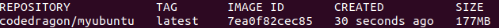
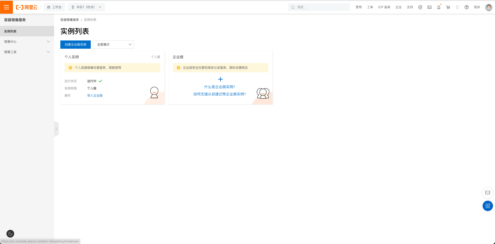
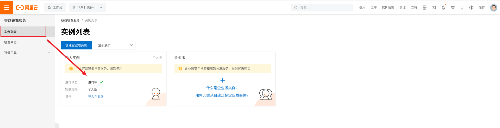
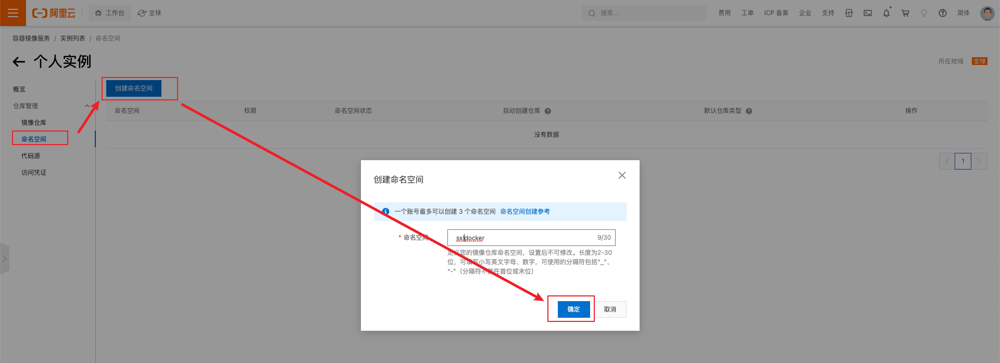
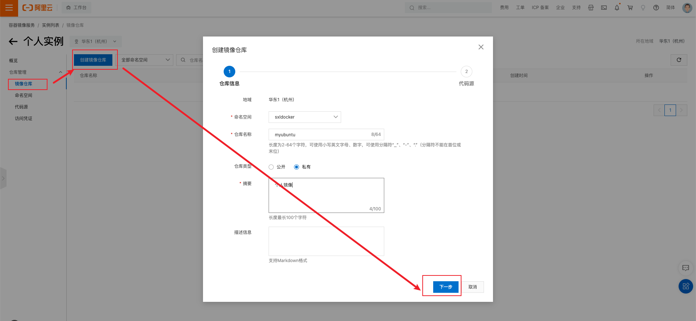
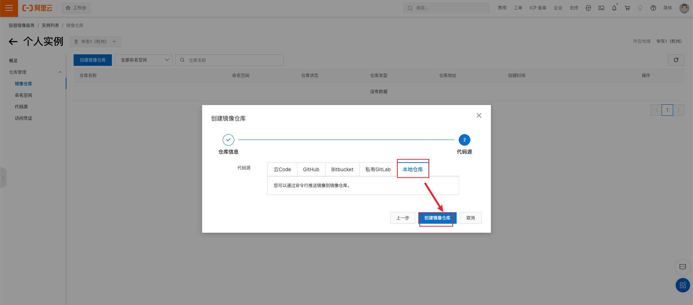
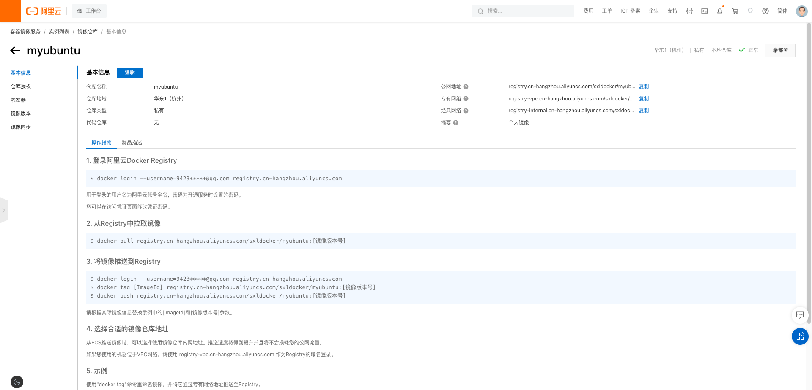
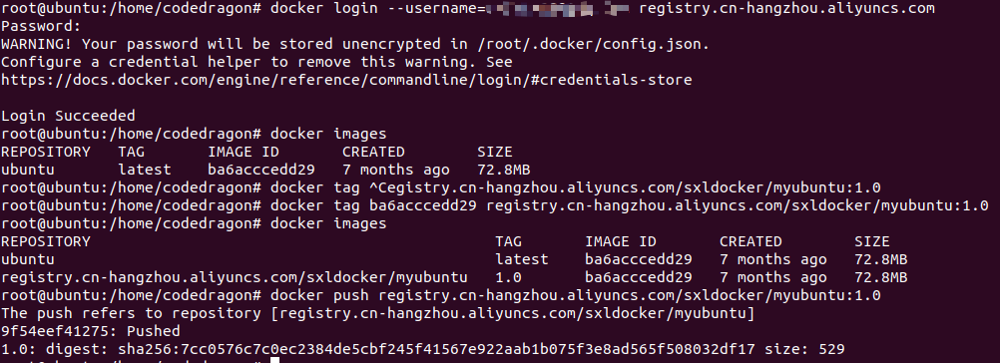

# 本地镜像发布到阿里云

## 本地镜像发布到阿里云流程


## 镜像的生成方法

基于当前容器创建一个新的镜像，新功能增强。

docker commit [OPTIONS] 容器 ID [REPOSITORY[:TAG]]

## 将本地镜像推送到阿里云

### 本地镜像素材原型



### 阿里云开发者平台

https://promotion.aliyun.com/ntms/act/kubernetes.html

### 创建镜像仓库

-   选择控制台，进入容器镜像服务

    

-   选择个人实例

    

-   命名空间

    

-   仓库名称

    

    

-   进入管理界面获得脚本

    

### 将镜像推送到阿里云 Registry

**管理界面脚本**


**脚本实例**



## 将阿里云上的镜像下载到本地

### 下载到本地

```
docker pull registry.cn-hangzhou.aliyuncs.com/sxldocker/myubuntu:[镜像版本号]
```