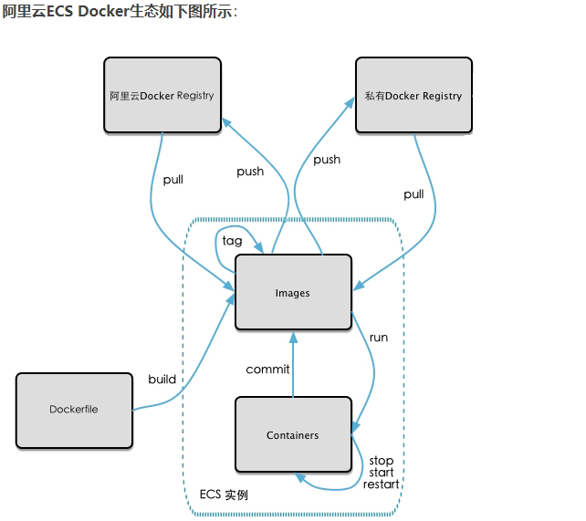

# 本地镜像发布到阿里云

## 本地镜像发布到阿里云流程

## 镜像的生成方法

基于当前容器创建一个新的镜像，新功能增强。

docker commit [OPTIONS] 容器 ID [REPOSITORY[:TAG]]

## 将本地镜像推送到阿里云

### 本地镜像素材原型

### 阿里云开发者平台

### 创建镜像仓库

### 将镜像推送到阿里云 Registry

**管理界面脚本**

**脚本实例**

## 将阿里云上的镜像下载到本地

### 下载到本地