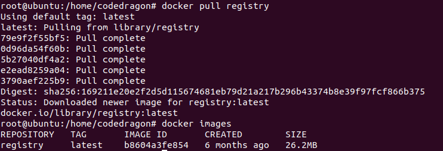
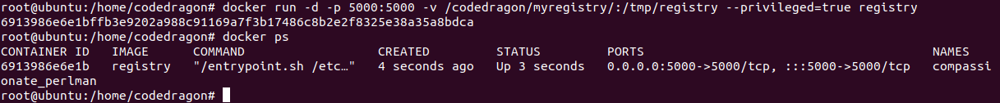
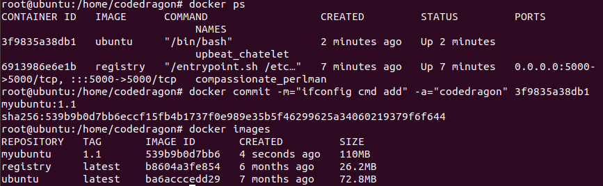
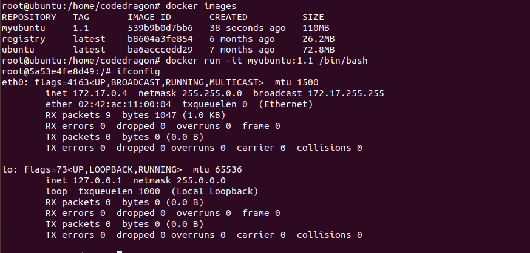
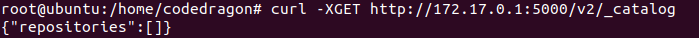
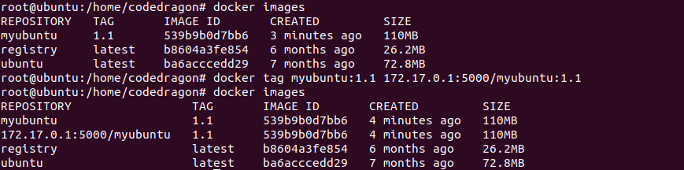
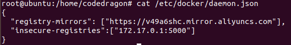
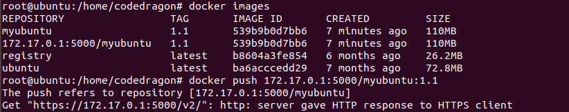
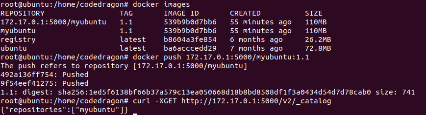
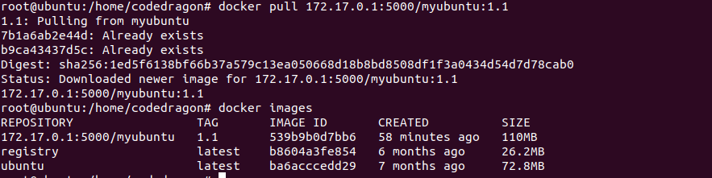

# 本地镜像发布到私有库

## 本地镜像发布到私有库流程

## 是什么

1. 官网 Docker Hub 地址：https://hub.docker.com/，中国大陆访问太慢了且有被阿里云取代的趋势，不太主流。
2. Docker Hub、阿里云这样的公共镜像仓库可能不太方便，涉及机密的公司不可能提供镜像给公网，所以需要创建一个本地私人仓库供给团队使用，基于公司内部项目构建镜像。
3. Docker Registry 是官方提供的工具，可以用于构建私有镜像仓库。

## 将本地镜像推送到私有库

1. 下载镜像 Docker Registry

    

2. 运行私有库 Registry，相当于本地有个私有 Docker Hub

    >   docker run -d -p 5000:5000 -v /codedragon/myregistry/:/tmp/registry --privileged=true registry
    >
    >   默认情况，仓库被创建在容器的 /var/lib/registry 目录下，建议自行用容器卷映射，方便与宿主机联调。
    >
    >   

3. 案例演示创建一个新镜像，Ubuntu 安装 ifconfig 命令

    1. 从 Hub 上下载 Ubuntu 镜像到本地并成功运行

    2. 原始的 Ubuntu 镜像是不带着 ifconfig 命令的

    3. 外网连通的情况下，安装 ifconfig 命令并测试通过

        

    4. 安装完成后，commit 我们自己的新镜像

        

    5. 启动我们的新镜像并和原来对比

        

4. curl 验证私服库上有什么镜像

    

5. 将新镜像修改符合私服规范的 Tag

    

6. 修改配置文件使之支持 http

    >   vim 命令新增如下红色内容：vim /etc/docker/daemon.json 
    >
    >   上述理由：Docker 默认不允许 http 方式推送镜像，通过配置选项来取消这个限制。====>  修改完后如果不生效，建议重启 Docker 

    

7. push 推送到私服库

    

8. curl 验证私服库上有什么镜像

    

9. pull 到本地并运行

    
