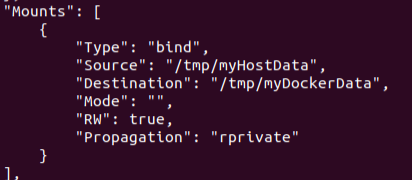
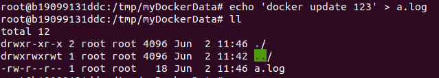
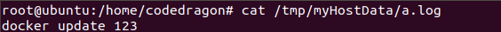
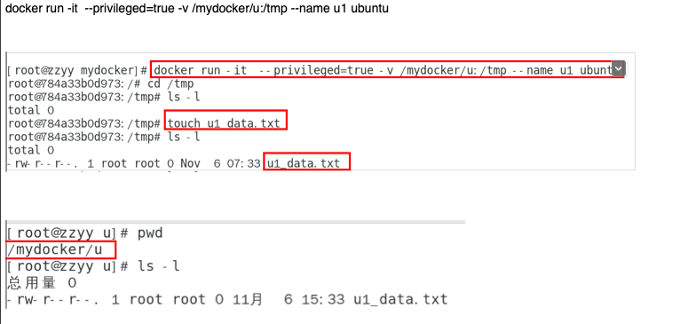
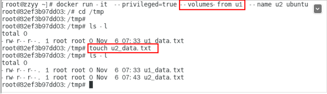

# Docker 容器数据卷

## 坑：容器卷记得加入 --privileged=true

原因：Docker 挂载主机目录访问如果出现 cannot open directory permission denied

解决办法：在挂载目录后多加一个 `--privileged=true` 参数即可

如果是 CentOS 7 安全模块会比之前系统版本加强，不安全的会先禁止，所以目录挂载的情况被默认为不安全的行为，在 SELinux 里面挂载目录被禁止掉了，如果要开启，我们一般使用 `--privileged=true` 命令，扩大容器的权限解决挂载目录没有权限的问题，也即使用该参数，container 内的 root 拥有真正的 root 权限，否则，container 内的 root 只是外部的一个普通用户权限。

## 是什么

卷就是目录或文件，存在于一个或多个容器中，由 Docker 挂载到容器，但不属于联合文件系统，因此能够绕过 Union File System 提供一些用于持续存储或共享数据的特性：卷的设计目的就是数据的持久化，完全独立于容器的生存周期，因此 Docker 不会在容器删除时删除其挂载的数据卷。

一句话：有点类似于我们 Redis 里面的 rdb 和 aof 文件，将 Docker 容器内的数据保存进宿主机的磁盘中，运行一个带有容器卷存储功能的容器实例，`docker run -it --privileged=true -v /宿主机绝对路径目录:/容器内目录 镜像名`。

## 能干什么

将运行与运行的环境打包镜像，run 后形成容器实例运行，但是我们对数据的要求希望是持久化的。Docker 容器产生的数据，如果不备份，那么当容器实例删除后，容器内的数据自然也就没有了，为了能保存数据在 Docker 中我们使用卷。

特点：

1. 数据卷可在容器之间共享或重用数据
2. 卷中的更改可以直接实时生效
3. 数据卷中的更改不会包含在镜像的更新中
4. 数据卷的生命周期一直持续到没有容器使用它为止

## 数据卷案例

1.   宿主 vs 容器之间映射添加容器卷

     >   命令：docker run -it --privileged=true -v/宿主机绝对路径目录:/容器内目录 镜像名
     >
     >   
     >
     >   查看数据卷是否挂载成功
     >
     >   
     >
     >   
     >
     >   容器和宿主机之间数据共享
     >
     >   
     >
     >   

2.   读写规则映射添加说明

     >   读写（默认）
     >
     >   docker run -it --privileged=true -v /宿主机绝对路径目录:/容器内目录:rw   镜像名
     >
     >   默认就是 rw
     >
     >   
     >
     >   只读：容器实例内部被限制，只能读取不能写
     >
     >   docker run -it --privileged=true -v /宿主机绝对路径目录:/容器内目录:ro   镜像名

3.   卷的继承和共享

     >   容器 1 完成和宿主机的映射
     >
     >   
     >
     >   
     >
     >   容器 2 继承容器 1 的卷规则
     >
     >   