## 总体步骤

1.   搜索镜像
2.   拉取镜像
3.   查看镜像
4.   启动镜像
5.   停止容器
6.   移除容器

## 安装 Tomcat

1.   docker hub 上面查找 Tomcat 镜像。

     

2.   从 docker hub 上拉取 Tomcat 镜像到本地。

     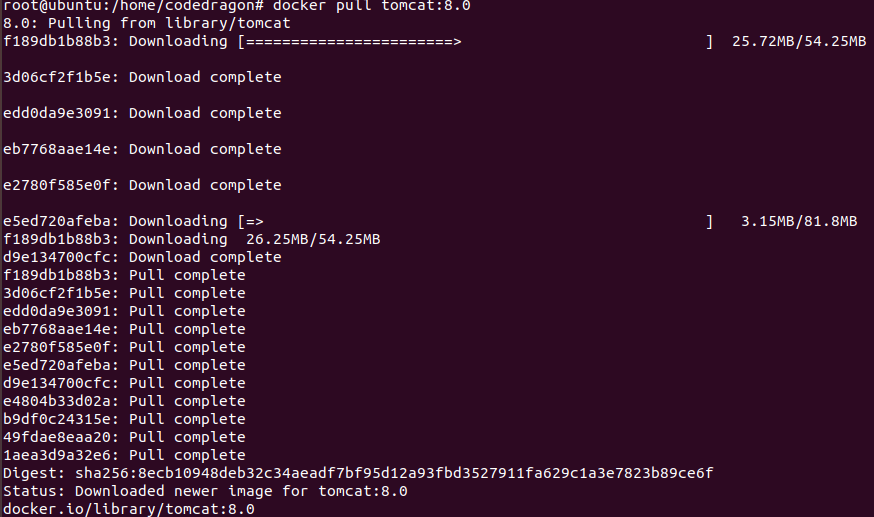

3.   docker images 查看是否有拉取到的 Tomcat。

     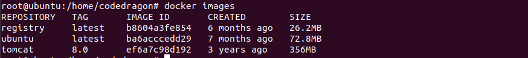

4.   使用 Tomcat 镜像创建容器实例（也叫做运行镜像）。

     >   docker run -it -p 8080:8080 tomcat 

5.   访问 Tomcat 首页。

     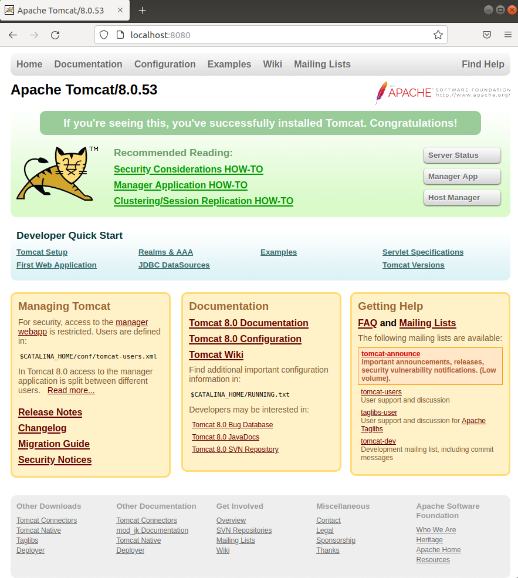

## 安装 MySQL

1.   docker hub 上面查找 MySQL 镜像。

     

2.   从 docker hub 上（阿里云加速器）拉取 MySQL 镜像到本地标签为 5.7。

     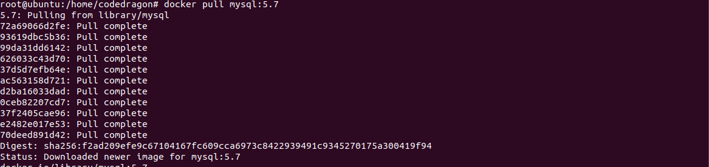

3.   使用 MySQL 5.7 镜像创建容器（也叫运行镜像）。

     1.   命令出处，哪里来的？

          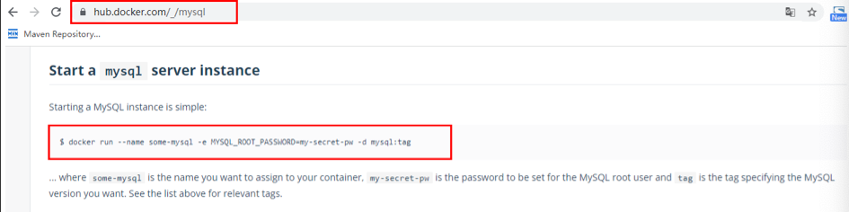

     2.   简单版

          >   使用 MySQL 镜像：
          >
          >   docker run -p 3306:3306 -e MYSQL_ROOT_PASSWORD=123456 -d mysql:5.7
          >
          >   docker ps
          >
          >   docker exec -it 容器 ID /bin/bash
          >
          >   mysql -uroot -p
          >
          >   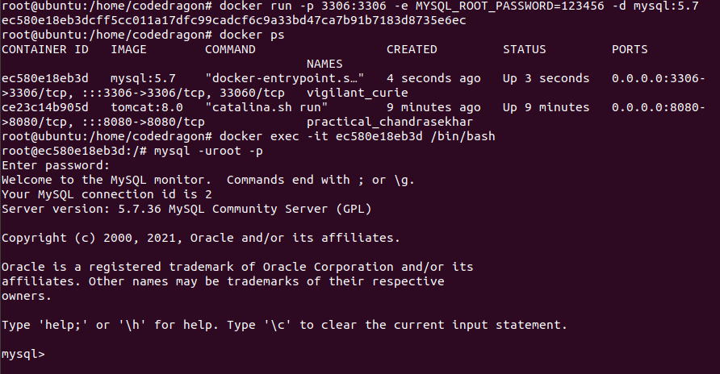
          >
          >   
          >
          >   建库建表插入数据：
          >
          >   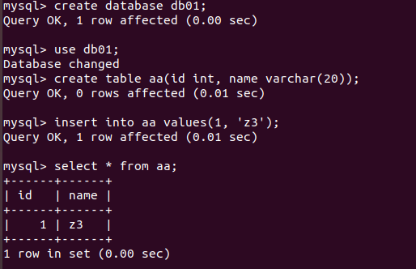
          >
          >   
          >
          >   问题：插入中文数据试试？为什么报错？
          >
          >   答：Docker 上默认字符集编码隐患。
          >
          >   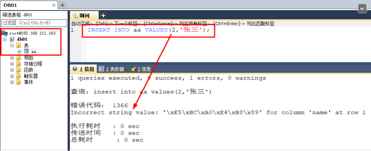
          >
          >   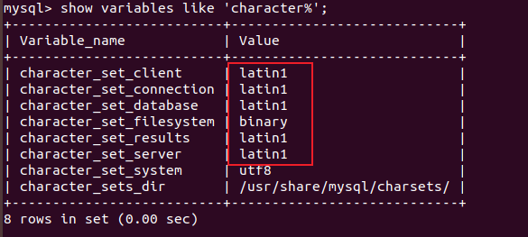

     3.   实战版

          1.   新建 MySQL 容器实例

               >   docker run -d -p 3306:3306 --privileged=true -v /zzyyuse/mysql/log:/var/log/mysql -v /zzyyuse/mysql/data:/var/lib/mysql -v /zzyyuse/mysql/conf:/etc/mysql/conf.d -e MYSQL_ROOT_PASSWORD=123456 --name mysql mysql:5.7 
               >
               >   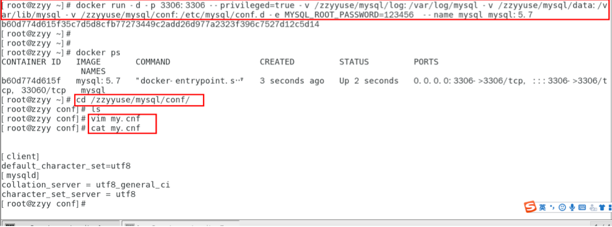

          2.   新建 my.cnf，通过容器卷同步给 MySQL 容器实例

               >   client]
               >
               >   default_character_set=utf8 
               >
               >   [mysqld] 
               >
               >   collation_server = utf8_general_ci 
               >
               >   character_set_server = utf8 
               >
               >   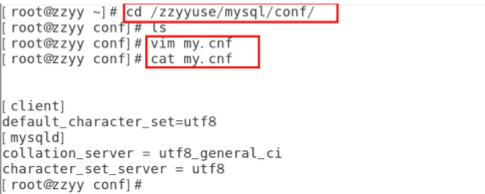

          3.   重新启动 MySQL 容器实例再重新进入并查看字符编码

               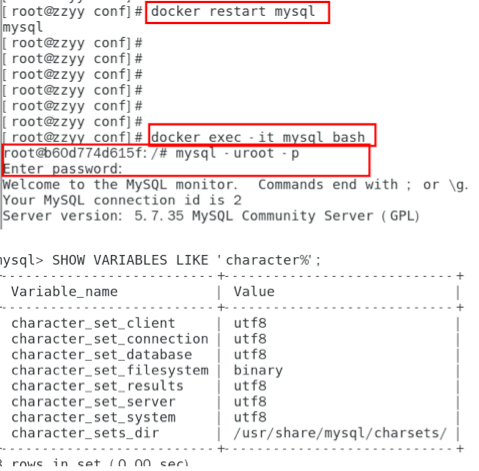

          4.   再新建库新建表再插入中文测试

               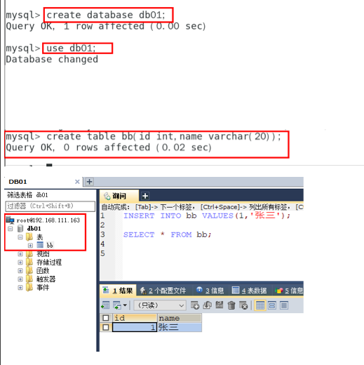

          5.   结论

               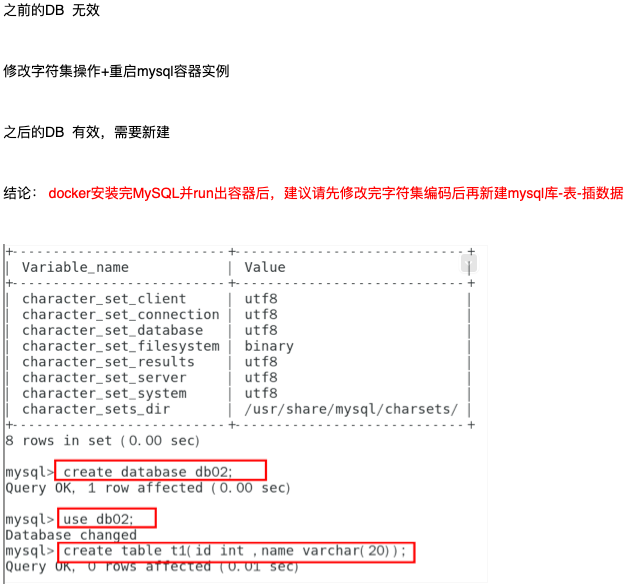

## 安装 Redis

1.   从 docker hub 上（阿里云加速器）拉取 Redis 镜像到本地标签为 6.0.8

     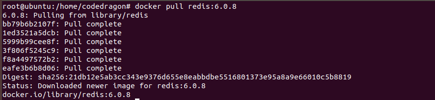

2.   入门命令

     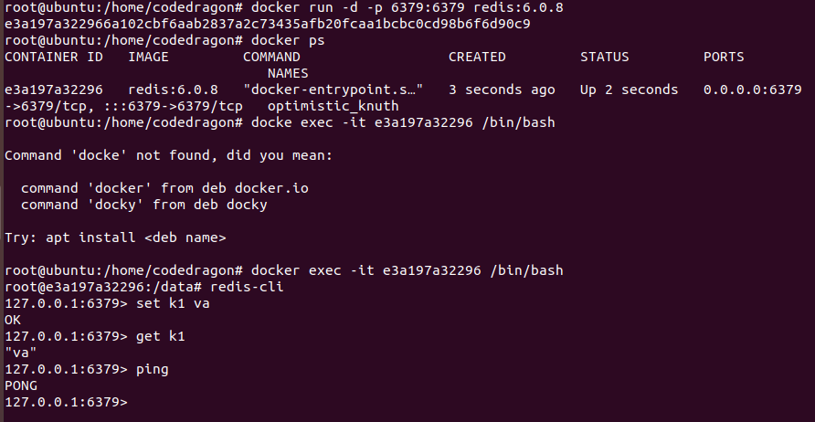

3.   在 Ubuntu 宿主机下新建目录 /app/redis

     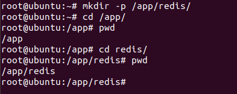

4.   将一个 redis.conf 文件模板拷贝进 /app/redis 目录下

5.   /app/redis 目录下修改 redis.conf 文件

     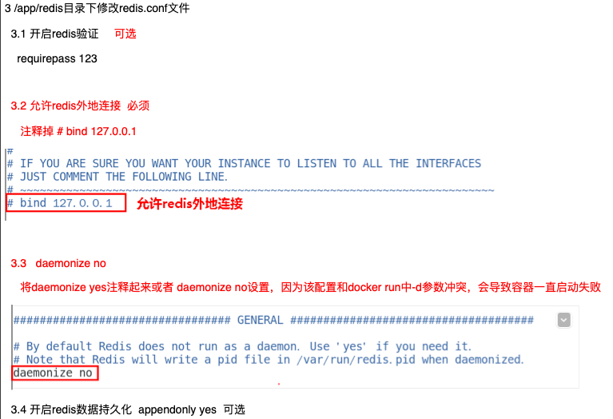

6.   使用 Redis 6.0.8 镜像创建容器（也叫运行镜像）

     >   docker run -p 6379:6379 --name myr3 --privileged=true -v /app/redis/redis.conf:/etc/redis/redis.conf -v /app/redis/data:/data -d redis:6.0.8 redis-server /etc/redis/redis.conf 

     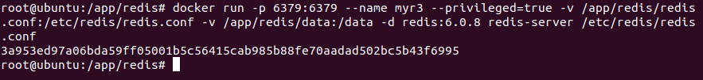

7.   测试 redis-cli 连接上来

