# JVM监控及诊断工具-GUI篇

## 工具概述

使用上一章命令行工具或组合能帮您获取目标 Java 应用性能相关的基础信息，但它们存在下列局限：

1. 无法获取方法级别的分析数据，如方法间的调用关系，各方法的调用次数和调用时间等（这对定位应用性能瓶颈至关重要）。
2. 要求用户登录到目标 Java 应用所在的宿主机上，使用起来不是很方便。
3. 分析数据通过终端输出，结果展示不够直观。

为此，JDK 提供了一些内存泄漏的分析工具，如 JConsole、jVisual VM 等，用于辅助开发人员定位问题，但这些工具很多时候并不足以满足快速定位的需求，所以这里我们介绍的工具相对多一些、丰富一些。

图形化综合诊断工具：

- JDK 自带的工具

    - JConsole：JDK 自带的可视化监控工具、查看 Java 应用程序的运行概况、监控堆信息、永久区（或元空间）使用情况、类加载情况等。

        位置：jdk\bin\JConsole.exe

    - Visual VM：Visual VM 是一个工具，它提供了一个可视界面，用于查看 Java 虚拟机上运行的基于 Java 技术的应用程序的详细信息。

        位置：jdk\bin\jvisualvm.exe

    - JVM：Java Mission Control，内置 Java Flight Recorder，能够以极低的性能开销收集 Java 虚拟机的性能数据。

- 第三方工具

    - MAT：MAT（Memory Analyzer Tool）是基于 Eclipse 的内存分析工具，是一个快速、功能丰富的 Java Heap 分析工具，它可以帮助我们查看内存泄漏和减少内存消耗。
    - JProfiler：商业软件，需要付费，功能强大。
    - Arthas：Alibaba 开源的 Java 诊断工具。
    - Btrace：Java 运行时追踪工具，可以在不停机的情况下，跟踪指定的方法调用、构造函数调用和系统内存等信息。

## JConsole

### 基本概述

- 从 Java 5 开始，在 JDK 中自带的 Java 监控和管理控制台。
- 用于对 JVM 中内存、线程和类等的监控，是一个基于 JMX（Java Management Extensions）的 GUI 性能监控工具。

官方教程：https://docs.oracle.com/javase/7/docs/technotes/guides/management/JConsole.html

### 启动

jdk/bin 目录下，启动 JConsole.exe 即可，不需要使用 jps 命令来查询。

### 三种连接方式

- Local：使用 JConsole 连接一个正在本地系统运行的 JVM，并且执行程序的和运行 JConsole 的需要是同一个用户，JConsole 使用文件系统的授权通过 RMI 连接器连接到平台的 MBean 服务器上。这种从本地连接的监控能力只有 Sun 的 JDK 具有。
- Remote：使用下面的 URL 通过 RMI 连接器连接到一个 JMX 代理，service:jmx:rmi:///jndi/rmi://hostName:portNum/jmxrmi。JConsole 为建立连接，需要在环境变量中设置 mx.remote.credentials 来指定用户名和密码，从而进行授权。
- Advanced：使用一个特殊的 URL 连接 JMX 代理。一般情况使用自己定制的连接器而不是 RMI 提供的连接器来连接 JMX 代理，或者是一个使用 JDK 1.4 的实现了 JMX 和 JMX Remote 的应用。

### 主要作用

- 监控内存
- 监控线程
- 监控死锁
- 类加载与虚拟机信息

## Visual VM

### 基本概述

Visual VM 是一个功能强大的多合一故障诊断和性能监控的可视化工具。

它继承了多个 JDK 命令行工具，使用 Visual VM 可用于显示虚拟机进程及进程的配置和环境信息（jps、jinfo），监视应用程序的 CPU、GC、堆、方法区及线程的信息（jstat、jstack）等，甚至代替 JConsole。

在 JDK 6 update 7 以后，Visual VM 便作为 JDK 的一部分发布（Visual VM 在 JDK/bin 目录下）。

此外，Visual VM 也可以作为独立的软件安装。首页：https://visualvm.github.io/index.html

### 插件的安装

Visual VM 的一大特点是支持插件扩展，并且插件安装非常方便。我们既可以通过离线下载插件文件 *.nbm，然后在 Plugin 对话框的已下载页面下，添加已下载的插件。也可以在可用插件页面下，在线安装插件。插件地址：https://visualvm.github.io/pluginscenters.html

IDEA 安装 Visual VM Launcher 插件：

```
Preferences --> Plugins --> 搜索 Visual VM Launcher，安装重启即可。
```

### 连接方式

本地连接：监控本地 Java 进程的 CPU、类、线程等。

远程连接：

1. 确定远程服务器的 IP 地址
2. 添加 JMX（通过 JMX 技术具体监控远端服务器哪个 Java 进程）
3. 修改 bin/catalina.sh 文件，连接远程的 Tomcat
4. 在 ../conf 中添加 jmxremote.access 和 jmxremote.password 文件
5. 将服务器地址改为公网 IP 地址
6. 设置阿里云安全策略和防火墙策略
7. 启动 Tomcat，查看 Tomcat 启动日志和端口监听
8. JMX 中输入端口号、用户名、密码登录

### 主要功能

1. 生成/读取堆内存快照
2. 查看 JVM 参数和系统属性
3. 查看运行中的虚拟机进程
4. 生成/读取线程快照
5. 程序资源的实时监控
6. 其他功能：
    1. JMX 代理连接
    2. 远程环境监控
    3. CPU 分析和内存分析

## Eclipse MAT

### 基本概述

MAT（Memory Analyzer Tool）工具是一款功能强大的 Java 堆内存分析器。可以用于查找内存泄漏以及查看内存消耗情况。

MAT 是基于 Eclipse 开发的，不仅可以单独使用，还可以作为插件的形式嵌入在 Eclipse 中使用，是一款免费的性能分析工具，使用起来非常方便。可以在 https://www.eclipse.org/mat/downloads.php 下载并使用 MAT。

### 获取堆 dump 文件

**dump 文件内容**

MAT 可以分析 Heap dump 文件。在进行内存分析时，只要获得了反映当前设备内存映像的 hprof 文件，通过 MAT 打开就可以直观地看到当前的内存信息。

一般来说：这些内存信息包含：

- 所有的对象信息，包括对象实例、成员变量、存储于栈中的基本类型值和存储于堆中的其他对象的引用值。
- 所有的类信息，包括 ClassLoader、类名称、父类、静态变量等。
- GCRoot 到所有的这些对象的引用路径。
- 线程信息，包括线程的调用栈及此线程的线程局部变量（TLS）。

**两点说明**

说明 1：

MAT 不是一个万能的工具，它并不能处理所有类型的堆存储文件。但是比较主流的厂家和格式，例如 Sun、HP、SAP 所采用的 HPROF 二进制堆存储文件。以及 IBM 的 PHD 堆存储文件等都能被很好地解析。

说明 2：

最吸引人的还是能够快速为开发人员生成内存泄漏报表，方便定位问题和分析问题。虽然 MAT 有如此强大的功能，但是内存分析也没有简单到一键完成的程度，很多内存问题还是需要我们从 MAT 展现给我们的信息当中通过经验和直觉来判断才能发现。

**获取 dump 文件**

方法一：通过前一章介绍的 jmap 工具生成，可以生成任意一个 Java 进程的 dump 文件；

方法二：通过配置 JVM 参数生成

- 选项"`-XX:+HeapDumpOnOutOfMemoryError`"或"`-XX:+HeapDumpBeforeFullGC`"
- 选项"`-XX:HeapDumpPath`"所代表的含义就是当程序出现 OutOfMemory 时，将会在相应的目录下生成一份 dump 文件。如果不指定选项"`XX:HeapDumpPath`"则在当前目录下生成 dump 文件。

对比：考虑到生产环境中几乎不可能在线对其进行分析，大家都是采用离线分析，因此使用 jmap+MAT 工具是最常见的组合。

方法三：使用 Visual VM 可以导出堆 dump 文件。

方法四：使用 MAT 既可以打开一个已有的堆快照，也可以通过 MAT 直接从活动 Java 程序中导出堆快照。该功能将借助 jps 列出当前正在运行的 Java 进程，以供选择并获取快照。

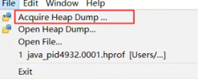

### 分析堆 dump 文件

**histogram**

展示了各个类的实例数目以及这些实例的 Shallow Heap 或 Retained Heap 的总和。

MAT 的直方图和 jmap 的 -histo 子命令一样，都能够展示各个类的实例数目以及这些实例的 Shallow Heap 总和。但是，MAT 的直方图还能够计算 Retained Heap，并支持基于实例数目或 Retained Heap 的排序方式（默认为 Shallow Heap）。

此外，MAT 还可以将直方图中的类按照超类、类加载器或者包名分组。

当选中某个类时，MAT 界面左上角的 Inspector 窗口将展示该类的 Class 实例的相关信息，如类加载器等。

**Thread Overview**

- 查看系统中的 Java 线程
- 查看局部变量的信息

**获得对象相互引用的关系**

- with outgoing references
- with incoming references

**浅堆与深堆**

- Shallow Heap

    浅堆（Shallow Heap）是指一个对象所消耗的内存。在 32 位系统中，一个对象引用会占据 4 个字节，一个 int 类型会占据 4 个字节，long 型变量会占据 8 个字节，每个对象头需要占用 8 个字节。根据堆快照格式不同，对象的大小可能会向 8 字节进行对齐。 

    以 String 为例：2 个 int 值共占 8 字节，对象引用占用 4 字节，对象头 8 字节，合计 20 字节，向 8 字节对齐，故占 24 字节。（JDK 7 中）

    这 24 字节为 String 对象的浅堆大小。它与 String 的 value 实际取值无关，无论字符串长度如何，浅堆大小始终是 24 字节。

- Retained Heap

    保留集（Retained Set）：

    对象 A 的保留集指当对象 A 被垃圾回收后，可以被释放的所有对象集合（包括对象 A 本身），即对象 A 的保留集可以被认为是只能通过对象 A 被直接或间接访问到的所有对象的集合。通俗地说，就是指仅被对象 A 所持有的对象的集合。

    深堆（Retained Heap）：

    深堆是指对象的保留集中所有的对象的浅堆大小之和。

    注意：浅堆指对象本身占用的内存，不包括其内部引用对象的大小。一个对象的深堆指只能通过该对象访问到的（直接或间接）所有对象的浅堆之和，即对象被回收后，可以释放的真实空间。

- 对象实际大小

    另外一个常用的概念是对象的实际大小。这里，对象的实际大小定义为一个对象所能触及的所有对象的浅堆大小之和，也就是通常意义上我们说的对象大小。与深堆相比，似乎这个在日常开发中更为直观和被人接受。但实际上，这个概念和垃圾回收无关。

    下图显示了一个简单的对象引用关系图，对象 A 引用了 C 和 D，对象 B 引用了 C 和 E。那么对象 A 的浅堆大小只是 A 本身，不含 C 和 D，而 A 的实际大小为A、C、D 三者之和。而 A 的深堆大小为 A 与 D 之和，由于对象 C 还可以通过对象 B 访问到，因此不在对象 A 的深堆范围内。

    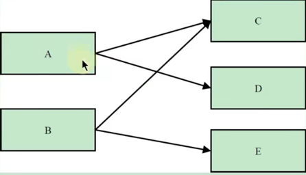

- 练习

    看图理解 Retained Size

    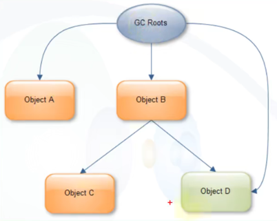

    上图中，GC Roots 直接引用了 A 和 B 两个对象。

    A 对象的 Retained Size=A 对象的 Shallow Size

    B 对象的 Retained Size=B 对象的 Shallow Size + C 对象的 Shallow Size

    这里不包括 D 对象，因为 D 对象被 GC Roots 直接引用。

- 支配树（Dominator Tree）

    支配树的概念源自图论。

    MAT 提供了一个称为支配树（Dominator Tree）的对象图。支配树体现了对象实例间的支配关系。在对象引用图中，所有指向对象 B 的路径都经过对象 A，则认为对象 A 支配对象 B。如果对象 A 是离对象 B 最近的一个支配对象，则认为对象 A 为对象 B 的直接支配者。支配树是基于对象间的引用图所建立的，它有以下基本性质：

    - 对象 A 的子树（所有被对象 A 支配的对象集合）表示对象 A 的保留集（Retained Set），即深堆。
    - 如果对象 A 支配对象 B，那么对象 A 的直接支配者也支配对象 B。
    - 支配树的边与对象引用图的边不直接对应。

    如下图所示：左图表示对象引用图，右图表示左图所对应的支配树。对象 A 和 B 由根对象直接支配，由于在到对象 C 的路径中，可以经过 A，也可以经过 B，因此对象 C 的直接支配者也是根对象。对象 F 与对象 D 相互引用，因为到对象 F 的所有路径必然经过对象 D，因此，对象 D 是对象 F 的直接支配者。而到对象 D 的所有路径中，必然经过对象 C，即使是从对象 F 到对象 D 的引用，从根节点出发，也是经过对象 C 的，所以，对象 D 的直接支配者为对象 C。

    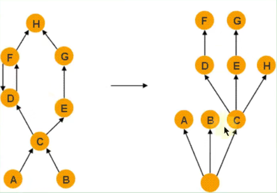

    同理，对象 E 支配对象 G。到达对象 H 的可以通过对象 D，也可以通过对象 E，因此对象 D 和 E 都不能支配对象 H，而经过对象 C 既可以到达 D 也可以到达 E，因此对象 C 为对象 H 的直接支配者。

    在 MAT 中，单击工具栏上的对象支配树按钮，可以打开对象支配树视图。

    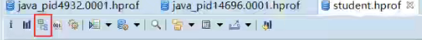

    下图显示了对象支配树视图的一部分。该截图显示部分 Lily 学生的 history 队列的直接支配对象。即当 Lily 对象被回收，也会一并回收的所有对象。显然能被 3 或者 5 整除的网页不会出现在该列表中，因为它们同时被另外两名学生对象引用。

    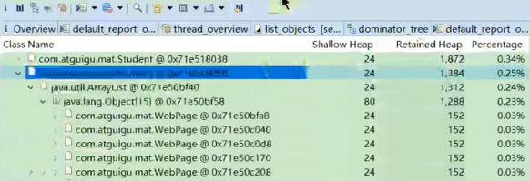

## 再谈内存泄漏

### 内存泄露的理解与分类

**何为内存泄漏（Memory Leak）**

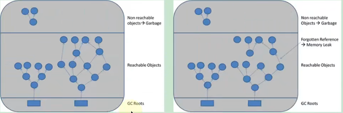

可达性分析算法来判断对象是否是不再使用的对象，本质都是判断一个对象是否还被引用。那么对于这种情况，由于代码的实现不同就会出现很多种内存泄漏问题（让 JVM 误以为此对象还在引用中，无法回收，造成内存泄漏）。

**内存泄漏（Memory Leak）的理解**

严格来说，只有对象不会再被程序用到了，但是 GC 又不能回收他们的情况，才叫内存泄漏。但实际情况很多时候一些不太好的实践（或疏忽）会导致对象的生命周期变得很长甚至导致 OOM，也可以叫做宽泛意义上的"内存泄漏"。

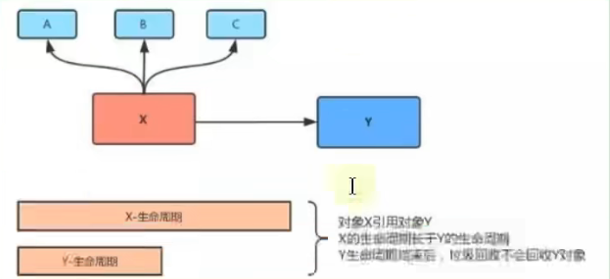

对象 X 引用对象 Y，X 的生命周期比 Y 的生命周期长，那么当 Y 生命周期结束的时候，X 依然引用着 Y，这时候，垃圾回收器是不会回收对象 Y 的；如果对象 X 还引用着生命周期比较短的 A、B、C，对象 A 又引用着对象 A、B、C，这样就可能造成大量无用的对象不能被回收，进而占据了内存资源，造成内存泄漏，直到内存溢出。

**内存泄漏和内存溢出的关系**

1. 内存泄漏（Memory Leak）

    申请了内存用完了不释放，比如一共有 1024M 的内存，分配了 521M 的内存一直不回收，那么可以用的内存只有 521M 了，仿佛泄漏掉了一部分。

2. 内存溢出（Out Of Memory）

    申请内存时，没有足够的内存可以使用。

可见，内存泄漏和内存溢出的关系：内存泄漏的增多，最终会导致内存溢出。

**泄漏的分类**

经常发生：发生内存泄露的代码会被多次执行，每次执行，泄漏一块内存；

偶尔发生：在某些特定情况下才会发生；

一次性：发生内存泄漏的方法只会执行一次；

隐式泄漏：一直占着内存不释放，直到执行结束；严格地说这个不算内存泄漏，因为最终释放掉了，但是如果执行时间特别长，也可能会导致内存耗尽。

### Java 中内存泄漏的 8 种情况

1. 静态集合类

    静态集合类，如 HashMap、LinkedList 等等。如果这些容器为静态的，那么它们的生命周期与 JVM 程序一致，则容器中的对象在程序结束之前将不能被释放，从而造成内存泄漏。简单而言，长生命周期的对象持有短生命周期对象的引用，尽管短生命周期的对象不再使用，但是因为长生命周期对象持有它的引用而导致不能被回收。

    ```java 
    public class MemoryLeak {
        static List list = new ArrayList();
        
        public void comTests() {
            Object obj = new Object();
            list.add(obj);
        }
    }
    ```

2. 单例模式

    单例模式，和静态集合导致内存泄漏的原因类似，因为单例的静态特性，它的生命周期和 JVM 的生命周期一样长，所以如果单例对象如果持有外部对象的引用，那么这个外部独享也不会被回收，那么就会造成内存泄漏。

3. 内部类持有外部类

    内部类持有外部类，如果一个外部类的实例对象的方法返回了一个内部类的实例对象。这个内部类对象被长期引用了，即使那个外部类实例对象不再被使用，但由于内部类持有外部类的实例对象，这个外部类对象将不会被垃圾回收，这也会造成内存泄漏。

4. 各种连接，如数据库连接、网络连接和 IO 连接等

    在对数据库进行操作的过程中，首先需要建立与数据库的连接，当不再使用时，需要调用 close 方法来释放与数据库的连接。只有连接被关闭后，垃圾回收器才会回收对应的对象。

    否则，如果在访问数据库的过程中，对 Connection、Statement 或 ResultSet 不显性地关闭，将会造成大量的对象无法被回收，从而引起内存泄漏。

    ```java
    public static void main(String[] args) {
        try {
            Connection conn = null;
            Class.forName("com.mysql.jdbc.Driver");
            conn = DriverManager.getConnection("url", "", "");
            Statement stmt = conn.createStatement();
            ResultSet rs = stmt.executeQuery("...");
        }catch (Exception e) {
            // 异常日志
        }finally {
            // 1.关闭结果集 Statement
            // 2.关闭声明的对象 ResultSet
            // 3.关闭连接 Connection
        }
    }
    ```

5. 变量不合理的作用域

    变量不合理的作用域。一般而言，一个变量的定义的作用范围大于其使用范围，很有可能会造成内存泄漏。另一方面，如果没有及时地把对象设置为 null，很有可能导致内存泄漏发生。

    ```java
    public class UsingRandom {
        private String msg;
        
        public void receiveMsg() {
            readFromNet(); // 从网络中接受数据保存到 msg 中
            saveDB(); // 把 msg 保存到数据库中
        }
    }
    ```

    如果上面这个伪代码，通过 readFromNet 方法把接受的消息保存在变量 msg 中，然后调用 saveDB 方法把 msg 的内容保存到数据库中，此时 msg 已经就没有用了，由于 msg 的生命周期与对象的生命周期相同，此时 msg 还不能回收，因此造成了内存泄漏。

    实际上这个 msg 变量可以放在 receiveMsg 方法内部，当方法使用完，那么 msg 的生命周期也就结束，此时就可以回收了。还有一种方法，在使用完 msg 后，把 msg 设置为 null，这样垃圾回收器也会回收 msg 的内存空间。

6. 改变哈希值

    改变哈希值，当一个对象被存储进 HashSet 集合中以后，就不能修改这个对象中的那些参与计算哈希值的字段了。

    否则，对象修改后的哈希值与最初存储进 HashSet 集合中时的哈希值就不同了，在这种情况下，即使在 contains 方法使用该对象的当前引用作为的参数去 HashSet 集合中检索对象，也将返回找不到对象的结果，这也会导致无法从 HashSet 集合中单独删除当前对象，造成内存泄漏。

    这也是 String 为什么被设置成了不可变类型，我们可以放心地把 String 存入 HashSet，或者把 String 当做 HashMap 的 key 值。

    当我们想把自己定义的类保存到散列表的时候，需要保证对象的 hashCode 不可改变。

7. 缓存泄露

    内存泄漏的另一个常见来源是缓存，一旦你把对象引用放入到缓存中，它就很容易遗忘。比如：之前项目在一次上线的时候，应用启动奇慢直到夯死，就是因为代码中会加载一个表中的数据到缓存（内存）中，测试环境只有几百条数据，但是生产环境有几百万的数据。

    对于这个问题，可以使用 WeakHashMap 代表缓存，此种 Map 的特点是，当除了自身有对 key 的引用外，此 key 没有其他引用那么此 map 会自动丢弃此值。

8. 监听器和回调

    内存泄漏第三个常见来源是监听器和其他回调，如果客户端在你实现的 API 中注册回调，却没有显示的取消，那么就会积聚。

    需要确保回调立即被当作垃圾回收的最佳方法是只保存它的弱引用，例如将他们保存成为 WeakHashMap 中的键。

### 支持使用 OQL 语言查询对象信息

MAT 支持一种类似于 SQL 的查询语言 OQL（Object Query Language），OQL 使用类 SQL 语法，可以在堆中进行对象的查找和筛选。

**SELECT 子句**

在 MAT 中，SELECT 子句的格式与 SQL 基本一致，用于指定要显示的列，SELECT 子句中可以使用"*"，查看结果对象的引用实例（相当于 outgoing reference）。

```sql
SELECT * FROM java.util.Vector v
```

使用"OBJECTS"关键字，可以将返回结果集中的项以对象的形式显示。

```sql
SELECT objects v.elementData FROM java.util.Vector v
SELECT objects s.value FROM java.lang.String s
```

在 SELECT 子句中，使用"AS RETAINED SET"关键字可以得到所得对象的保留集。

```sql
SELECT AS RETAINED SET * FROM com.atguigu.mat.Student
```

"DISTINCT" 关键字用于在结果集中去除重复对象。

```sql
SELECT DISTINCT OBJECTS classof(s) FROM java.lang.String s
```

**FROM 子句**

FROM 子句用于指定查询范围，它可以指定类名、正则表达式或者对象地址。

```sql
SELECT * FROM java.lang.String s
```

下列使用正则表达式，限定搜索范围，输出所有 com.atguigu 包下所有类的实例

```sql
SELECT * FROM "com\.atguigu\.."
```

也可以直接使用类的地址进行搜索。使用类的地址的好处是可以区分被不同 ClassLoader 加载的同一种类型。

```sql
SELECT * FROM 0x37a0b4d
```

**WHERE 子句**

WHERE 子句用于指定 OQL 的查询条件。OQL 查询将只返回满足 WHERE 子句指定条件的对象。WHERE 子句的格式与传统 SQL 极为相似。

下例返回长度大于 10 的 char 数组。

```sql
SELECT * FROM char[] s WHERE s.lenght > 10
```

下例返回所有 value 域不为 null 的字符串，使用"="操作符。

```sql
SELECT * FROM java.lang.String s WHERE s.value != null 
```

WHERE 子句支持多个条件的 AND、OR 运算。下例返回数组长度大于 15，并且深堆大于 1000 字节的所有 Vector 对象。

```sql
SELECT * FROM java.util.Vector v WHERE v.elementData.@length >15 AND v.@retainedHeapSize > 1000
```

**内置对象与方法**

OQL 中可以访问堆内对象的属性，也可以访问堆内代理对象的属性，访问堆内对象的属性时，格式如下：

`[<alias>.] <field>.<field>.<field>`，其中 alias 为对象名称。

访问 java.io.File 对象的 path 属性，并进一步访问 path 的 value 属性。

```sql
SELECT toString(f.path.value) FROM java.io.File f
```

下例显示了 String 对象的内容、objectId 和 objectAddress：

```sql
SELECT s.toString(), s.@objectId, s.@objectAddress FROM java.lang.String s
```

下例显示了 java.util.Vector 内部数组的长度：

```sql
SELECT v.elementData.@length FROM java.util.Vector v
```

下例显示了所有的 java.util.Vector 对象及其子类型：

```sql
SELECT * FROM INSTANCEOF java.util.Vector
```

## JProfiler

### 基本概述

**介绍**

在运行 Java 的时候有时候想测试运行时占用内存情况，这时候就需要使用测试工具查看了。在 Eclipse 里面有 Eclipse Memory Analyzer Tool（MAT）插件可以测试，而在 IDEA 中也有这么一个插件，就是 JProfiler。

JProfiler 是由 ej-technologies 公司开发的一款 Java 应用性能诊断工具。功能强大，但是收费。

官网下载地址：https://www.ej-technologies.com/products/jprofiler/overview.html

**特点**

- 使用方便、界面操作友好（简单且强大）
- 对被分析的应用影响小（提供模板）
- CPU、Thread、Memory 分析功能尤其强大
- 支持对 JDBC、NoSQL、JSP、Servlet、Socket 等进行分析
- 支持多种模式（离线、在线）的分析
- 支持监控本地、远程的 JVM
- 跨平台，拥有多种操作系统的安装版本

**主要功能**

1. 方法调用：对方法调用的分析可以帮助您了解应用程序正在做什么，并找到提高其性能的方法。
2. 内存分配：通过分析堆上对象、引用链和垃圾收集能帮您修复内存泄漏问题，优化内存使用。
3. 线程和锁：JProfiler 提供多种针对线程和锁的分析视图助您发现多线程问题。
4. 高级子系统：许多性能问题都发生在更高的语义级别上。例如，对于 JDBC 调用，您可能希望找出执行最慢的 SQL 语句。JProfiler 支持对这些子系统进行集成分析。

### 安装与配置

**下载与安装**

下载地址：https://www.ej-technologies.com/download/jprofiler/version_100

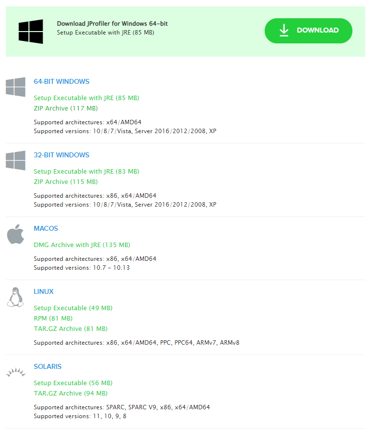

### 具体使用

**数据采集方式**

JProfiler 数据采集方式分为两种：Sampling（样本采集）和 Instrumentation（重构模式）

- Instrumentation：这是 JProfiler 全功能模式，在 class 加载之前，JProfiler 把相关功能代码写入到需要分析的 class 的 bytecode 中，对正在运行的 JVM 有一定影响。
    - 优点：功能强大。在此设置中，调用堆栈信息是准确的。
    - 缺点：若要分析的 class 较多，则对应用的性能影响较大，CPU 开销可能很高（取决于 Filter 的控制）。因此使用此模式一般配合 Filter 使用，只对特定的类或包进行分析。
- Sampling：类似于样本统计，每隔一定时间（5ms）将每个线程栈中方法栈中的信息统计出来。
    - 优点：对 CPU 的开销非常低，对应用影响小（即使你不配置任何 FIlter）。
    - 缺点：一些数据、特性不能提供（例如：方法的调用次数、执行时间）。

注意：JProfiler 本身没有指出数据的采集类型，这里的采集类型是针对方法调用的采集类型。因为 JProfiler 的绝大多数核心功能都依赖方法调用采集的数据，所以可以直接认为是 JProfiler 的数据采集类型。

**遥感监测 Telemetries**

**内存视图 Live Memory**

Live Memory 内存剖析：class/class instance 的相关信息。例如对象的个数、大小、对象创建的方法执行栈，对象创建的热点。

- 所有对象 All Objects

    显示所有加载的类的列表和在堆上分配的实例数。只有 Java 1.5（JVMTI）才会显示此视图。

    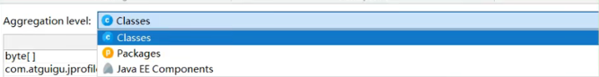

- 记录对象 Record Objects

    查看特定时间段对象的分配，并记录分配的调用堆栈。

- 分配访问树 Allocation Call Tree

    显示一棵请求树或者方法、类、包或对已选择类有带注释的分配信息的 J2EE 组件。

- 分配热点 Allocation Hot Spots

    显示一个列表，包括方法、类、包或分配已选类的 J2EE 组件。你可以标注当前值并且显示差异值。对于每个热点都可以显示它的跟踪记录树。

- 类追踪器 Class Tracker

    类跟踪视图可以包含任意数量的图表，显示选定的类和包的实例与时间。

> 分析：内存中的对象的情况。
>
> - 频繁创建的 Java 对象：死循环、循环次数过多。
> - 存在大的对象：读取文件时，byte[] 应该边读边写。如果长时间不写出的话，导致 byte[] 过大。
> - 存在内存泄漏。

**CPU 视图 CPU Views**

JProfiler 提供不同的方法来记录访问树以优化性能和细节。线程或者线程组以及线程状况可以被所有的视图选择。所有的视图都可以聚集到方法、类、包或 J2EE 组件等不同层上。

- 访问树 Call Tree

    显示一个积累的自顶向下的树，树中包含所有在 JVM 中已记录的访问队列。JDBC、JMS 和 JNDI 服务请求都被注释在请求树中。请求树可以根据 Servlet 和 JSP 对 URL 的不同需要进行拆分。

- 热点 Hot Spots

    显示消耗时间最多的方法的列表。对每个热点都能够显示回溯树。该热点可以按照方法请求，JDBC、JMS 和 JNDI 服务请求以及按照 URL 请求来进行计算。

- 访问图 Call Graph

    显示一个从已选方法、类、包或 J2EE 组件开始的访问队列的图。

- 方法统计 Method Statistics

    显示一段时间内记录的方法的调用时间细节。

**线程视图 Threads**

JProfiler 通过对线程历史的监控判断其运行状态，并监控是否有线程阻塞产生，还能将一个线程所管理的方法以树状形式呈现，对线程剖析。

- 线程历史 Thread History

    显示一个与线程活动和线程状态在一起的活动时间表。

- 线程监控 Thread Monitor

    显示一个列表，包括所有的活动线程以及它们目前的活动状况。

- 线程转储 Thread Dumps

    显示所有线程的堆栈跟踪。

线程分析主要关系三个方面：

1. Web 容器的线程最大数。比如：Tomcat 的线程容量应该略大于最大并发数。
2. 线程阻塞。
3. 线程死锁。

**监视器&锁 Monitors&Locks**

监控和锁 Monitors&Locks 所有线程持有锁 的情况以及锁的信息。

观察 JVM 的内部线程并查看状态：

- 死锁探测图表 Current Locking Graph：显示 JVM 中的当前死锁图表。
- 目前使用的监测器 Current Monitors：显示目前使用的监测器并且包括它们的关联线程。
- 锁定历史图表 Locking History Graph：显示记录在 JVM 中的锁定历史。
- 历史检测记录 Monitor History：显示重大的等待时间和阻塞时间的历史记录。
- 监控器使用统计 Monitor Usage Statistics：显示分组监测、线程和监测类的统计检测数据。

## Arthas

### 基本概述

**背景**

前面，我们介绍了 JDK 自带的 jVisual VM 等免费工具，以及商业化工具 JProfiler。这两款工具在业界知名度也比较高，它们的优点是可以图形界面上看到各维度的性能数据，使用者根据这些数据进行综合分析，然后判断哪里出现了性能问题。

但是这两款软件也有个缺点，都必须在服务端项目进程中配置相关的监控参数。然后工具通过远程连接到项目进程，获取相关的数据。这样就会带来一些不便，比如线上环境的网络是隔离的，本地的监控工具根部连不上线上环境。并且类似于 JProfiler 这样的商业工具，是需要付费的。

那么有没有一款工具不需要远程连接，也不需要配置监控参数，同时也提供了丰富的性能监控数据呢？阿里巴巴开源性能分析神器 Arthas（阿尔萨斯）。

**概述**

Arthas（阿尔萨斯）是 Alibaba 开源的 Java 诊断工具，深受开发者喜爱。在线排查问题，无需重启，动态跟踪 Java 代码，实时监控 JVM 状态。

Arthas 支持 JDK 6+，支持 Linux/Mac/Windows，采用命令行交互模式，同时提供丰富的 Tab 自动补全功能，进一步方便进行问题的定位和诊断。

当你遇到以下类似问题而束手无策时，Arthas 可以帮助你解决：

- 这个类从哪个 jar 包加载的？为什么会报各种类相关的 Exception？
- 我改的代码为什么没有执行到？难道是我没 commit？分支搞错了？
- 遇到问题无法在线上 debug，难道只能通过加日志再重新发布吗？
- 线上遇到某个用户的数据处理有问题，但线上同样无法 debug，线下无法重现！
- 是否有一个全局视角来查看系统的运行状况？
- 有什么办法可以监控到 JVM 的实时运行状态？
- 怎么快速定位应用的热点，生成火焰图？

**基于哪些工具开发而来**

- greys-anatomy：Arthas 代码基于 Greys 二次开发而来，非常感谢 Greys 之前所有的工作，以及 Greys 原作者对 Arthas 提出的意见和建议！
- termd：Arthas 的命令行实现基于 termd 开发，是一款优秀的命令行程序开发框架，感谢 termd 提供了优秀的框架。
- crash：Arthas 的文本渲染功能基于 crash 中的文本渲染功能开发，感谢 crash 在这方面所做的优秀工作。
- cli：Arthas 的命令行界面基于 vert.x 提供的 cli 库进行开发，感谢 vert.x 在这方面做的优秀工作。
- compiler：Arthas 里的内存编译器代码来源。
- Apache Commons Net：Arthas 里的 Telnet Client 代码来源。
- JavaAgent：运行在 main 方法之前的拦截器，它内定的方法名叫 premain，也就是说先执行 premain 方法然后再执行 main 方法。
- ASM：一个通用的 Java 字节码操作和分析框架。它可以用于修改现有的类或直接以二进制形式动态生成类。ASM 提供了一些常见的字节码转换和分析算法，可以从它们构建定制的复杂转换和代码分析工具。ASM 提供了与其他 Java 字节码框架类似的功能，但是主要关注性能。因为它被设计和实现得尽可能小和快，所以非常适合在动态系统中使用（当然也可以以静态方式使用，例如在编译器中）。

**官方使用文档：https://arthas.aliyun.com/zh-cn/**

### 安装与使用

**安装**

安装方式一：可以直接在 Linux 上通过命令下载。可以咋官方 GitHub 上进行下载，如果速度较慢，可以尝试国内的码云 Gitee 下载。

- GitHub 下载：`wget https://alibaba.github.io/arthas-boot.jar`
- Gitee 下载：`wget https://arthas.gitee.io/arthas-boot.jar`

安装方式二：也可以在浏览器直接访问 https://alibaba.github.io/arthas/arthas-boot.jar，等待下载成功后，上传到 Linux 服务器上。

卸载：若在 Linux/Unix/Mac 平台，删除下面的文件：

```shell
rm -rf ~/.arthas/
rm -rf ~/logs/arthas
```

Windows 平台直接删除 user home 下面的 .arthas 和 logs/arthas 目录。

**工程目录**

```
arthas-agent：基于 JavaAgent 技术的代理
bin：一些启动脚本
arthas-boot：Java 版本的一键安装启动脚本
arthas-client：Telnet Client 代码
arthas-common：一些公用的工具类和枚举类
arthas-core：核心库，各种 Arthas 命令的交互和实现
arthas-demo：示例代码
arthas-memorycompiler：内存编译器代码，Fork From：https://github.com/skalogs/SkaETL/tree/master/compiler
arthas-packaing：Maven 打包相关
arthas-site：Arthas 站点
arthas-spy：编织到目标类中的各个切面
static：静态资源
arthas-testcase：测试
```

**启动**

Arthas 只是一个 Java 程序，所以可以直接使用 java -jar 运行。

执行成功后，Arthas 提供了一种命令行方式的交互方式，Arthas 会检测当前服务器上的 Java 进程，并将进程列表展示出来，用户输入对应的编号（1、2、3、4……）进行选择，然后回车。

```
方式 1：
java -jar arthas-boot.jar

# 选择进程（输入[]内编号（不是 PID）回车）
[INFO] arthas-boot version:3.1.4
[INFO] Found existing java process, please choose one and hit RETURN.
* [1]:11616 com.Arthas
  [2]:8676
  [3]:16200 org.jetbrains.jps.cmdline.Launcher
  [4]:21032 org.jetbrains.idea.maven.server.RemoteMavenServer
方式 2：运行时选择 Java 进程 PID
java -jar arthas-boot.jar [PID]
```

**查看日志：cat ~/logs/arthas/arthas.log**

**查看帮助：java -jar arthas-boot.jar -h**

**Web Console**

除了在命令行查看外，Arthas 目前还支持 Web Console。在成功启动连接进程之后就已经自动启动，可以直接访问 http://127.0.0.1:8563/ 访问，页面上的操作模式和控制台完全一样。

**退出**

最后一行 `[arthas@7457]$`，说明打开进入了监控客户端，在这里就可以执行相关命令进行查看了。

- 使用 quit\exit：退出当前客户端。
- 使用 stop\shutdown：关闭 Arthas 服务端，并退出所有客户端。

### 相关诊断指令

**基础指令**

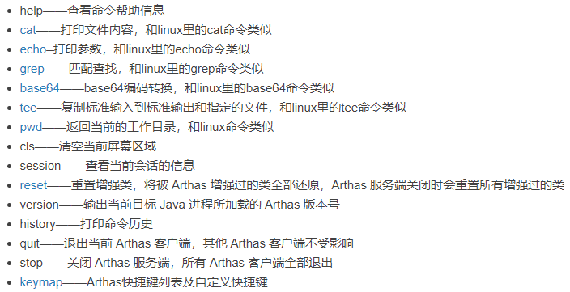

**JVM 相关**

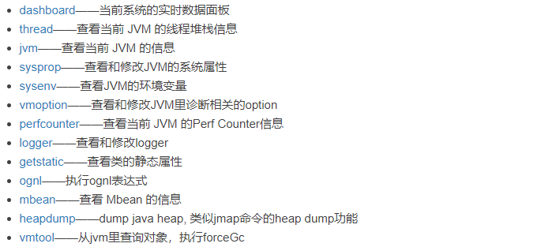

**class/classloader 相关**

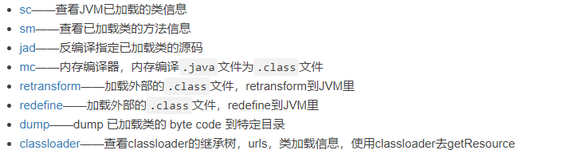

**monitory/watch/trace 相关**

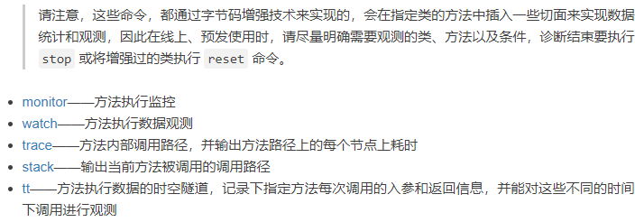

**其它**

使用 > 将结果重写到日志文件，使用 & 指令命令是后台运行，session 断开不影响任务执行（生命周期默认为 1 天）。

jobs：列出所有 job。

kill：强制终止任务。

fg：将暂停的任务拉到前台执行。

bg：将暂停的任务放到后台执行。

grep：搜索满足条件的结果。

plaintext：将命令的结果去除 ANSI 颜色。

wc：按行统计输出结果。

options：查看或设置 Arthas 全局开关。

profiler：使用 async-profiler 对应用采样，生成火焰图。

## Java Mission Control

### 历史

在 Oracle 收购 Sun 之前，Oracle 的 JRockit 虚拟机提供了一款叫做 JRockit Mission Control 的虚拟机诊断工具。

在 Oracle 收购 Sun 之后，Oracle 公司同时拥有了 Sun HotSpot 和 JRockit 两款虚拟机。根据 Oracle 对于 Java 的战略，在今后的发展中，会将 JRockit 的优秀特性移植到 HotSpot 上。其中，一个重要的改进就是在 Sun 的 JDK 中加入了 JRockit 的支持。

在 Oracle JDK 7u40 之后，Mission Control 这款工具已经绑定在 Oracle JDK 中发布。

自 Java 11 开始，本节介绍的 JFR 已经开源。但在之前的 Java 版本，JFR 属于 Commercial Feature，需要通过 Java 虚拟机参数 `-XX:+UnlockCommercialFeatures`开启。

如果有兴趣可以查看 OpenJDK 的 Mission Control 项目：https://github.com/JDKMissionControl/jmc

### 启动

Mission Control 位于 `%JAVA_HOME/bin/jmc.exe`，双击即可运行。

### 概述

Java Mission Control（简称 JMC），Java 官方提供的性能强劲的工具。是一个用于对  Java 应用程序进行管理、监视、概要分析和故常排除的工具套件。

它包含一个 GUI 客户端，以及众多用来收集 Java 虚拟机性能数据的插件，如 JMX Console（能够访问用来存放虚拟机各个子系统运行数据的 MXBeans），以及虚拟机内置的高效 profiling 工具 Java Flight Recorder（JFR）。

JMC 的另一个优点就是：采用取样，而不是传统的代码植入技术，对应用性能的影响非常非常小，完全可以开着 JMC 来做压测（唯一影响可能是 Full GC 多了）。

### 功能：实时监控 JVM 运行时的状态

如果是远程服务器，使用前要开 JMX。

```
-Dcom.sun.management.jmxremote.port=${YOUR PORT}
-Dcom.sun.management.jmxremote
-Dcom.sun.management.jmxremote.authenticate=false
-Dcom.sun.management.jmxremote.ssl=false
-Djava.rmi.server.hostname=${YOUR HOST/IP}

文件-->连接-->创建新连接，填入上面 JMX 参数的 host 和 port
```

### Java Flight Recorder

**事件类型**

当启用时，JFR 将记录运行过程中发生的一系列事件。其中包括 Java 层面的事件，如线程事件、锁事件，以及 Java 虚拟机内部的事件，如新建对象、垃圾回收和即时编译事件。

按照发生时机以及持续时间来划分，JFR 的事件共有四种类型，它们分别为以下四种。

1. 瞬时事件（Instant Event），用户关心的是它们发生与否，例如异常、线程启动事件。
2. 持续事件（Duration Event），用户关心的是它们的持续时间，例如垃圾回收事件。
3. 计时事件（Timed Event），是时长超出指定阈值的持续事件。
4. 取样事件（Sample Event），是周期性取样的事件。

取样事件的其中一个常见例子便是方法抽样（Method Sampling），即每隔一段时间统计各个线程的栈轨迹。如果在这些抽样取得的栈轨迹中存在一个反复出现的方法，那么我们可以推测该方法是热点方法。

**启动方式**

- 方式 1：使用 `-XX:StartFlightRecording=参数`

    第一种是在运行目标 Java 程序时添加 `-XX:StartFlightRecording=参数`。

    比如：下面命令中，JFR 将会在 Java 虚拟机启动 5s 后（对应 delay=5s）收集数据，持续 20s（对应 duration=20s）。当收集完毕后，JFR 会将收集得到的数据保存至指定的文件中（对应 filename=myrecording.jfr）。

    ```shell
    java -XX:StartFilghtRecording=delay=5s,duration=20s,filname=myrecording.jfr,settings=profile MyApp
    ```

    由于 JFR 将持续收集数据，如果不加以限制，那么 JFR 可能会填满硬盘的所有空间。因此，我们有必要对这种模式下所收集的数据进行限制。

    ```shell
    java -XX:StartFilghtRecording=maxage=10m,maxsiez=100m,name=SomeLabel MyApp
    ```

- 方式 2：使用 jcmd 的 JFR.* 子命令

    通过 jcmd 来让 JFR 开始收集数据、停止收集数据，或者保存所收集的数据，对应的子命令分别为 JFR.start、JFR.stop，以及 JFR.dump。

    ```shell
    $ jcmd <PID> JFR.start settings=profile maxage=10m maxsize=150m name=SomeLabel
    ```

    上述命令运行之后，目标进程中的 JFR 已经开始收集数据。此时，我们可以通过下述命令来导出已经收集到的数据：

    ```shell
    $ jcmd <PID> JFR.dump name=SomeLabel filename=myrecording.jfr
    ```

    最后，我们可以通过下述命令关闭目标进程中的 JFR：

    ```shell
    $ jcmd <PID> JFR.stop name=SomeLabel
    ```

- 方式 3：JMC 的 JFR 插件

    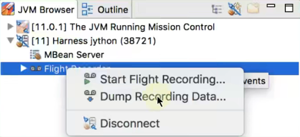

**Java Flight Recorder 取样分析**

要采用取样，必须先添加参数：

- `-XX:+UnlockCommercialFeatures`
- `-XX:+FlightRecorder`

取样时间默认 1 分钟，可自行按需调整，事件设置选为 profiling，然后可以设置取样 profile 信息，例如：

- 加上对象数量的统计：Java Virtual Machine -> GC -> Detailed -> Object Count/Object Count after GC。
- 方法调用采样的间隔从 10ms 改为 1ms（但不能低于 1ms，否则会影响性能了）：Java Virtual Machine -> Profiling -> Method Profiling Sample/Method Sampling Information。
- Socket 与 File 采样，10ms 太久，但即使改为 1ms 也未必能抓住什么，可以干脆取消掉：Java Application -> File Read/FileWrite/Socket Read/Socket Write。

然后就开始 Profile，到时间后 Profile 结束，会自动把记录下载回来，在 JMC 中展示。

## 其他工具

### Flame Graphs（火焰图）

在追求极致性能的场景下，了解你的程序运行过程中 CPU 在干什么很重要，火焰图就是一种非常直观的展示 CPU 在整个生命周期过程中时间分配的工具。

火焰图对于现代的程序员不应该陌生，这个工具可以非常直观的显示出调用栈中的 CPU 消耗瓶颈。

网上的关于 Java 火焰图的讲解大部分来自于 Brendan Gregg 的博客：http://www.brendangregg.com/flamegraphs.html

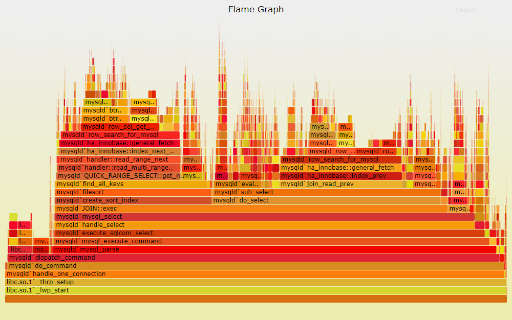

火焰图，简单通过 x 轴横条宽度来度量时间指标，y 轴代表线程栈的层次。

### Tprofiler

- 案例

    使用 JDK 自身提供的工具进行 JVM 调优可以将 TPS 由 2.5 提升到 20（提升了 7 倍），并准确定位系统瓶颈。

    系统瓶颈有：应用里静态对象不是太多、有大量的业务线程在频繁创建一些生命周期很长的临时对象，代码里有问题。

    那么，如何在海量业务代码里边准确定位这些性能代码？这里使用阿里开源工具 TProfiler 来定位这些性能代码，成功解决掉了 GC 过于频繁的性能瓶颈，并最终在上次优化的基础上将 TPS 再提升了 4 倍，即提升到 100。

- TProfiler 配置部署、远程操作、日志阅读都不太复杂，操作还是很简单的。但是其却是能够起到一针见血、立竿见影的效果，帮我们解决了 GC 过于频繁的性能瓶颈。

- TProfiler 最重要的特性就是能够统计出你指定时间段内 JVM 的 top method，这些 top method 极有可能就是造成你 JVM 性能瓶颈的元凶。这是其他大多数 JVM 调优工具所不具备的，包括 JRockit Mission Control。JRockit 首席开发者 Marcus Hirt 在其私人博客《Low Overhead Method Profiling with Java Mission Control》下的评论中曾明确指出 JRMC 并不支持 TOP 方法的统计。

- TProfiler 的下载

    https://github.com/alibaba/TProfiler

### BTrace——Java 运行时追踪工具

常见的动态追踪工具有 BTrace、HouseMD（该项目已经停止开发）、Greys-Anatomy（国人开发，个人开发者）、Byteman（JBoss 出品），注意 Java 运行时追踪工具并不限于这几种，但是这几个是相对比较常用的。

BTrace 是 Sun Kenai 云计算开发平台下的一个开源项目，旨在为 Java 提供安全可靠的动态跟踪分析工具。先看一下 BTrace 的官方定义：

> BTrace is a safe, dynamic tracing tool for the Java platform. BTrace can be used to dynamically trace a running Java program(similar to DTrace for OpenSolaris applications and OS). BTrace dynamically instruments the classes of the target application to inject tracing code("bytecode tracing").

简洁明了，大意是一个 Java 平台的安全的动态追踪工具。可以用来动态地追踪一个运行的 Java 程序。BTrace 动态调整目标应用程序的类以注入追踪代码（"字节码跟踪"）。