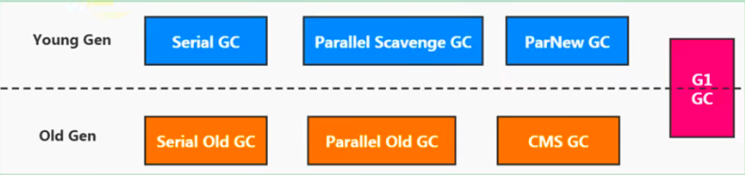
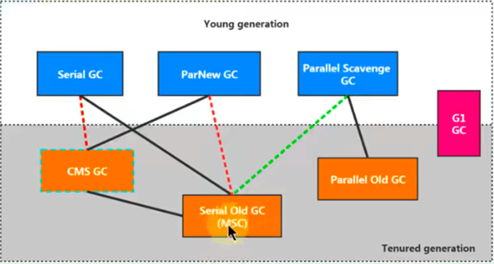

# JVM运行时参数

## JVM 参数选项类型

### 类型一：标准参数选项

**特点**

比较稳定，后续版本基本不会变化，以`-`开头。

**各种选项**

运行 Java 或者 `java -help` 可以看到所有的标准选项。

**补充内容：-server 与 -client**

HotSpot JVM 有两种模式，分别是 server 和 client，分别通过 -server 和 -client 模式设置：

1. 在 32 位 Windows 系统上，默认使用 Client 类型的 JVM。要想使用 Server 模式，则机器配置至少有 2 个以上的 CPU 和 2G 以上的物理内存。Client 模式适用于对内存要求较小的桌面应用程序，默认使用 Serial 串行垃圾收集器。
2. 64 位机器上只支持 Server 模式的 JVM，适用于需要大内存的应用程序，默认使用并行垃圾收集器。

关于 Server 和 Client 的官网介绍为：https://docs.oracle.com/javase/8/docs/techontes/guides/vm/server-class.html

### 类型二：-X 参数选项

**特点**

非标准化参数，功能比较稳定，以 `-X` 开头。

**各种选项**

运行 `java -X` 命令可以看到所有的 X 选项。

```
-Xmixed								混合模式执行（默认）
-Xint								仅解释模式执行
-Xcomp								仅采用即时编译器模式
-Xbootclasspath:<用;分隔的目录和 zip/jar 文件>	设置搜索路径以引导类和资源
-Xbootclasspath/a:<用;分隔的目录和 zip/jar 文件>	附加在引导类路径末尾
-Xbootclasspath/p:<用;分隔的目录和 zip/jar 文件>	置于引导类路径之前
-Xdiag								显示附加诊断消息
-Xnoclassgc							禁用类垃圾收集
-Xincgc								启用增量垃圾收集
-Xloggc:<file>						将 GC 状态记录在文件中（带时间戳）
-Xbatch								禁用后台编译
-Xms<size>							设置初始 Java 堆大小
-Xmx<size>							设置最大 Java 堆大小
-Xss<size>							设置 Java 线程堆栈大小
-Xprof								输出 CPU 配置文件数据
-Xfuture							启用最严格的检查，预期将来的默认值
-Xrs								减少 Java/VM 对操作系统信号的使用
-Xcheck:jni							对 JNI 函数执行其他检查
-Xshare:off							不尝试使用共享类数据
-Xshare:auto						在可能的情况下使用共享类数据（默认）
-Xshare:on							要求使用共享类数据，否则将失败
-XshowSettings						显示所有设置并继续
-XshowSettings:all					显示所有设置并继续
-XshowSettings:vm					显示所有与 VM 相关的设置并继续
-XshowSettings:properties			显示所有属性设置并继续
-XshowSettings:locale				显示所有与区域设置相关的设置并继续
```

**JVM 的 JIT 编译模式相关的选项**

- `-Xint`：禁用 JIT，所有字节码都被解释执行，这个模式的速度是最慢的。
- `-Xcomp`：所有字节码第一次使用就都被编译成本地代码，然后再执行。
- `-Xmixed`：混合模式，默认模式，让 JIT 根据程序运行的情况，有选择地将某些代码编译成本地代码

**特别地**

-Xmx -Xms -Xss 属于 XX 参数？

- `-Xms<size>`：设置初始 Java 堆大小，等价于 `-XX:InitialHeapSize`。
- `-Xmx<size>`：设置最大 Java 堆大小，等价于 `-XX:MaxHeapSize`。
- `-Xss<size>`：设置 Java 线程堆栈大小，`-XX:ThreadStackSize`。

### 类型三：-XX 参数选项

**特点**

- 非标准化参数
- 使用的最多的参数类型
- 实验性选项
- 以 `-XX` 开头

**作用**

用于开发和调试 JVM。

**分类**

- Boolean 类型格式
  - `-XX:+<option>` 表示启用 option 属性。
  
  - `-XX:- <option>` 表示禁用 option 属性。
  
  - 说明：因为有的指令默认是开启的，所以可以使用 `-` 关闭。
  
      >   `-XX:+UseParallelGC` 选择垃圾收集器为并行收集器
      >
      >   `-XX:+UseG1GC` 表示启用 G1 收集器
      >
      >   `-XX:+UseAdaptiveSizePolicy` 自动选择年轻代区大小和相应的 Survivor 区比例
  
- 非 Boolean 类型模式（key-value 类型）
  - 子类型 1：数值型格式 `-XX:<option>=<number>`。
  
      >   number 表示数值，number 可以带上单位，比如：'m'、'M' 表示兆，'k'、'K' 表示 Kb，'g'、'G' 表示 g
      >
      >   例如：
      >
      >   `-XX:NewSize=1024m`：表示设置新生代初始大小为 1024M。
      >
      >   `-XX:MaxGCPauseMillis=500`：表示设置 GC 停顿时间：500 毫秒。
      >
      >   `-XX:GCTimeRatio=19`：表示设置吞吐量。
      >
      >   `-XX:NewRatio=2`：表示新生代与老年代的比例。
  
  - 子类型 2：非数值型格式 `-XX:<name>=<string>`。
  
      >   `-XX:HeapDumpPath=/usr/local/heapdump.hprof`：用来指定 Heap 转存文件的存储路径。

**特别地**

- `-XX:+PrintFlagsFinal`
  - 输出所有参数的名称和默认值。
  - 默认不包括 Diagnostic 和 Experimental 的参数。
  - 可以配合 `-XX:+UnlockDiagnosticVMOptions` 和 `-XX:UnlockExperimentalVMOptions` 使用。

## 添加 JVM 参数选项

### Eclipse

### IDEA

### 运行 jar 包

`java -Xms50m -Xmx50m -XX:+PrintGCDetails -XX:+PrintGCTimeStamps -jar demo.jar`

### 通过 Tomcat 运行 war 包

- Linux 系统下可以在 tomcat/bin/catalina.sh 中添加类似如下配置： JAVA_OPTS="-Xms512M -Xmx1024M"。
- Windows 系统下在 catalina.bat 中添加类似如下配置： set "JAVA_OPTS=Xms512M -Xmx1024M"。

### 程序运行过程中

- 使用 jinfo -flag <name>=<value> <pid> 设置非 Boolean 类型参数。
- 使用 jinfo -flag [+ | -] <name> <pid> 设置 Boolean 类型参数。

## 常用的 JVM 参数选项

### 打印设置的 XX 选项及值

- `-XX:+PrintCommandLineFlags`：可以让在程序运行前打印出用户手动设置或者 JVM 自动设置的 XX 选项。
- `-XX:+PrintFlagsInitial`：表示打印所有 XX 选项的默认值。
- `-XX:+PrintFlagsFinal`：表示打印出 XX 选项在运行程序时生效的值。
- `-XX:+PrintVMOptions`：打印 JVM 的参数。

### 堆、栈、方法区等内存大小设置

栈：

- `-Xss128k`
  - 设置每个线程的栈大小为 128k。
  - 等价于 `-XX:ThreadStackSize=128k`。

堆内存：

- `-Xms3550m`：等价于 `-XX:InitialHeapSize`，设置 JVM 初始堆内存为 3550M。
- `-Xmx3550m`：等价于 `-XX:MaxHeapSize`，设置 JVM 最大堆内存为 3550M。
- `-Xmn2g`
  - 设置年轻代大小为 2G。
  - 官方推荐配置为整个堆大小的 3/8。
- `-XX:NewSize=1024m`：设置年轻代初始值为 1024M。
- `-XX:MaxNewSize=1024m`：设置年轻代最大值为 1024M。
- `-XX:SurvivorRatio=8`：设置年轻代中 Eden 区与一个 Survivor 区的比值，默认为 8。
- `-XX:+UseAdaptiveSizePolicy`：自动选择各区大小比例。
- `-XX:NewRatio=4`：设置老年代与年轻代（包括 1 个 Eden 和 2 个 Survivor 区）的比值。
- `-XX:PretenureSizeThreadshold=1024`
  - 设置让大于此阈值的对象直接分配在老年代，单位为字节。
  - 只对 Serial、ParNew 收集器有效。
- `-XX:MaxTenuringThreshold=15`
  - 默认值为 15。
  - 新生代每次 MinorGC 后，还存活的对象年龄 +1，当对象的年龄大于设置的这个值时就进入老年代。
- `-XX:+PrintTenuringDistribution`：让 JVM 在每次 MinorGC 后打印出当前使用的 Survivor 中对象的年龄分布。
- `-XX:TargetSurvivoRatio`：表示 MinorGC 结束后 Survivor 区域中占用空间的期望比例。

方法区：

- 永久代：
  - `-XX:PermSize=256m`：设置永久代初始值为 256M。
  - `-XX:MaxPermSize=256m`：设置永久代最大值为 256M。
- 元空间：
  - `-XX:MetaspaceSize`：初始空间大小。
  - `-XX:MaxMetaspaceSize`：最大空间，默认没有限制。
  - `-XX:+UseCompressedOops`：压缩对象指针。
  - `-XX:CompressedClassSpaceSize`：设置 Class Metaspace 的大小，默认 1G。

直接内存：

- `-XX:MaxDirectMemorySize`：指定 DirectMemory 容量，若未指定，则默认与 Java 堆最大值一样。

### OutOfMemory 相关的选项

- `-XX:+HeapDumpOnOutOfMemoryError`：表示在内存出现 OOM 的时候，把 Heap 转存（Dump）到文件以便后续分析。
- `-XX:+HeapDumpBeforeFullGC`：表示在出现 FullGC 之前，生成 Heap 转储文件。
- `-XX:HeapDumpPath=<path>`：指定 Heap 转存文件的存储路径。
- `-XX:OnOutOfMemoryError`：指定一个可行性程序或者脚本的路径，当发生 OOM 的时候，去执行这个脚本。

    > 对 OnOutOfMemoryError 的运维处理
    >
    > 以部署在 Linux 系统 /opt/Server 目录下的 Server.jar 为例
    >
    > 1. 在 run.sh 启动脚本添加 JVM 参数：`-XX:OnOutOfMemoryError=/opt/Server/restart.sh`
    > 2. restart.sh 脚本
    >
    > Linux 环境：
    >
    > ```shell
    > #!/bin/bash
    > pid=${ps -ef | grep Server.jar | awk '{if($8=="java") {print $2}}'}
    > kill -9 pid
    > cd /opt/Server/;sh run.sh
    > ```
    >
    > Windows 环境：
    >
    > ```shell
    > echo off
    > wmic process where Name='java.exe' delete
    > cd D:\Server
    > start run.bat
    > ```

### 垃圾收集器相关选项

7 款经典垃圾收集器与垃圾分代之间的关系：



垃圾收集器的组合关系：



-   查看默认垃圾收集器

    -   `-XX:+PrintCommandLineFlags`：查看命令行相关参数（包含使用的垃圾收集器）。
    -   使用命令行指令：`jinfo -flag 相关垃圾回收器参数 PID`。

-   Serial 回收器

    >   Serial 收集器作为 HotSpot 中 Client 模式下的默认新生代垃圾回收器。Serial Old 是运行在 Client 模式下默认的老年代的垃圾回收器。
    >
    >   `-XX:+UseSerialGC`：指定年轻代和老年代都使用串行回收器。等价于新生代用 Serial GC，且老年代用 Serial Old GC。可以获得最高的单线程收集效率。

-   ParNew 回收器

    >   `-XX:+UseParNewGC`：手动指定使用 ParNew 回收器执行内存回收任务。它表示年轻代使用并行回收器，不影响老年代。
    >
    >   `-XX:ParallelGCThreads=N`：限制线程数量，默认开启和 CPU 数据相同的线程数。

-   Parallel 回收器

    >   -   `-XX:+UseParallelGC`：手动指定年轻代使用 Parallel 并行回收器执行内存回收任务。
    >
    >   -   `-XX:+UseParallelOldGC`：手动指定老年代都是使用并行回收收集器。
    >       -   分别适用于新生代和老年代。默认 JDK 8 是开启的。
    >       -   上面两个参数，默认开启一个，另一个也会被开启。（相互激活）
    >   -   `-XX:ParallelGCThread`：设置年轻代并行收集器的线程数。一般地，最好与 CPU 数量相等，以避免过多的线程数影响垃圾收集性能。
    >       -   在默认情况下，当 CPU 数量小于 8 个，ParallelGCThreads 的值等于 CPU 的数量。
    >       -   当 CPU 数量大于 8 个，ParallelGCThreads 的值等于 3+[5*CPU_Count]/8。
    >   -   `-XX:MaxGCPauseMillis`：设置垃圾回收器最大停顿时间（即 STW 的时间）。单位是毫秒。
    >       -   为了尽可能地把停顿时间控制在 MaxGCPauseMillis 以内，收集器在工作时会调整 Java 堆大小或者其他一些参数。
    >       -   对于用户来讲，停顿时间越短体验越好。但是在服务器端，我们注重高并发，整体的吞吐量。所以服务器端适合 Parallel，进行控制。
    >       -   该参数使用需谨慎。
    >   -   `-XX:GCTimeRatio`：垃圾收集时间占总时间的比例 （=1/(N+1)）。用于衡量吞吐量的大小。
    >       -   取值范围 (0,100)。默认值 99，也就是垃圾回收时间不超过 1%。
    >       -   与前一个 `-XX:MaxGCPauseMillis `参数有一定矛盾性，暂停时间越长，Ratio 参数就容易超过设定的比例。
    >   -   `-XX:+UseAdaptiveSizePolicy`：设置 Parallel Scavenge 收集器具有自适应调节策略。
    >       -   在这种模式下，年轻代的大小、Eden 和 Survivor 的比例、晋升老年代的对象年龄等参数会被自动调整，已达到在堆大小、吞吐量和停顿时间之间的平衡点。
    >       -   在手动调优比较困难的场合，可以直接使用这种自适应的方式，仅指定虚拟机的最大堆、目标的吞吐量（GCTimeRatio）和停顿时间（MaxGCPauseMillis），让虚拟机自己完成调优工作。

-   CMS 回收器

    >   -   `-XX:+UseConcMarkSweepGC`：手动指定使用 CMS 收集器执行内存回收任务。
    >       -   开启该参数后会自动将 `-XX:+UseParNewGC` 打开。即：ParNew（Young 区用）+CMS（Old 区用）+Serial Old 的组合。
    >   -   `-XX:CMSInitiatingOccupanyFraction`：设置堆内存使用率的阈值，一旦达到该阈值，便开始进行回收。
    >       -   JDK 5 及以前版本的默认值为 68，即当老年代的空间使用率达到 68% 时，会执行一次 CMS 回收。JDK 6 及以上版本默认值为 92%。
    >       -   如果内存增长缓慢，则可以设置一个稍大的值，大的阈值可以有效降低 CMS 的触发频率，减少老年代回收的次数可以较为明显地改善应用程序性能。反之，如果应用程序内存使用率增长很快，则应该降低这个阈值，以避免频繁触发老年代串行收集器。因此通过该选项便可以有效降低 Full GC 的执行次数。
    >   -   `-XX:+UseCMSCompactAtFullCollection`：用于指定在执行完 Full GC 后对内存空间进行压缩整理，以此避免内存碎片的产生。不过由于内存压缩整理过程无法并发执行，所带来的问题就是停顿时间变得更长了。
    >   -   `-XX:CMSFullGCsBeforeCompaction`：设置在执行多少次 Full GC 后对内存空间进行压缩整理。
    >   -   `-XX:ParallelCMSThreads`：设置 CMS 的线程数量。
    >       -   CMS 默认启动的线程数是（ParallelGCThreads+3）/4，ParallelGCThreads 是年轻代并行收集器的线程数，当 CPU 资源比较紧张时，受到 CMS 收集器线程的影响，应用程序的性能在垃圾回收阶段可能会非常糟糕。
    >
    >   
    >
    >   另外，CMS 收集器还有如下常用参数：
    >
    >   -   `-XX:ConcGCThreads`：设置并发垃圾收集的线程数，默认该值是基于 ParallelGCThreads 计算出来的。
    >   -   `-XX:+UseCMSInitiatingOccupancyOnly`：是否动态可调，用这个参数可以使 CMS 一直按 CMSInitiatingOccupancyFraction 设定的值启动。
    >   -   `-XX:+CMSScavengeBeforeRemark`：强制 HotSpot 虚拟机在 CMS Remark 阶段之前做一次 Minor GC，用于提高 Remark 阶段的速度。
    >   -   `-XX:+CMSClassUnloadingEnable`：如果有的话，启用回收 Perm 区（JDK 8 之前）。
    >   -   `-XX:+CMSParallelInitialEnabled`：用于开启 CMS Initial-Mark 阶段采用多线程的方式进行标记，用于提高标记速度，在 Java 8 开始已经默认开启。
    >   -   `-XX:+CMSParallelRemarkEnables`：用户开启 CMS Remark 阶段采用多线程的方式进行重新标记，默认开启。
    >   -   `-XX:+ExplicitGCInvokesConcurrent`、`-XX:+ExplicitGCInvokesConcurrentAndUnloadsClasses`：这两个参数用户指定 HotSpot 虚拟机在执行 System.gc() 时使用 CMS 周期。
    >   -   `-XX:+CMSPrecleaningEnabled`：指定 CMS 是否需要进行 Pre Cleaning 这个阶段。
    >
    >   
    >
    >   特别说明：
    >
    >   -   JDK 9 新特性：CMS 被标记为 Deprecate（JEP291）
    >       -   如果对 JDK 9 及以上版本的 HotSpot 虚拟机使用参数 `-XX:+UseConcMarkSweepGC` 来开启 CMS 收集器的话，用户会收到一个警告信息，提示 CMS 未来将会被废弃。
    >   -   JDK 14 新特性：删除 CMS 垃圾回收器（JEP363）
    >       -   移除了 CMS 垃圾回收器，如果在 JDK 14 中使用 `-XX:+UseConcMarkSweepGC` 的话，JVM 不会报错，只是给出一个 Warning 信息，但是不会 exit。JVM 会自动回退以默认 GC 方式启动 JVM。

-   G1 回收器

    >   -   `-XX:+UseG1GC`：手动指定使用 G1 收集器执行内存回收任务。
    >   -   `-XX:G1HeapRegionSize`：设置每个 Region 的大小。值是 2 的幂，范围是 1MB 到 32MB 之间，目标是根据最小的 Java 堆大小划分出约 2048 个区域。默认是堆内存的 1/2000。
    >   -   `-XX:MaxGCPauseMillis`：设置期望达到的最大 GC 停顿时间指标（JVM 会尽力实现，但不保证达到）。默认值是 200ms。
    >   -   `-XX:ParallelGCThread`：设置 STW 时 GC 线程数的值，最多设置为 8。
    >   -   `-XX:ConcGCThreads`：设置并发标记的线程数。将 n 设置为并行垃圾回收线程数（ParallelGCThreads）的 1/4 左右。
    >   -   `-XX:InitiatingHeapOccupancyPercent`：设置触发并发 GC 周期的 Java 堆占用率阈值。超过此值，就触发 GC。默认值是 45。
    >   -   `-XX:G1NewSizePercent、-XX:G1MaxNewSizePercent`：新生代占用整个堆内存的最小百分比（默认 5%）、最大百分比（默认 60%）。
    >   -   `-XX:G1ReservePercent=10`：保留内存区域，防止 To Space（Survivor 中的 To 区）溢出。
    >
    >   
    >
    >   注意：G1 收集器主要涉及到 Mixed GC，Mixed GC 会回收 Young 区和部分 Old 区。
    >
    >   G1 关于 Mixed GC 调优常用参数：
    >
    >   -   `-XX:InitiatingHeapOccupancyPercent`：设置堆占用率的百分比（0 到 100）达到这个数值的时候触发 Global Concurrent Marking（全局并发标记），默认为 45%。值为 0 表示间断进行全局并发标记。
    >   -   `-XX:G1MixedGCLiveThreadholdPercent`：设置 Old 区的 Region 被回收时候的对象占比，默认占用率 85%。只有 Old 区的 Region 中存活的对象占用达到了这个百分比，才会在 Mixed GC 中被回收。
    >   -   `-XX:G1HeapWastePercent`：在 Global Concurrent Marking（全局并发标记）结束之后，可以知道所有的区有多少空间要被回收，在每次 Young GC 之后和再次发生 Mixed GC 之前，会检查垃圾占比是否达到此参数，只有达到了，下次才会发生 Mixed GC。
    >   -   `-XX:G1MixedGCCountTarget`：一次 Global Concurrent Marking（全局并发标记）之后，最多执行 Mixed GC 的次数，默认是 8。
    >   -   `-XX:G1OldGCSetRegionThresholdPercent`：设置 Mixed GC 收集周期中要收集的 Old Region 数的上限。默认值是 Java 堆的 10%。

-   怎么选择垃圾回收器

    >   -   优先调整堆的大小让 JVM 自适应完成。
    >   -   如果内存小于 100M，使用串行收集器。
    >   -   如果是单核、单机程序，并且没有停顿时间的要求，使用串行收集器。
    >   -   如果是多 CPU、需要高吞吐量、允许停顿时间超过 1 秒，选择并行或者 JVM 自己选择。
    >   -   如果是多 CPU、追求低停顿时间，需快速响应（比如延迟不能超过 1 秒，如互联网应用），使用并发收集器。官方推荐 G1，性能高。现在互联网的项目，基本都是使用 G1。
    >
    >   
    >
    >   特别说明：
    >
    >   1.   没有最好的收集器，更没有万能的收集器；
    >   2.   调优永远都是针对特定场景、特定需要，不存在一劳永逸的收集器。

### GC 日志相关选项

-   `-verbose:gc`：输出 GC 日志信息，默认输出到标准输出。
-   `-XX:+PrintGC`：等同于 `-verbose:gc` 表示打开简化的 GC 日志。
-   `-XX:+PrintGCDetails`：在发生垃圾回收时打印内存回收详细的日志，并在进程退出时输出当前内存各区域分配情况。
-   `-XX:+PrintGCTimeStamps`：输出 GC 发生时的时间戳。
-   `-XX:+PrintGCDateStamps`：输出 GC 发生时的时间戳（以日期的形式，如 2013-05-04T21:53:59.234+0800。
-   `-XX:+PrintHeapAtGC`：每一次 GC 前和 GC 后，都打印堆信息。
-   `-Xloggc:<file>`：把 GC 日志写入到一个文件夹中去，而不是打印到标准输出中。
-   `-XX:+TraceClassLoading`：监控类的加载。
-   `-XX:+PrintGCApplicationStoppedTime`：打印 GC 时线程的停顿时间。
-   `-XX:+PrintReferenceGC`：记录回收了多少种不同引用类型的引用。
-   `-XX:+UseGCLogFileRotation`：启用 GC 日志文件的自动转储。
-   `-XX:+PrintTenuringDistribution`：让 JVM 在每次 Minor GC 后打印出当前使用的 Survivor 中对象的年龄分布。
-   `-XX:NumberOfGClogFiles=1`：GC 日志文件的循环数目。
-   `-XX:GCLogFileSize=1M`：控制 GC 日志文件的大小。

### 其他参数

-   `-XX:+DisableExplicitGC`：禁止 HotSpot 执行 System.gc()，默认禁用。
-   `-XX:ReservedCodeCacheSize=<n>[g|m|k]、-XX:InitialCodeCacheSize=<n>[g|m|k]`：指定代码缓存的大小。
-   `-XX:+UseCodeCacheFlushing`：使用该参数让 JVM 放弃一些被编译的代码，避免代码缓存被占满时 JVM 切换到 Interpreted-only 的情况。
-   `-XX:+DoEscapeAnalysis`：开启逃逸分析。
-   `-XX:+UseBiasedLocking`：开启偏向锁。
-   `-XX:+UseLargePages`：开启使用大页面。
-   `-XX:+UseTLAB`：使用 TLAB，默认打开。
-   `-XX:+PrintTLAB`：打印 TLAB 的使用情况。
-   `-XX:TLABSize`：设置 TLAB 大小。

## 通过 Java 代码获 JVM 参数

Java 提供了 java.lang.management 包用于监视和管理 Java 虚拟机和 Java 运行时中的其他组件，它允许本地和远程监控和管理运行的 Java 虚拟机。其中 ManagementFactory 这个类还是挺常用的。另外还有 Runtime 类也可以获取一些内存、CPU 核数等相关问题。

通过这些 API 可以监控我们的应用服务器的堆内存使用情况，设置一些阈值进行报警等处理。

```java
public class MemoryMonitor {
    public static void main(String[] args) {
        MemoryMXBean memorymbean = ManagementFactory.getMemoryMXBean();
        MemoryUsage usage = memorymbean.getHeapMemoryUsage();
        System.out.println("INIT HEAP: " + usage.getInit() / 1024 / 1024 + "M");
        System.out.println("MAX HEAP: " + usage.getMax() / 1024 / 1024 + "M");
        System.out.println("USE HEAP: " + usage.getUsed() / 1024 / 1024 + "M");
        System.out.println("\n Full Information: ");
        System.out.println("Heap Memory Usage: " + memorymbean.getHeapMemoryUsage());
        System.out.println("No-Heap Memory Usage: " + memorymbean.getNonHeapMemoryUsage());
        System.out.println("============通过 Java 来获取相关系统状态============");
        System.out.println("当前堆内存大小 TotalMemory：" + (int)Runtime.getRuntime().totalMemory() / 1024 / 1024 + "M");
        System.out.println("空闲堆内存大小 FreeMemory：" + (int)Runtime.getRuntime().freeMemory() / 1024 / 1024 + "M");
        System.out.println("最大可用总堆内存 MaxMemory：" + (int)Runtime.getRuntime().maxMemory() / 1024 / 1024 + "M");
    }
}
```

```java
public class HeapSpaceInitial {
    public static void main(String[] args) {
        // 返回 Java 虚拟机中的堆内存总量
        long initialMemory = Runtime.getRuntime().totalMemory() / 1024 / 1024;
        // 返回 Java 虚拟机试图使用的最大堆内存量
        long maxMemory = Runtime.getRuntime().maxMemory() / 1024 / 1024;
        
        System.out.println("-Xmx: " + initialMemory + "M");
        System.out.println("-Xms: " + maxMemory + "M");
        
        System.out.println("系统内存大小为：" + maxMemory * 4.0 / 1024 + "G");
        System.out.println("系统内存大小为：" + initialMemory * 64.0 / 1024 + "G");
    }
}
```

