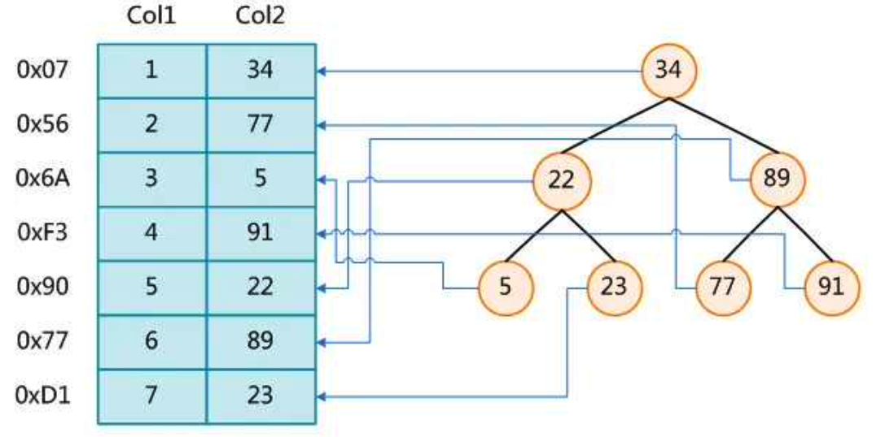
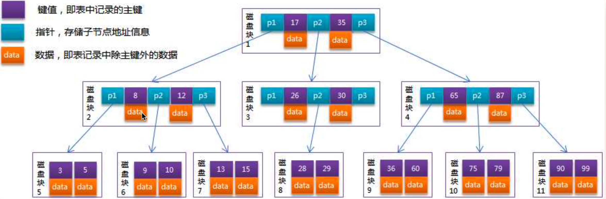

# MySQL 架构

和其它数据库相比，MySQL 有点与众不同，它的架构可以在多种不同场景中应用并发挥良好作用。主要体现在存储引擎的架构上， **插件式的存储引擎架构将查询处理和其它的系统任务以及数据的存储提取相分离** 。这种架构可以根据业务的需求和实际需要选择合适的存储引擎。

-   连接层：最上层是一些客户端和连接服务。**主要完成一些类似于连接处理、授权认证、及相关的安全方案。**在该层上引入了线程池的概念，为通过认证安全接入的客户端提供线程。同样在该层上可以实现基于 SSL 的安全链接。服务器也会为安全接入的每个安户端验证它斤且有的损作权限。
-   服务层：第二层服务层，主要完成大部分的核心服务功能，包括查询解析、分析、优化、缓存、以及所有的内置函数，所有跨存储引擎的功能也都在这一层实现，包括触发器、存储过程、视图等。
-   引擎层：第三层存储引擎层，存储引擎真正的负责了 MySQL 中数据的存储和提取，服务器通过 API 与存储引擎进行通信。不同的存储引擎具有的功能不同，这样我们可以根据自己的实际需要进行选取
-   存储层：第四层为数据存储层，主要是将数据存储在运行于该设备的文件系统之上，并完成与存储引擎的交互。

客户端请求 ---> 连接器（验证用户身份，给予权限）---> 查询缓存（存在缓存则直接返回，不存在则执行后续操作）---> 分析器（对 SQL 进行词法分析和语法分析操作）---> 优化器（主要对执行的 SQL 优化选择最优的执行方案方法）--->执行器（执行时会先看用户是否有执行权限，有才去使用这个引擎提供的接口）--->  去引擎层获取数据返回（如果开启查询缓存则会缓存查询结果）


# 存储引擎

存储引擎是 MySQL 的组件，用于处理不同表类型的 SQL 操作。不同的存储引擎提供不同的存储机制、索引技巧、锁定水平等功能，使用不同的存储引擎，还可以获得特定的功能。

使用哪一种引擎可以灵活选择， **一个数据库中多个表可以使用不同引擎以满足各种性能和实际需求** ，使用合适的存储引擎，将会提高整个数据库的性能。

MySQL 服务器使用可插拔的存储引擎体系结构，可以从运行中的 MySQL 服务器加载或卸载存储引擎。

## 查看存储引擎

```sql
-- 查看支持的存储引擎
SHOW ENGINES;

-- 查看默认存储引擎
SHOW VARIABLES LIKE 'storage_engine';

-- 查看具体某一个表所使用的存储引擎，这个默认存储引擎被修改了!
show create table tablename;

-- 准确查看某个数据库中的某一表所使用的存储引擎
show table status like 'tablename';
show table status from database where name="tablename";
```

## 设置存储引擎

```sql
-- 建表时指定存储引擎。默认的就是 INNODB，不需要设置
CREATE TABLE t1 (i INT) ENGINE = INNODB;
CREATE TABLE t2 (i INT) ENGINE = CSV;
CREATE TABLE t3 (i INT) ENGINE = MEMORY;

-- 修改存储引擎
ALTER TABLE t ENGINE = InnoDB;

-- 修改默认存储引擎，也可以在配置文件 my.cnf 中修改默认引擎
SET default_storage_engine = NDBCLUSTER;
```

默认情况下，每当`CREATE TABLE`或`ALTER TABLE`不能使用默认存储引擎时，都会生成一个警告。为了防止在所需的引擎不可用时出现令人困惑的意外行为，可以启用`NO_ENGINE_SUBSTITUTION SQL`模式。如果所需的引擎不可用，则此设置将产生错误而不是警告，并且不会创建或更改表。

## 存储引擎对比

常见的存储引擎就 InnoDB、MyISAM、 Memory、NDB。InnoDB 现在是 MySQL 默认的存储引擎， **支持事务、行级锁定和外键。**

## 文件存储结构对比

在 MySQL 中建立任何一张数据表，在其数据目录对应的数据库目录下都有对应表的`.frm`文件，`.frm`文件是用来保存每个数据表的元数据（meta）信息，包括表结构的定义等，与数据库存储引擎无关，也就是任何存储引擎的数据表都必须有`.frm `文件，命名方式为数据表名`.frm`，如`user.frm`。

查看 MySQL 数据保存在哪里：`show variables like 'data%'` 。

MyISAM 物理文件结构为：

-   `.frm`文件：与表相关的元数据信息都存放在`frm`文件，包括表结构的定义信息等。
-   `.MYD`（MYData）文件：MyISAM 存储引擎专用，用于存储 MyISAM 表的数据。
-   ` .MYI`（MYIndex）文件：MyISAM 存储引擎专用，用于存储 MyISAM 表的索引相关信息。

InnoDB 物理文件结构为：

-   `.frm`文件：与表相关的元数据信息都存放在 frm 文件，包括表结构的定义信息等
-   `.ibd`文件或`.ibdata`文件：这两种文件都是存放 InnoDB 数据的文件，之所以有两种文件形式存放 InnoDB 的数据，是因为 InnoDB 的数据存储方式能够通过配置来决定是使用共享表空间存放存储数据，还是用独享表空间存放存储数据。

独享表空间存储方式使用`.ibd`文件，并且每个表一个`.ibd`文件共享表空间存储方式使用`.ibdata`文件，所有表共同使用一个`.ibdata`文件（或多个，可自己配置）。

1.  InnoDB 支持事务，MyISAM 不支持事务。这是 MySQL 将默认存储引擎从 MyISAM 变成 InnoDB 的重要原因之一；
2.  InnoDB 支持外键，而 MyISAM 不支持。对一个包含外键的 InnoDB 表转为 MyISAM 会失败：
3.  InnoDB 是聚簇索引，MyISAM 是非聚簇索引。聚簇索引的文件存放在主键索引的叶子节点上，因此 InnoDB 必须要有主键，通过主键索引效率很高。但是辅助索引需要两次查询，先查询到主键，然后再通过主键查询到数据。因此，主键不应该过大，因为主键太大，其他索引也都会很大。而 MyISAM 是非聚集引，数据文件是分离的，索引保存的是数据文件的指针。主键索引和辅助索引是独立的。
4.  InnoDB 不保存表的具体行数，执行`select count(*) from table`时需要全表扫描。而 MyISAM 用一个变量保存了整个表的行数，执行上述语句时只需要读出该变量即可，速度很快：
5.  InnoDB 最小的锁粒度是行锁，MyISAM 最小的锁粒度是表锁。一个更新语句会锁住整张表，导致其他查询和更新都会被阻塞，因此并发访问受限。这也是 MySQL 将默认存储引擎从 MyISAM 变成 InnoDB 的重要原因之一。

|  对比项  |                          MyISAM                          |                            InnoDB                            |
| :------: | :------------------------------------------------------: | :----------------------------------------------------------: |
|  主外键  |                          不支持                          |                             支持                             |
|   事务   |                          不支持                          |                             支持                             |
|  行表锁  | 表锁，即使操作一条记录也会锁住整个表，不适合高并发的操作 |    行锁，操作时只锁住某一行，不影响其它行，适合高并发操作    |
|   缓存   |                只缓存索引，不缓存真实数据                | 不仅缓存索引还要缓存真实数据，对内存要求较高，而且内存大小对性能有决定性影响 |
|  表空间  |                            小                            |                              大                              |
|  关注点  |                           性能                           |                             事务                             |
| 默认安装 |                            是                            |                              是                              |

>   一张表，里面有 ID 自增主键，当 insert 了 17 条记录之后，删除了第 15,16,17 条记录，再把 MySQL 重启，再 insert 一条记录，这条记录的ID是18还是15? 
>
>   如果表的类型是 MyISAM，那么是 18。因为 MyISAM 表会把自增主键的最大 ID 记录到数据文件中，重启 MySQL 自增主键的最大 ID 也不会丢失：如果表的类型是 InnoDB，那么是 15。因为 InnoDB 表只是把自增主键的最大 ID 记录到内存中，所以重启数据库或对表进行 OPTION 操作，都会导致最大 ID 丢失。

>   哪个存储引擎执行`select count(*)`更快，为什么?
>   MyISAM 更快，因为 MyISAM 内部维护了一个计数器，可以直接调取。
>
>   -   在 MyISAM 存储引擎中，把表的总行数存储在磁盘上，当执行`select count(*) from t`时，直接返回总数据。
>   -   在 InnoDB 存储引擎中，跟 MyISAM 不一样，没有将总行数存储在磁盘上，当执行`select count(*) from t`时，会先把数据读出来，一行一行的累加，最后返回总数量。
>
>   InnoDB 中`count(*)`语句是在执行的时候，全表扫描统计总数量，所以当数据越来越大时，语句就越来越耗时了，为什么 InnoDB 引擎不像 MyISAM 引擎一样，将总行数存储到磁盘上？这跟 InnoDB 的事务特性有关，由于多版本并发控制（MVCC）的原因，InnoDB 表"应该返回多少行"也是不确定的。

# 数据类型

主要包括以下五大类：

-   整数类型：BIT、BOOL、TINY INT、SMALL INT、MEDIUM INT、INT、BIG INT；
-   浮点数类型：FLOAT、DOUBLE、DECIMAL；
-   字符串类型：CHAR、CARCHAR、TINY TEXT、TEXT、MEDIUM TEXT、LONGTEXT、TINY BLOB、BLOB、MEDIUM BLOB、LONG BLOB；
-   日期类型：Date、DateTIme、TImeStamp、TIme、Year；
-   其他数据类型：BINARY、VARBINARY、ENUM、SET、Geometry、Point、MultiPoint、LineString、LineString、MultiLineString、Polygon、GeometryCollection 等。


>   CHAR 和 VARCHAR 的区别？
>
>   char 是固定长度，varchar 长度可变：
>
>   char(n) 和 varchar(n) 中括号中 n 代表字符的个数，并不代表字节个数，比如 CHAR(30) 就可以存储 30 个字符。
>
>   存储时，前者不管实际存储数据的长度，直接按 char 规定的长度分配存储空间；而后者会根据实际存储的数据分配最终的空间。
>
>   相同点：
>
>   1.  char(n)，varchar(n) 中 n 都代表字符的个数；
>   2.  超过 char，varchar 最大长度 n 的限制后，字符串会被截断。
>
>   不同点：
>
>   1.  char 不论实际存储的字符数都会占用 n 个字符的空间，而 varchar 只会占用实际字符应该占用的字节空间加 1（实际长度 length，0 <= length < 255）或加 2（length > 255）。因为 varchar 保存数据时除了要保存字符串之外还会加一个字节来记录长度（如果列声明长度大于 255 则使用两个字节来保存长度）。
>   2.  能存储的最大空间限制不一样；char 的存储上限是 255 字节。
>   3.  char 在存储时会截断尾部的空格，而 varchar 不会。
>
>   char 适合存储很短的、一般固定长度的字符串。例如，char 非常适合存储密码的 MD5 值，因为这是一个定长的值。对于非常短的列，char 比 varchar 在存储空间上也更有效率。

>   列的字符串类型可以是什么？
>
>   字符串类型是：SET、BLOB、ENUM、CHAR、TEXT、VARCHAR。

>   BLOB 和 TEXT 有什么区别？
>
>   BLOB 是一个二进制对象，可以容纳可变数量的数据。有四种类型的 BLOB：TINYBLOB、BLOB、MEDIUMBLO 和 LONGBLOB。
>
>   TEXT 是一个不区分大小写的 BLOB。四种 TEXT 类型：TINYTEXT、TEXT、MEDIUMTEXT 和 LONGTEXT。
>
>   BLOB 保存二进制数据，TEXT 保存字符数据。

# 索引

MySQL 官方对索引的定义为：索引（index）是帮助 MySQL 搞笑获取数据的数据结构，所以说 **索引的本质是：数据结构。**

索引的目的在于提高查询效率，可以类比字典、火车站的车次表、图书的目录等。

可以简单的理解为"排好序的快速查找数据结构"，数据本身之外， **数据库还维护着一个满足特定查找算法的数据结构，**这些数据结构以某种方式引用（指向）数据，这样就可以在这些数据结构上实现高级查询算法。这种数据结构就是索引。下图是一种可能的索引方式示例：



左边的数据表一共有两列七条记录，最左边的是数据记录的物理地址。为了加快 Col2 的查找，可以维护一个右边所示的二叉查找树，每个节点分别包含索引键值，和一个指向对应数据记录物理地址的指针，这样就可以运用二叉查找在一定的复杂度上获取到对应的数据，从而快速检索出符合条件的记录。

索引本身也很大，不可能全部存储在内存中， **一般以索引文件的形式存储在磁盘上。**

平常说的索引，没有特别指明的话，就是 B+ 树（多路搜索树，不一定是二叉树）结构组织的索引。其中聚集索引、次要索引、覆盖索引、复合索引、前缀索引、唯一索引默认都是使用 B+ 树索引，统称索引。此外还有哈希索引等。

## 基本语法

-   创建：

    -   创建索引：`CREATE [UNIQUE] INDEX indexName ON mytable(username(length));`

    如果是 CHAR、VARCHAR 类型，length 可以小于字段实际长度；如果是 BLOB 和 TEXT 类型，必须指定 length。

    -   修改表结构（添加索引）：`ALTER table tableName ADD [UNIQUE] INDEX indexName(cloumnName)`

-   删除：`DROP INDEX [indexName] ON mytable;`

-   查看：`SHOW INDEX FROM table_name\G`，可以通过添加`\G`来格式化输出信息

-   使用 ALTER 命令

    -   `ALTER TABLE tbl_name ADD PRIMARY KEY (column_list);`该语句添加一个主键，这意味着索引值必须是唯一的，且不能为 NULL。
    -   `ALTER TABLE tbl_name ADD UNIQUE index_name(column_list);`这条语句创建索引的值必须是唯一的（除了 NULL 外，NULL 可能会出现多次）。
    -   `ALTER TABLE tbl_name ADD INDEX index_name(column_list);`添加普通索引，索引值可出现多次。
    -   `ALTER TABLE tbl_name ADD FULLTEXT index_name(column_list);`该语句指定了索引为 FULLTEXT，用于全文索引。

## 优势

-   提高数据检索效率，降低数据库 IO 成本
-   降低数据排序的成本，降低 CPU 的消耗

## 劣势

-   索引也是一张表，保存了主键和索引字段，并指向实体表的记录，所以也需要占用内存
-   虽然索引大大提高了查询速度，同时却会降低更新表的速度，如对表进行 INSERT、UPDATE 和 DELETE。因为更新表时，MySQL 不仅要保存数据，还要保存一下索引文件每次更新添加了索引列的字段，都会调整因为更新所带来的键值变化后的索引信息

## MySQL 索引分类

### 数据结构角度

-   B+ 树索引
-   Hash 索引
-   Full-Text 全文索引
-   R-Tree 索引

### 从物理存储角度

-   聚集索引（clustered index）

-   非聚集索引（non-clustered index），也叫辅助索引（secondary index）

    聚集索引和非聚集索引都是 B+ 树结构

### 从逻辑角度

-   主键索引：主键索引是一种特殊的唯一索引，不允许有空值
-   普通索引或者单列索引：每个索引只包含单个列，一个表可以有多个单列索引
-   多列索引（复合索引、联合索引）：复合索引指多个字段上创建的索引，只有在查询条件中使用了创建索引时的第一个字段，索引才会被使用。使用复合索引时遵循最左前缀集合
-   唯一索引或者非唯一索引
-   空间索引：空间索引是对空间数据类型的字段建立的索引，MySQL 中的空间数据类型有 4 种，分别是 GEOMETRY、POINT、 LINESTRING、 POLYGON。MySQL 使用 SPATIAL 关键字进行扩展，使得能够用于创建正规索引类型的语法创建空间索引。创建空间索引的列，必须将其声明为 NOT NULL，空间索引只能在存储引擎为 MYISAM 的表中创建

## MySQL 索引结构

**首先要明白索引（index）是在存储引擎（storage engine）层面实现的，而不是 server 层面。** 不是所有的存储引擎都支持所有的索引类型。即使多个存储引擎支持某一索引类型，它们的实现和行为也可能有所差别。

### B+ Tree 索引

MyISAM 和 InnoDB 存储引擎，都使用 B+ Tree 的数据结构，它相对与 B-Tree 结构，所有的数据都存放在叶子节点上，且把叶子节点通过指针连接到一起，形成了一条数据链表，以加快相邻数据的检索效率。

### B-Tree

B-Tree 是为磁盘等外存储设备设计的一种平衡查找树。系统从磁盘读取数据到内存时是以磁盘块（block）为基本单位的，位于同一个磁盘块中的数据会被一次性读取出来，而不是需要什么取什么。InnoDB 存储引擎中有页（Page）的概念，页是其磁盘管理的最小单位。InnoDB 存储引擎中默认每个页的大小为 16KB，可通过参数`innodb_ page_ size`将页的大小设置为 4K、8K、16K，在 MySQL 中可通过如下命令查看页的大小：`show variables like 'innodb_ page_ size'`；

而系统一个磁盘块的存储空间往往没有这么大，因此 InnoDB 每次申请磁盘空间时都会是若干地址连续磁盘块来达到页的大小 16KB。InnoDB 在把磁盘数据读入到磁盘时会以页为基本单位，在查询数据时如果一个页中的每条数据都能有助于定位数据记录的位置，这将会减少磁盘 I/O 次数，提高查询效率。

B-Tree 结构的数据可以让系统高效的找到数据所在的磁盘块。为了描述 B-Tree， 首先定义一条记录为一个二元组 [key, data]，key 为记录的键值，对应表中的主键值，data 为一行记录中除主键外的数据。对于不同的记录，key 值互不相同。

一棵 m 阶的 B-Tree 有如下特性：

1.  每个节点最多有 m 个孩子
2.  除了根节点和叶子节点外，其它每个节点至少有 Ceil(m/2) 个孩子
3.  若根节点不是叶子节点，则至少有 2 个孩子
4.  所有叶子节点都在同一层，且不包含其它关键字信息
5.  每个非终端节点包含 n 个关键字信息（PO,1.1...Pn, k1...kn）
6.  关键字的个数 n 满足：ceil(m/2)-1 <= n <= m-1
7.  ki(i=1...n) 为关键字，且关键字升序排序
8.  Pi(i=1...n) 为指向子树根节点的指针。P(i-1) 指向的子树的所有节点关键字均小于 ki，但都大于 k(i-1)

B-Tree 中的每个节点根据实际情况可以包含大量的关键字信息和分支，如下图所示为一个 3 阶的 B-Tree：



每个节点占用一个盘块的磁盘空间，一个节点上有两个升序排序的关键字和三个指向子树根节点的指针，指针存储的是子节点所在磁盘块的地址。两个关键词划分成的三个范围域对应三个指针指向的子树的数据的范围域。以根节点为例，关键字为 17 和 35，P1 指针指向的子树的数据范围为小于 17，P2 指针指向的子树的数据范围为 17~35，P3 指针指向的子树的数据范围为大于 35。 

模拟查找关键字 29 的过程:

1.  根据根节点找到磁盘块 1，读入内存。[磁盘 I/O 操作第 1 次]
2.  比较关键字 29 在区间（17，35）找到磁盘块 1 的指针 P2。
3.  根据 P2 指针找到磁盘块 3，读入内存。[磁盘 I/O 操作第 2 次]
4.  比较关键字 29 在区间（26，30），找到磁盘块 3 的指针 P2。
5.  根据 P2 指针找到磁盘块 8，读入内存。[磁盘 I/O 操作第 3 次]
6.  在磁盘块 8 中的关键字列表中找到关键字 29。

分析上面过程，发现需要 3 次磁盘 I/O 操作，和 3 次内存查找操作。由于内存中的关键字是一个有序表结构，可以利用二分法查找提高效率。而 3 次磁盘 I/O 操作是影响整个 B-Tree 查找效率的决定因素。B-Tree 相对于 AVLTree 缩减了节点个数，使每次磁盘 I/O 取到内存的数据都发挥了作用，从而提高了查询效率。

### B+Tree

B+Tree 是在 B-Tree 基础上的一种优化，使其更适合实现外存储索引结构，InnoDB 存储引擎就是用 B+Tree 实现其索引结构。从上一节中的 B-Tree 结构图中可以看到每个节点中不仅包含数据的 key 值，还有 data 值。而每一个页的存储空间是有限的，如果 data 数据较大时将会导致每个节点（即一个页）能存储的 key 的数量很小，当存储的数据量很大时同样会导致 B-Tree 的深度较大，增大查询时的磁盘 I/O 次数，进而影响查询效率。 **在 B+Tree 中，所有数据记录节点都是按照键值大小顺序存放在同一层的叶子节点上，而非叶子节点上只存储 key 值信息，这样可以大大加大每个节点存储的 key 值数量，降低 B+Tree 的高度。**

B+Tree 相对于 B-Tree 有几点不同：

1.  非叶子节点只存储键值信息；
2.  所有叶子节点之间都有一个链指针；
3.  数据记录都存放在叶子节点中。

将上一节中的 B-Tree 优化，由于 B+Tree 的非叶子节点只存储键值信息，假设每个磁盘块能存储 4 个键值及指针信息，则变成 B+Tree 后其结构如下图所示：


通常在 B+Tree 上有两个头指针，一个指向根节点，另一个指向关键字最小的叶子节点，而且所有叶子节点（即数据节点）之间是一种链式环结构。因此可以对 B+Tree 进行两种查找运算：一种是对于主键的范围查找和分页查找，另一种是从根节点开始，进行随机查找。

可能上面例子中只有 22 条数据记录，看不出 B+Tree 的优点，下面做一个推算：

InnoDB 存储引擎中页的大小为 16KB，一般表的主键类型为 INT（占用 4 个字节）或 BIGINT（占用 8 个字节），指针类型也一般为 4 或 8 个字节，也就是说一个页（B+Tree 中的一个节点）中大概存储 `16KB/(8B+8B)=1K` 个键值（因为是估值，为方便计算，这里的 K 取值为`10^3`）。也就是说一个深度为 3 的 B+Tree 索引可以维护 `10^3 * 10^3 * 10^3 = 10` 亿条记录。

实际情况中每个节点可能不能填充满，因此在数据库中，B+Tree 的高度一般都在 2-4 层。MySQL 的 InnoDB 存储引擎在设计时是将根节点常驻内存的，也就是说查找某一键值的行记录时最多只需要 1~3 次磁盘 I/O 操作。

### B+Tree 性质

1.  通过上面的分析，我们知道 IO 次数取决于 B+Tree 的高度 h，假设当前数据表的数据为 N，每个磁盘块的数据项的数量是 m，则有 `h=log(m+1)N`，当数据量 N 一定的情况下，m 越大，h 越小；而 m = 磁盘块的大小 / 数据项的大小，磁盘块的大小也就是一个数据页的大小，是固定的，如果数据项占的空间越小，数据项的数量越多，树的高度越低。这就是为什么每个数据项，即索引字段要尽量的小，比如 int 占 4 字节，要比 bigint 8 字节少一半。这也是为什么 B+Tree 要求把真实的数据放到叶子节点而不是内层节点，一旦放到内层节点，磁盘块的数据项会大幅度下降，导致树增高。当数据项等于 1 时将会退化成线性表。
2.  当 B+Tree 的数据项是复合的数据结构，比如（name，age，sex）的时候，B+Tree 是按照从左到右的顺序来建立搜索树的，比如当（张三，20，F）这样的数据来检索的时候，B+Tree 会优先比较 name 来确定下一步的所搜方向，如果 name 相同再依次比较 age 和 sex，最后得到检索的数据；但当（20，F）这样的没有 name 的数据来的时候，B+Tree 就不知道下一步该查哪个节点，因为建立搜索树的时候 name 就是第一个比较因子，必须要先根据 name 来搜索才能知道下一步去哪里查询。比如当（张三，F）这样的数据来检索时，B+Tree 可以用 name 来指定搜索方向，但下一个字段 age 的缺失，所以只能把名字等于张三的数据都找到，然后再匹配性别是 F 的数据了，这个是非常重要的性质，即 **索引的最左匹配特性。**

### MyISAM 主键索引与辅助索引的结构

MyISAM 引擎的索引文件和数据文件是分离的。 **MyISAM 引擎索引结构的叶子节点的数据域，存放的并不是实际的数据记录，而是数据记录的地址。** 索引文件与数据文件分离，这样的索引称为"非聚簇索引"。MyISAM 的主索引与辅助索引区别并不大，只是主键索引不能有重复的关键字。


在 MyISAM 中，索引（含叶子节点）存放在单独的`.myi`文件中，叶子节点存放的是数据的物理地址偏移量（通过偏移量访问就是随机访问，速度很快）。

主索引是指主键索引，键值不可能重复；辅助索引则是普通索引，键值可能重复。

通过索引查找数据的流程：先从索引文件中查找到索引节点，从中拿到数据的文件指针，再到数据文件中通过文件指针定位了具体的数据。辅助索引类似。
