# HTTP 基本概念

### HTTP 是什么？描述一下

HTTP 是超文本传输协议，也就是 HyperText Transfer Protocol。

### 能否详细解释「超文本传输协议」?

HTTP的名字「超文本协议传输」，它可以拆成三个部分：

-   超文本
-   传输
-   协议

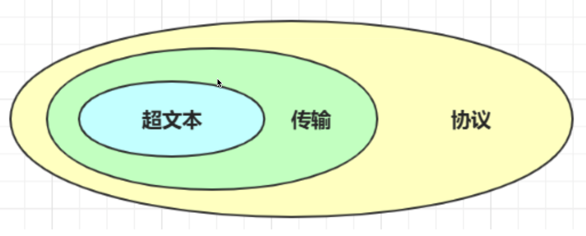

1.  协议

在生活中，我们也随处可见「协议」，例如：

-   刚毕业时会签一个「三方协议」；
-   找房子时会签一个「租房协议」


生活中的协议，本质上与计算机中的协议是相同的，协议的特点：

-   「协」字，代表的意思是必须有 **两个以上的参与者**。例如三方协议里的参与者有三个：你、公司、学校三个；租房协议里的参与者有两个：你和房东。
-   「议」 字，代表的意思是对参与者的一种 **行为约定和规范**。例如三方协议里规定试用期期限、毁约金等；租房协议里规定租期期限、每月租金金额、违约如何处理等。

针对 HTTP 协议，我们可以这么理解。HTTP 是一个用在计算机世界里的协议。它使用计算机能够理解的语言确立了一种计算机之间交流通信的规范 **（两个以上的参与者）**，以及相关的各种控制和错误处理方式（行为约定和规范）。

2.  传输

所谓的「传输」，很好理解，就是把一堆东西从 A 点搬到 B 点，或者从 B 点搬到 A 点。

别轻视了这个简单的动作，它至少包含两项重要的信息。

HTTP 协议是一个 **双向协议**。我们在上网冲浪时，浏览器是请求方 A，百度网站就是应答方 B。双方约定用 HTTP 协议来通信，于是浏览器把请求数据发送给网站，网站再把一些数据返回给浏览器，最后由浏览器渲染在屏幕，就可以看到图片、视频了。


数据虽然是在 A 和 B 之间传输，但允许中间有 **中转或接力**。

就好像第一排的同学想传递纸条给最后一排的同学, 那么传递的过程中就需要经过好多个同学（中间人），这样的传输方式就从「A<-->B」，变成了「A<->N<->M<->B」。

而在 HTTP 里，需要中间人遵从 HTTP 协议，只要不打扰基本的数据传输，就可以添加任意额外的东西。

针对传输，我们可以进一步理解了 HTTP。

HTTP 是一个在计算机世界里专门用来在 **两点之间传输数据** 的约定和规范。

3.  「超文本」

HTTP 传输的内容是「超文本」。

我们先来理解「文本」，在互联网早期的时候只是简单的字符文字，但现在「文本」的涵义已经可以扩展为图片、视频、压缩包等，在 HTTP 眼里这些都算作「文本」。

再来理解「超文本」，它就是 **超越了普通文本的文本**，它是文字、图片、视频等的混合体，最关键有超链接，能从一个超文本跳转到另外一个超文本。

HTML 就是最常见的超文本了，它本身只是纯文字文件，但内部用很多标签定义了图片、视频等的链接，再经过浏览器的解释，呈现给我们的就是一个文字、有画面的网页了。

经过了对 HTTP 里这三个名词的详细解释，就可以给出比「超文本传输协议」 这七个字更准确更有技术含量的答案：

**HTTP 是一个在计算机世界里专门在「两点」之间「传输」文字、图片、音频、视频等「超文本」数据的「约定和规范」。**

### 那 HTTP 是用于从互联网服务器传输超文本到本地浏览器的协议，这种说法正确吗?

这种说法是不正确的。因为也可以是「服务器< - >服务器」，所以采用两点之间的描述会更准确。

### HTTP常见的状态码，有哪些?

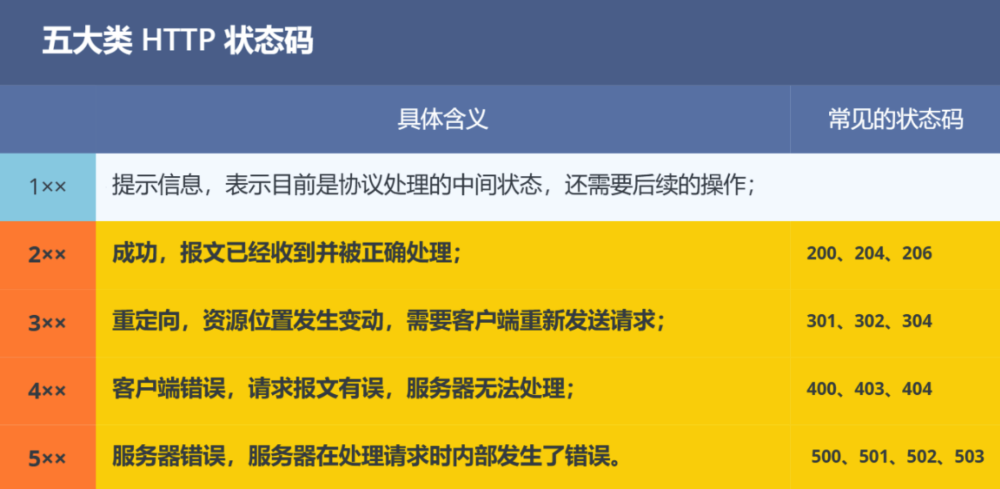

`1xx`类状态码属于提示信息，是协议处理中的一种中间状态，实际用到的比较少。

`2xx`类状态码表示服务器成功处理了客户端的请求，也是我们最愿意看到的状态。

-   「200 OK」是最常见的成功状态码，表示一切正常。如果是非 HEAD 请求，服务器返回的响应头都会有 body 数据。

-   「204 No Content」也是常见的成功状态码，与 200 OK 基本相同，但响应头没有 body 数据。

-   「206 Partial Content」是应用于 HTTP 分块下载或断点续传，表示响应返回的 body 数据并不是资源的全部，而是其中的一部分，也是服务器处理成功的状态。

`3xx`类状态码表示客户端请求的资源发送了变动，需要客户端用新的 URL 重新发送请求获取资源，也就是 **重定向**。

-   「301 Moved Permanently」表示永久重定向，说明请求的资源已经不存在了，需改用新的 URL 再次访问。

-   「302 Found」表示临时重定向，说明请求的资源还在，但暂时需要用另一个 URL 来访问。
-   301 和 302 都会在响应头里使用字段 Location，指明后续要跳转的 URL，浏览器会自动重定向新的 URL。
-   「304 Not Modified」不具有跳转的含义，表示资源未修改，重定向已存在的缓冲文件，也称缓存重定向，用于缓存控制。

`4xx`类状态码表示客户端发送的报文有误，服务器无法处理，也就是错误码的含义。

-   「400 Bad Request」表示客户端请求的报文有错误，但只是个笼统的错误。
-   「403 Forbidden」表示服务器禁止访问资源，并不是客户端的请求出错。
-   「404 Not Found」表示请求的资源在服务器上不存在或未找到，所以无法提供给客户端。

`5xx`类状态码表示客户端请求报文正确，但是服务器处理时内部发生了错误，属于服务器端的错误码。

-   「500 Internal Server Error」与 400 类型，是个笼统通用的错误码，服务器发生了什么错误，我们并不知道。
-   「501 Not Implemented」表示客户端请求的功能还不支持，类似“即将开业，敬请期待”的意思。
-   「502 Bad Gateway」通常是服务器作为网关或代理时返回的错误码，表示服务器自身工作正常，访问后端服务器发生了错误。
-   「503 Service Unavailable」表示服务器当前很忙，暂时无法响应服务器，类似“网络服务正忙，请稍后重试”的意思。

### Http 常见的字段有哪些？

Host 字段：客户端发送请求时，用来指定服务器的域名。

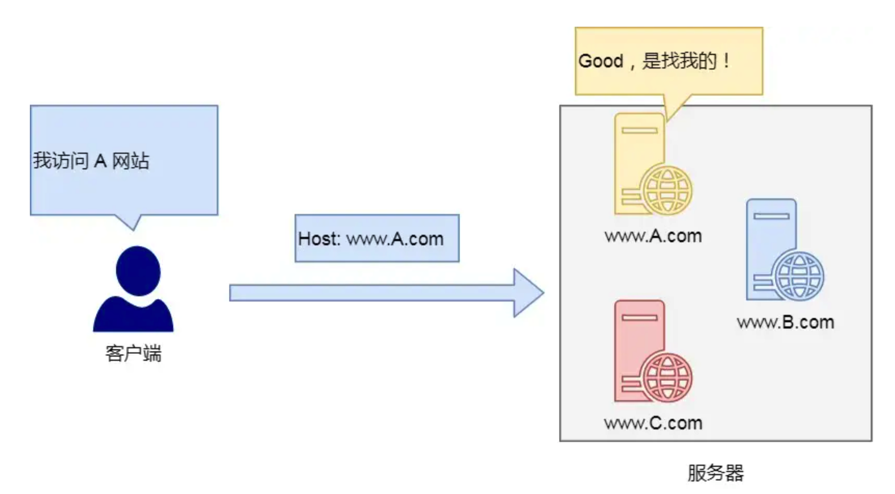

```
Host:www.A.com
```

有了`Host`字段，就可以将请求发往「同一台」服务器上的不同网站。

Content-Length 字段：服务器在返回数据时，会有 Content-Length 字段，表明本次回应的数据长度。


```
Content-Length:1000
```

Connection 字段：Connection 字段最常用于客户端要求服务器使用 TCP 持久连接，以便其他请求复用。

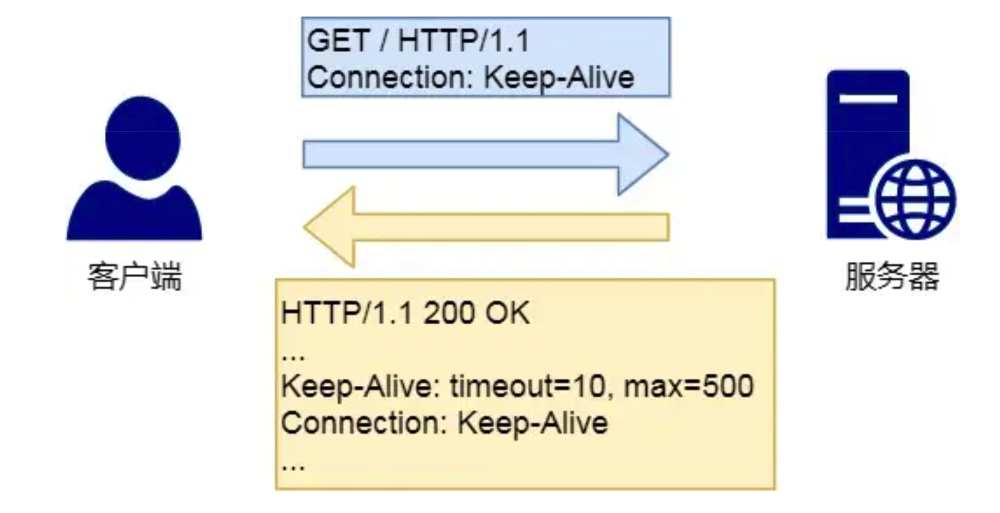

HTTP/1.1 版本的默认连接都是持久连接，但为了兼容老版本的 HTTP，需要指定段的值为 Keep-Alive。

```
Connection:keep-alive
```

一个可以复用的 TCP 连接就建立了，直到客户端或服务器主动关闭连接。但是，这不是标准字段。

Content-Type 字段：Content-Type 字段用于服务器回应时，告诉客户端，本次数据是什么格式。

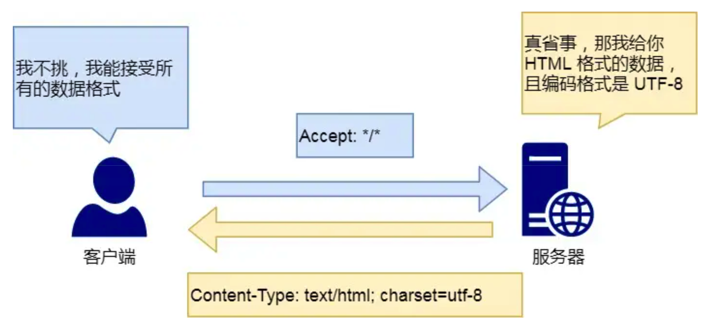

```
Content-Type:text/html;charset=utf-8
```

上面的类型表明，发送的是网页，而且编码是 UTF-8。

客户端请求的时候，可以使用 Accept 字段声明自己可以接受哪些数据格式。

```
Accept:*/*
```

上面代码中，客户端声明自己可以接受任何格式的数据。

Content-Encoding 字段：Content-Encoding 字段说明数据的压缩方法。表示服务器返回的数据使用了什么压缩格式。

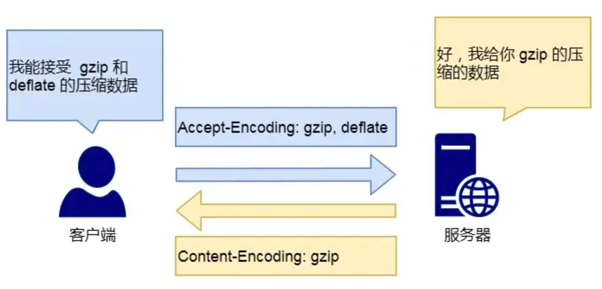

```
Content-Encoding:gzip
```

上面表示服务器返回的数据采用了 gzip 方式压缩，告知客户端需要用此方式解压。

客户端在请求时，用 Accept-Encoding 字段说明自己可以接受哪些压缩方法。

```
Accept-Encoding:gzip,deflate
```

# GET 与 POST

### 说一下 GET 和 POST 的区别？

GET 方法的含义是请求从服务器获取资源，这个资源可以是静态的文本、页面、图片视频等。

比如，你打开我的文章，浏览器就会发送 GET 请求给服务器，服务器就会返回文章的所有文字及资源。

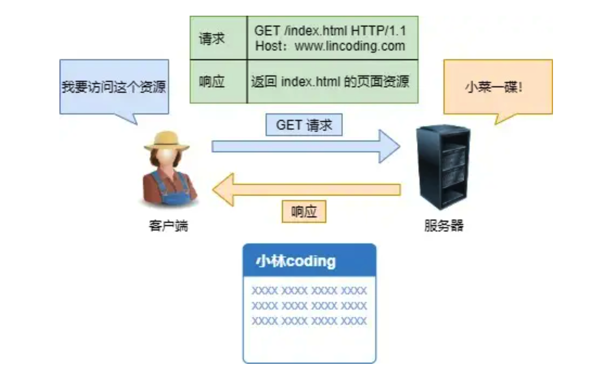

而 POST 方法则是相反操作，它向 URI 指定的资源提交数据，数据就放在报文的 body 里。

比如，在文章底部，敲入了留言后点击「提交」，浏览器就会执行一次 POST 请求，把留言文字放进了报文 body 里，然后拼接好 POST 请求头，通过 TCP 协议发送给服务器。


### GET 和 POST 方法都是安全和幂等的吗？

先说明下安全和幂等的概念：

-   在 HTTP 协议里，所谓的「安全」是指请求方法不会「破坏」服务器上的资源。
-   所谓的「幂等」，意思是多次执行相同的操作，结果都是「相同」的。

那么很明显 **GET 方法就是安全且幂等的**，因为它是「只读」操作，无论操作多少次，服务器上的数据都是安全的，且每次的结果都是相同的。

POST 因为是「新增或提交数据」的操作，会修改服务器上的资源，所以是 **不安全** 的，且多次提交数据就会创建多个资源，所以 **不是幂等的**。

# HTTP 特性

### 你知道的 HTTP（1.1）的优点有哪些，怎么体现的？

HTTP 最凸出的优点是「简单、灵活和易于扩展、应用广泛和跨平台」。

1.  简单

    HTTP 基本的报文格式就是 header + body，头部信息也是 key-value 简单文本的形式，易于理解，降低了学习和使用的门槛。

2.  灵活和易于扩展

    HTTP 协议里的各类请求方法、URI/URL、状态码、头字段等每个组成要求都没有被固定死，都允许开发人员自定义和扩充。同时 HTTP 由于是工作在应用层（OSI 第七层），则它下层可以随意变化。HTTPS 也就是在 HTTP 与 TCP 层之间增加了 SSL/TLS 安全传输层，HTTP/3 甚至把 TCP 层换成了基于 UDP 的 QUIC。

3.  应用广泛和跨平台

    互联网发展至今，HTTP 的应用范围非常的广泛，从台式机的浏览器到手机上的各种 APP，从看新闻、刷贴吧到购物、理财、吃鸡，HTTP 的应用片地开花，同时天然具有跨平台的优越性。

### 那它的缺点呢？

HTTP 协议里有优缺点一体的双刃剑，分别是「无状态、明文传输」，同时还有一大缺点「不安全」。

1. 无状态双刃剑

   无状态的好处，因为服务器不会去记忆 HTTP 的状态，所以不需要额外的资源来记录状态信息，这能减轻服务器的负担，能够把更多的 CPU 和内存用来对外提供服务。无状态的坏处，既然服务器没有记忆能力，它在完成有关联性的操作时会非常麻烦。

   例如登录->添加购物车->下单->结算->支付，这系列操作都要知道用户的身份才行。但服务器不知道这些请求是有关联的，每次都要问一遍身份信息。这样每操作一次，都要验证信息，这样的购物体验还能愉快吗？别问，问就是酸爽！对于无状态的问题，解法方案有很多种，其中比较简单的方式用 Cookie 技术。Cookie 通过在请求和响应报文中写入 Cookie 信息来控制客户端的状态。相当于，在客户端第一次请求后，服务器会下发一个装有客户信息的「小贴纸」，后续客户端请求服务器的时候，带上「小贴纸」，服务器就能认得了。

   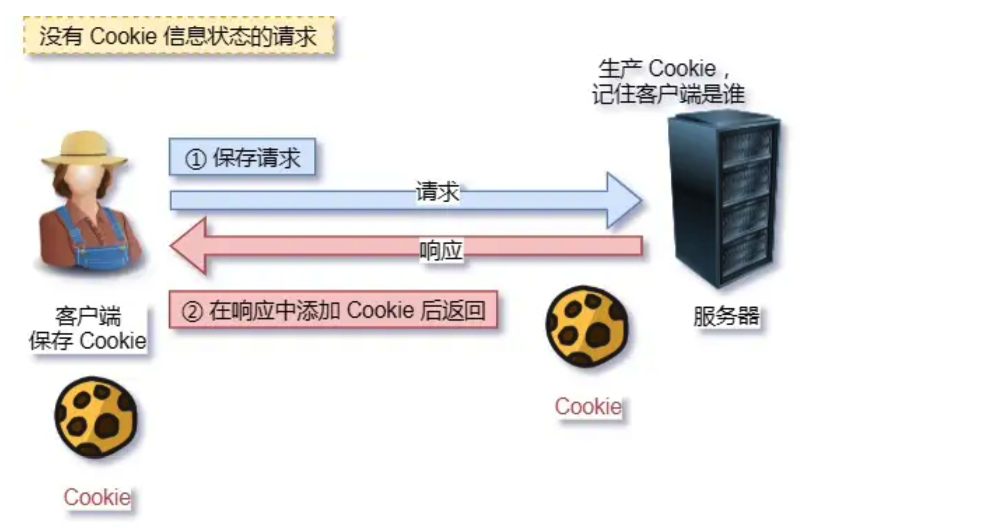

   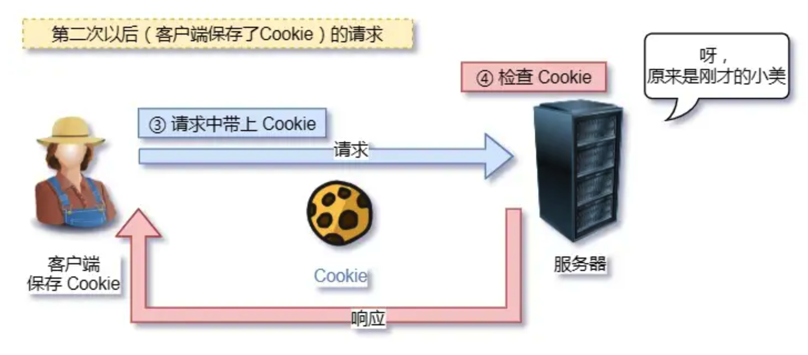

2.  明文传输双刃剑

    明文意味着在传输过程中的信息，是可方便阅读的，通过浏览器的 F12 控制台或 Wireshark 抓包都可以直接肉眼查看，为我们调试工作带了极大的便利性。

    但是这正是这样，HTTP 的所有信息都暴露在了光天化日下，相当于信息裸奔。在传输的漫长的过程中，信息的内容都毫无隐私可言，很容易就能被窃取，如果里面有你的账号密码信息，那你号没了。

3.  不安全

    HTTP 比较严重的缺点就是不安全：

    -   通信使用明文（不加密），内容可能会被窃听。比如，账号信息容易泄漏，那你号没了。
    -   不验证通信方的身份，因此有可能遭遇伪装。比如，访问假的淘宝、拼多多，那你钱没了。
    -   无法证明报文的完整性，所以有可能已遭篡改。比如，网页上植入垃圾广告，视觉污染，眼没了。

    HTTP 的安全问题，可以用 HTTPS 的方式解决，也就是通过引入 SSL/TLS 层，使得在安全上达到了极致。

### HTTP/1.1 的性能如何？

HTTP 协议是基于 TCP/IP，并且使用了「请求 - 应答」的通信模式，所以性能的关键就在这两点里。

1.  长连接

    早期 HTTP/1.0 性能上的一个很大的问题，那就是每发起一个请求，都要新建一次 TCP 连接（三次握手），而且是串行请求，做了无谓的 TCP 连接建立和断开，增加了通信开销。

    为了解决上述 TCP 连接问题，HTTP/1.1 提出了长连接的通信方式，也叫持久连接。这种方式的好处在于减少了 TCP 连接的重复建立和断开所造成的额外开销，减轻了服务器端的负载。

    持久连接的特点是，只要任意一端没有明确提出断开连接，则保持 TCP 连接状态。

    

2.  管道网络传输

    HTTP/1.1 采用了长连接的方式，这使得管道（pipeline）网络传输成为了可能。

    即可在同一个 TCP 连接里面，客户端可以发起多个请求，只要第一个请求发出去了，不必等其回来，就可以发第二个请求出去，可以减少整体的响应时间。

    举例来说，客户端需要请求两个资源。以前的做法是，在同一个 TCP 连接里面，先发送 A 请求，然后等待服务器做出回应，收到后再发出 B 请求。管道机制则是允许浏览器同时发出 A 请求和 B 请求。

    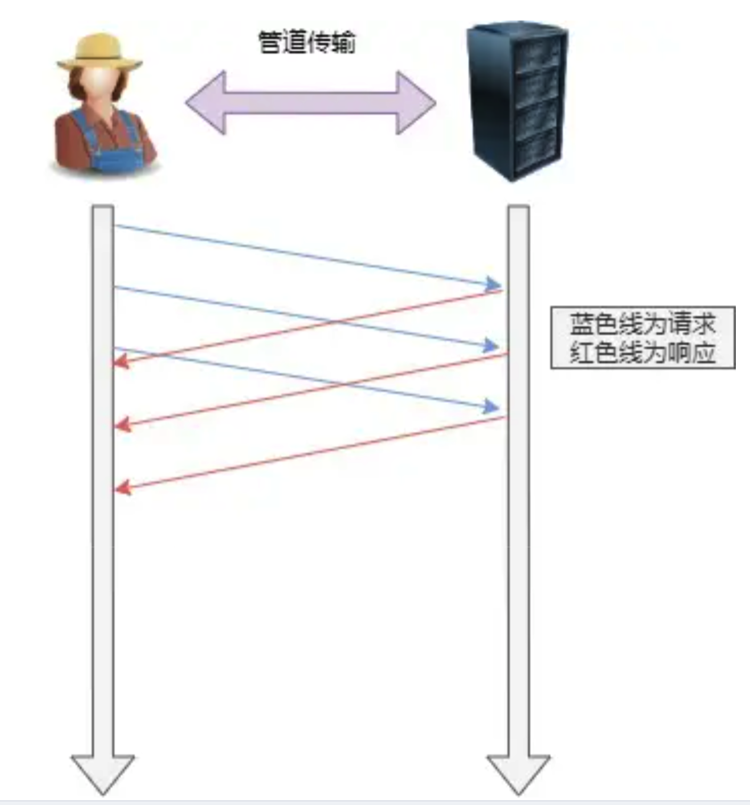

    但是服务器还是按照顺序，先回应 A 请求，完成后再回应 B 请求。要是前面的回应特别慢，后面就会有许多请求排队等着。这称为「队头堵塞」。

    3.  队头阻塞

        「请求 - 应答」的模式加剧了 HTTP 的性能问题。

        因为当顺序发送的请求序列中的一个请求因为某种原因被阻塞时，在后面排队的所有请求也一同被阻塞了，会招致客户端一直请求不到数据，这也就是「队头阻塞」。好比上班的路上塞车。

        

总之 HTTP/1.1 的性能一般般，后续的 HTTP/2 和 HTTP/3 就是在优化 HTTP 的性能。

# HTTP 与 HTTPS

### HTTP 与 HTTPS 有哪些区别？

1.  HTTP 是超文本传输协议，信息是明文传输，存在安全风险的问题。HTTPS 则解决 HTTP 不安全的缺陷，在 TCP 和 HTTP 网络层之间加入了 SSL/TLS 安全协议，使得报文能够加密传输。
2.  HTTP 连接建立相对简单， TCP 三次握手之后便可进行 HTTP 的报文传输。而 HTTPS 在 TCP 三次握手之后，还需进行 SSL/TLS 的握手过程，才可进入加密报文传输。
3.  HTTP 的端口号是 80，HTTPS 的端口号是 443。
4.  HTTPS 协议需要向 CA（证书权威机构）申请数字证书，来保证服务器的身份是可信的。

### HTTPS 解决了 HTTP 的哪些问题？

HTTP 由于是明文传输，所以安全上存在以下三个风险：

-   窃听风险，比如通信链路上可以获取通信内容，用户号容易没。
-   篡改风险，比如强制植入垃圾广告，视觉污染，用户眼容易瞎。
-   冒充风险，比如冒充淘宝网站，用户钱容易没。


HTTPS 在 HTTP 与 TCP 层之间加入了 SSL/TLS 协议，可以很好的解决了上述的风险：

-   信息加密：交互信息无法被窃取，但你的号会因为「自身忘记」账号而没。
-   校验机制：无法篡改通信内容，篡改了就不能正常显示，但百度「竞价排名」依然可以搜索垃圾广告。
-   身份证书：证明淘宝是真的淘宝网，但你的钱还是会因为「剁手」而没。

可见，只要自身不做「恶」，SSL/TLS 协议是能保证通信是安全的。

### HTTPS 是如何解决上面的三个风险的？

-   混合加密的方式实现信息的机密性，解决了窃听的风险。
-   摘要算法的方式来实现完整性，它能够为数据生成独一无二的「指纹」，指纹用于校验数据的完整性，解决了篡改的风险。
-   将服务器公钥放入到数字证书中，解决了冒充的风险。

1.  混合加密

    通过混合加密的方式可以保证信息的机密性，解决了窃听的风险。

    

    HTTPS 采用的是对称加密和非对称加密结合的「混合加密」方式：

    -   在通信建立前采用非对称加密的方式交换「会话秘钥」，后续就不再使用非对称加密。
    -   在通信过程中全部使用对称加密的「会话秘钥」的方式加密明文数据。

    采用「混合加密」的方式的原因：

    -   对称加密只使用一个密钥：运算速度快，密钥必须保密，无法做到安全的密钥交换。
    -   非对称加密使用两个密钥：公钥和私钥，公钥可以任意分发而私钥保密，解决了密钥交换问题但速度慢。

2.  摘要算法

    摘要算法用来实现完整性，能够为数据生成独一无二的「指纹」，用于校验数据的完整性，解决了篡改的风险。

    

    客户端在发送明文之前会通过摘要算法算出明文的「指纹」，发送的时候把「指纹 + 明文」一同加密成密文后，发送给服务器，服务器解密后，用相同的摘要算法算出发送过来的明文，通过比较客户端携带的「指纹」和当前算出的「指纹」做比较，若「指纹」相同，说明数据是完整的。

3.  数字证书

    客户端先向服务器端索要公钥，然后用公钥加密信息，服务器收到密文后，用自己的私钥解密。

    这就存在些问题，如何保证公钥不被篡改和信任度？

    所以这里就需要借助第三方权威机构 CA（数字证书认证机构），将服务器公钥放在数字证书（由数字证书认证机构颁发）中，只要证书是可信的，公钥就是可信的。

    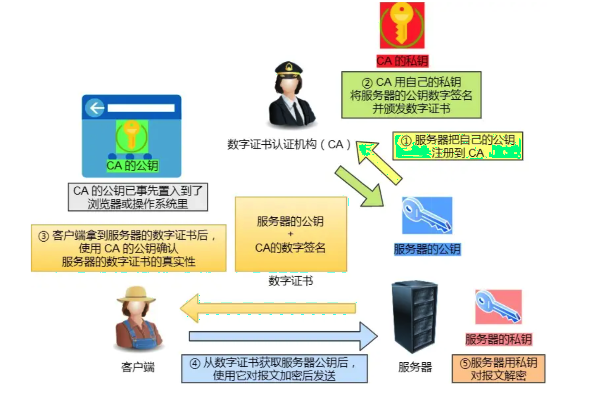

    通过数字证书的方式保证服务器公钥的身份，解决冒充的风险。

### HTTPS 是如何建立连接的？其间交互了什么？

SSL/TLS 协议基本流程：

-   客户端向服务器索要并验证服务器的公钥。
-   双方协商生产「会话秘钥」。
-   双方采用「会话秘钥」进行加密通信。

前两步也就是 SSL/TLS 的建立过程，也就是握手阶段。

SSL/TLS 的「握手阶段」涉及四次通信，可见下图：


SSL/TLS 协议建立的详细流程：

1.  ClientHello

    首先，由客户端向服务器发起加密通信请求，也就是 ClientHello 请求。

    在这一步，客户端主要向服务器发送以下信息：

    1.  客户端支持的 SSL/TLS 协议版本，如 TLS 1.2 版本。
    2.  客户端生产的随机数（Client Random），后面用于生产「会话秘钥」。
    3.  客户端支持的密码套件列表，如 RSA 加密算法。

2.  ServerHello

    服务器收到客户端请求后，向客户端发出响应，也就是 SeverHello。服务器回应的内容有如下内容：

    1.  确认 SSL/TLS 协议版本，如果浏览器不支持，则关闭加密通信。
    2.  服务器生产的随机数（Server Random），后面用于生产「会话秘钥」。
    3.  确认的密码套件列表，如 RSA 加密算法。
    4.  服务器的数字证书。

3.  客户端回应

    客户端收到服务器的回应之后，首先通过浏览器或者操作系统中的 CA 公钥，确认服务器的数字证书的真实性。

    如果证书没有问题，客户端会从数字证书中取出服务器的公钥，然后使用它加密报文，向服务器发送如下信息：

    1.  一个随机数（pre-master key）。该随机数会被服务器公钥加密。
    2.  加密通信算法改变通知，表示随后的信息都将用「会话秘钥」加密通信。
    3.  客户端握手结束通知，表示客户端的握手阶段已经结束。这一项同时把之前所有内容的发生的数据做个摘要，用来供服务端校验。

    上面第一项的随机数是整个握手阶段的第三个随机数，这样服务器和客户端就同时有三个随机数，接着就用双方协商的加密算法，各自生成本次通信的「会话秘钥」。

4.  服务器的最后回应

    服务器收到客户端的第三个随机数（pre-master key）之后，通过协商的加密算法，计算出本次通信的「会话秘钥」。然后，向客户端发生最后的信息：

    1.  加密通信算法改变通知，表示随后的信息都将用「会话秘钥」加密通信。
    2.  服务器握手结束通知，表示服务器的握手阶段已经结束。这一项同时把之前所有内容的发生的数据做个摘要，用来供客户端校验。

至此，整个 SSL/TLS 的握手阶段全部结束。接下来，客户端与服务器进入加密通信，就完全是使用普通的 HTTP 协议，只不过用「会话秘钥」加密内容。

# HTTP/1.1、HTTP/2、HTTP/3 演变

>   说说 HTTP/1.1 相比 HTTP/1.0 提高了什么性能？

HTTP/1.1 相比 HTTP/1.0 性能上的改进：

-   使用 TCP 长连接的方式改善了 HTTP/1.0 短连接造成的性能开销。
-   支持管道（pipeline）网络传输，只要第一个请求发出去了，不必等其回来，就可以发第二个请求出去，可以减少整体的响应时间。

但 HTTP/1.1 还是有性能瓶颈：

-   请求 / 响应头部（Header）未经压缩就发送，首部信息越多延迟越大。只能压缩 Body 的部分；
-   发送冗长的首部。每次互相发送相同的首部造成的浪费较多；
-   服务器是按请求的顺序响应的，如果服务器响应慢，会招致客户端一直请求不到数据，也就是队头阻塞；
-   没有请求优先级控制；
-   请求只能从客户端开始，服务器只能被动响应。

### 那上面的 HTTP/1.1 的性能瓶颈，HTTP/2 做了什么优化？

HTTP/2 协议是基于 HTTPS 的，所以 HTTP/2 的安全性也是有保障的。

那 HTTP/2 相比 HTTP/1.1 性能上的改进：

1.  头部压缩

    HTTP/2 会压缩头（Header）如果你同时发出多个请求，他们的头是一样的或是相似的，那么，协议会帮你消除重复的部分。

    这就是所谓的 HPACK 算法：在客户端和服务器同时维护一张头信息表，所有字段都会存入这个表，生成一个索引号，以后就不发送同样字段了，只发送索引号，这样就提高速度了。

2.  二进制格式

    HTTP/2 不再像 HTTP/1.1 里的纯文本形式的报文，而是全面采用了二进制格式，头信息和数据体都是二进制，并且统称为帧（frame）：头信息帧和数据帧。

    这样虽然对人不友好，但是对计算机非常友好，因为计算机只懂二进制，那么收到报文后，无需再将明文的报文转成二进制，而是直接解析二进制报文，这 **增加了数据传输的效率。**

3.  数据流

    HTTP/2 的数据包不是按顺序发送的，同一个连接里面连续的数据包，可能属于不同的回应。因此，必须要对数据包做标记，指出它属于哪个回应。

    每个请求或回应的所有数据包，称为一个数据流（Stream）。每个数据流都标记着一个独一无二的编号，其中规定客户端发出的数据流编号为奇数，服务器发出的数据流编号为偶数。

    客户端还可以指定数据流的优先级。优先级高的请求，服务器就先响应该请求。

4.  多路复用

    HTTP/2 是可以在一个连接中并发多个请求或回应，而不用按照顺序一一对应。

    移除了 HTTP/1.1 中的串行请求，不需要排队等待，也就不会再出现「队头阻塞」问题，降低了延迟，大幅度提高了连接的利用率。

    举例来说，在一个 TCP 连接里，服务器收到了客户端 A 和 B 的两个请求，如果发现 A 处理过程非常耗时，于是就回应 A 请求已经处理好的部分，接着回应 B 请求，完成后，再回应 A 请求剩下的部分。

    

5.  服务器推送

    HTTP/2 还在一定程度上改善了传统的「请求 - 应答」工作模式，服务不再是被动地响应，也可以主动向客户端发送消息。

    举例来说，在浏览器刚请求 HTML 的时候，服务器就提前把可能会用到的 JS、CSS 文件等静态资源主动发给客户端，减少延时的等待，也就是服务器推送（Server Push，也叫 Cache Push）。

### HTTP/2 有哪些缺陷？HTTP/3 做了哪些优化？

HTTP/2 主要的问题在于，多个 HTTP 请求在复用一个 TCP 连接，下层的 TCP 协议是不知道有多少个 HTTP 请求的。所以一旦发生了丢包现象，就会触发 TCP 的重传机制，这样在一个 TCP 连接中的 **所有的 HTTP 请求都必须等待这个丢了的包被重传回来。**

-   HTTP/1.1 中的管道（pipeline）传输中如果有一个请求阻塞了，那么队列后请求也统统被阻塞住了
-   HTTP/2 多个请求复用一个 TCP 连接，一旦发生丢包，就会阻塞住所有的 HTTP 请求。

这都是基于 TCP 传输层的问题，所以 **HTTP/3 把 HTTP 下层的 TCP 协议改成了 UDP！**


UDP 发生是不管顺序，也不管丢包的，所以不会出现 HTTP/1.1 的队头阻塞和 HTTP/2 的一个丢包全部重传问题。

大家都知道 UDP 是不可靠传输的，但基于 UDP 的 QUIC 协议可以实现类似 TCP 的可靠性传输。

-   QUIC 有自己的一套机制可以保证传输的可靠性的。当某个流发生丢包时，只会阻塞这个流，其他流不会受到影响。
-   TLS3 升级成了最新的 1.3 版本，头部压缩算法也升级成了 QPack。
-   HTTPS 要建立一个连接，要花费 6 次交互，先是建立三次握手，然后是 TLS/1.3 的三次握手。QUIC 直接把以往的 TCP 和
    TLS/1.3 的 6 次交互合并成了 3 次，减少了交互次数。

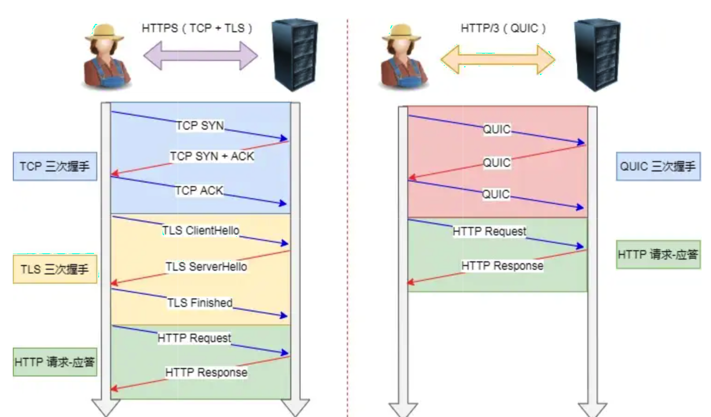

所以， QUIC 是一个在 UDP 之上的伪 TCP + TLS + HTTP/2 的多路复用的协议。

QUIC 是新协议，对于很多网络设备，根本不知道什么是 QUIC，只会当做 UDP，这样会出现新的问题。所以 HTTP/3 现在普及的进度非常的缓慢，不知道未来 UDP 是否能够逆袭 TCP。

# IP 基本知识

IP 在 TCP/IP 参考模型中处于第三层，也就是网络层。

网络层的主要作用是： **实现主机与主机之间的通信，也叫点对点（end to end）通信。**

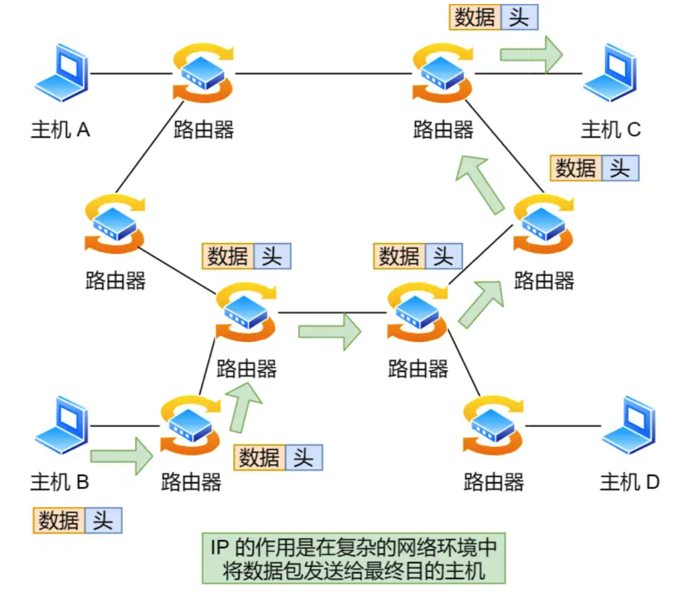

### 网络层与数据链路层有什么关系呢？

有的小伙伴分不清 IP（网络层）和 MAC （数据链路层）之间的区别和关系。

其实很容易区分，在上面我们知道 IP 的作用是主机之间通信用的，而 MAC 的作用则是实现「直连」的两个设备之间通信，而 IP 则负责在「没有直连」的两个网络之间进行通信传输。

举个生活的栗子，小林要去一个很远的地方旅行，制定了一个行程表，其间需先后乘坐飞机、地铁、公交车才能抵达目的地，为此小林需要买飞机票，地铁票等。

飞机票和地铁票都是去往特定的地点的，每张票只能够在某一限定区间内移动，此处的「区间内」就如同通信网络中数据链路。

在区间内移动相当于数据链路层，充当区间内两个节点传输的功能，区间内的出发点好比源 MAC 地址，目标地点好比目的 MAC 地址。

整个旅游行程表就相当于网络层，充当远程定位的功能，行程的开始好比源 IP，行程的终点好比目的 IP 地址。


如果小林只有行程表而没有车票，就无法搭乘交通工具到达目的地。相反，如果除了车票而没有行程表，恐怕也很难到达目的地。因为小林不知道该坐什么车，也不知道该在哪里换乘。

因此，只有两者兼备，既有某个区间的车票又有整个旅行的行程表，才能保证到达目的地。与此类似， **计算机网络中也需要「数据链路层」和「网络层」这个分层才能实现向最终目标地址的通信。**

还有重要一点，旅行途中我们虽然不断变化了交通工具，但是旅行行程的起始地址和目的地址始终都没变。其实，在网络中数据包传输中也是如此，源 IP 地址和目标 IP 地址在传输过程中是不会变化的， **只有源 MAC 地址和目标 MAC 一直在变化。**

# IP 地址的基础知识

在 TCP/IP 网络通信时，为了保证能正常通信，每个设备都需要配置正确的 IP 地址，否则无法实现正常的通信。

IP 地址（IPv4 地址）由 32 位正整数来表示，IP 地址在计算机是以二进制的方式处理的。

而人类为了方便记忆采用了点分十进制的标记方式，也就是将 32 位 IP 地址以每 8 位为组，共分为 4 组，每组以「.」隔开，再将每组转换成十进制。


那么，IP 地址最大值也就是


也就说，最大允许 43 亿台计算机连接到网络。

实际上，IP 地址并不是根据主机台数来配置的，而是以网卡。像服务器、路由器等设备都是有 2 个以上的网卡，也就是它们会有 2 个以上的 IP 地址。


因此，让 43 亿台计算机全部连网其实是不可能的，更何况 IP 地址是由「网络标识」和「主机标识」这两个部分组成的，所以实际能够连接到网络的计算机个数更是少了很多。

>   可能有的小伙伴提出了疑问，现在不仅电脑配了 IP，手机、IPad 等电子设备都配了 IP 呀，照理来说肯定会超过 43 亿啦，那是怎么能够支持这么多 IP 的呢？
>
>   因为会根据一种可以更换 IP 地址的技术 NAT，使得可连接计算机数超过 43 亿台。NAT 技术后续会进一步讨论和说明。

## IP 地址的分类

互联网诞生之初，IP 地址显得很充裕，于是计算机科学家们设计了分类地址。

IP 地址分类成了 5 种类型，分别是 A 类、B 类、C 类、D 类、E 类。

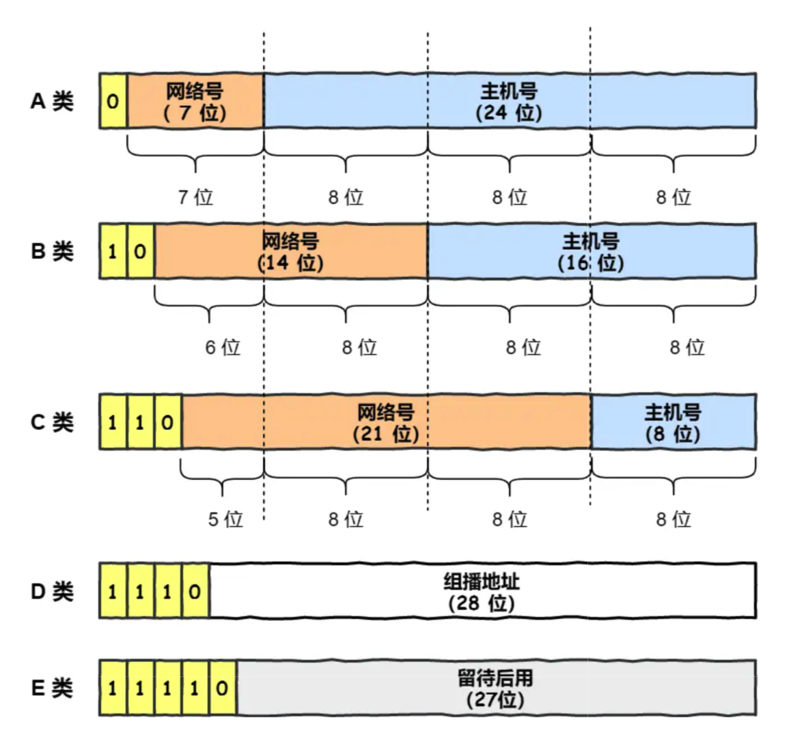

上图中黄色部分为分类号，用以区分 IP 地址类别。

### 什么是 ABC 类地址？

其中对于 A、B、C 类主要分为两个部分，分别是网络号和主机号。这很好理解，好比小林是 A 小区 1 栋 101 号，你是 B 小区 1 栋 101 号。

我们可以用下面这个表格，就能很清楚的知道 A、B、C 分类对应的地址范围、最大主机个数。


### A、B、C 分类地址最大主机个数是如何计算的呢？

最大主机个数，就是要看主机号的位数，如 C 类地址的主机号占 8 位，那么 C 类地址的最大主机个数：


为什么要减 2 呢？

因为在 IP 地址中，有两个 IP 是特殊的，分别是主机号全为 1 和全为 0 地址。


-   主机号全为 1 指定某个网络下的所有主机，用于广播
-   主机号全为 0 指定某个网络

因此，在分配过程中，应该去掉这两种情况。

### 广播地址用于什么？

广播地址用于在 **同一个链路中相互连接的主机之间发送数据包。**

学校班级中就有广播的例子，在准备上课的时候，通常班长会喊：“上课，全体起立！”，班里的同学听到这句话是不是全部都站起来了？这个句话就有广播的含义。

当主机号全为 1 时，就表示该网络的广播地址。例如把 172.20.0.0/16 用二进制表示如下：

10101100.00010100.00000000.00000000

再将这个地址用十进制表示，则为 172.20.255.255。

广播地址可以分为本地广播和直接广播两种。

-   **在本网络内广播的叫做本地广播。**例如网络地址为 192.168.0.0/24 的情况下，广播地址是 192.168.0.255 。因为这个广播地址的 IP 包会被路由器屏蔽，所以不会到达 192.168.0.0/24 以外的其他链路上。
-   **在不同网络之间的广播叫做直接广播。**例如网络地址为 192.168.0.0/24 的主机向 192.168.1.255/24 的目标地址发送 IP 包。收到这个包的路由器，将数据转发给 192.168.1.0/24，从而使得所有 192.168.1.1~192.168.1.254 的主机都能收到这个包（由于直接广播有一定的安全问题，多数情况下会在路由器上设置为不转发。）


### 什么是 D、E 类地址？

而 D 类和 E 类地址是没有主机号的，所以不可用于主机 IP，D 类常被用于多播，E 类是预留的分类，暂时未使用。

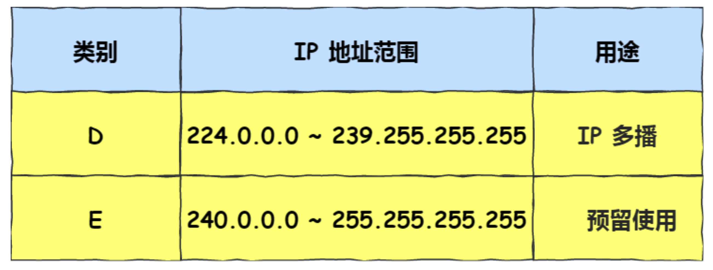

>   多播地址用于什么？

多播用于将包发送给特定组内的所有主机。

还是举班级的栗子，老师说：“最后一排的同学，上来做这道数学题。”，老师指定的是最后一排的同学，也就是多播的含义了。

由于广播无法穿透路由，若想给其他网段发送同样的包，就可以使用可以穿透路由的多播。

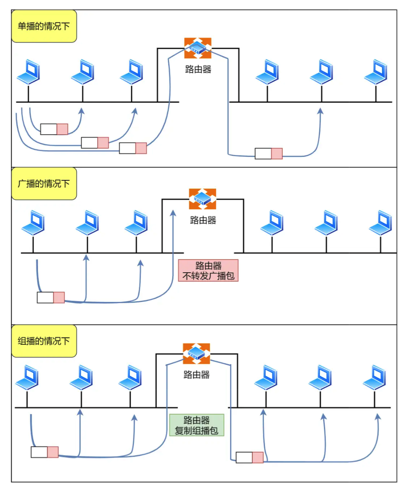

多播使用的 D 类地址，其前四位是 1110 就表示是多播地址，而剩下的 28 位是多播的组编号。

从 224.0.0.0 ~ 239.255.255.255 都是多播的可用范围，其划分为以下三类：

-   224.0.0.0 ~ 224.0.0.255 为预留的组播地址，只能在局域网中，路由器是不会进行转发的。
-   224.0.1.0 ~ 238.255.255.255 为用户可用的组播地址，可以用于 Internet 上。
-   239.0.0.0 ~ 239.255.255.255 为本地管理组播地址，可供内部网在内部使用，仅在特定的本地范围内有效。

### IP 分类的优点

不管是路由器还是主机解析到一个 IP 地址时候，我们判断其 IP 地址的首位是否为 0，为 0 则为 A 类地址，那么就能很快的找出网络地址和主机地址。

其余分类判断方式参考如下图：


所以，这种分类地址的优点就是简单明了、选路（基于网络地址）简单。

### IP 分类的缺点

缺点一：

同一网络下没有地址层次，比如一个公司里用了 B 类地址，但是可能需要根据生产环境、测试环境、开发环境来划分地址层次，而这种 IP 分类是没有地址层次划分的功能，所以这就缺少地址的灵活性。

缺点二：

A、B、C 类有个尴尬处境，就是不能很好的与现实网络匹配。

-   C 类地址能包含的最大主机数量实在太少了，只有 254 个，估计一个网吧都不够用。
-   而 B 类地址能包含的最大主机数量又太多了，6 万多台机器放在一个网络下面，一般的企业基本达不到这个规模，闲着的地址就是浪费。

这两个缺点，都可以在 CIDR 无分类地址解决。

## 无分类地址 CIDR

正因为 IP 分类存在许多缺点，所以后面提出了无分类地址的方案，即 CIDR。

这种方式不再有分类地址的概念，32 比特的 IP 地址被划分为两部分，前面是网络号，后面是主机号。

### 怎么划分网络号和主机号的呢？

表示形式 a.b.c.d/x，其中 /x 表示前 x 位属于网络号， x 的范围是 0~32，这就使得 IP 地址更加具有灵活性。

比如 10.100.122.2/24，这种地址表示形式就是 CIDR，/24 表示前 24 位是网络号，剩余的 8 位是主机号。


还有另一种划分网络号与主机号形式，那就是子网掩码，掩码的意思就是掩盖掉主机号，剩余的就是网络号。

将子网掩码和 IP 地址按位计算 AND，就可得到网络号。


### 为什么要分离网络号和主机号？

因为两台计算机要通讯，首先要判断是否处于同一个广播域内，即网络地址是否相同。如果网络地址相同，表明接受方在本网络上，那么可以把数据包直接发送到目标主机。

路由器寻址工作中，也就是通过这样的方式来找到对应的网络号的，进而把数据包转发给对应的网络内。


### 怎么进行子网划分？

在上面我们知道可以通过子网掩码划分出网络号和主机号，那实际上子网掩码还有一个作用，那就是划分子网。

子网划分实际上是将主机地址分为两个部分：子网网络地址和子网主机地址。形式如下：


- 未做子网划分的 ip 地址：网络地址＋主机地址
- 做子网划分后的 ip 地址：网络地址＋（子网网络地址＋子网主机地址）

假设对 C 类地址进行子网划分，网络地址 192.168.1.0，使用子网掩码 255.255.255.192 对其进行子网划分。

C 类地址中前 24 位是网络号，最后 8 位是主机号，根据子网掩码可知从 8 位主机号中借用 2 位作为子网号。

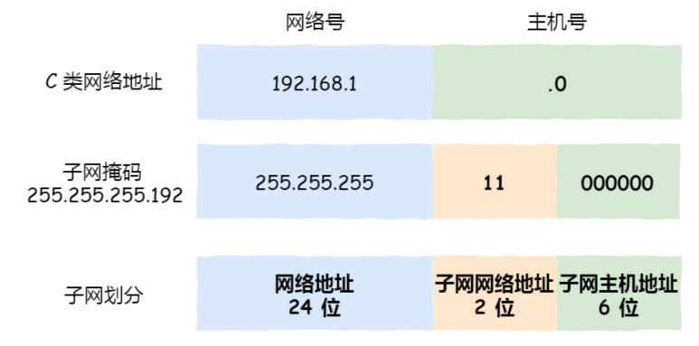

由于子网网络地址被划分成 2 位，那么子网地址就有 4 个，分别是 00、01、10、11，具体划分如下图：

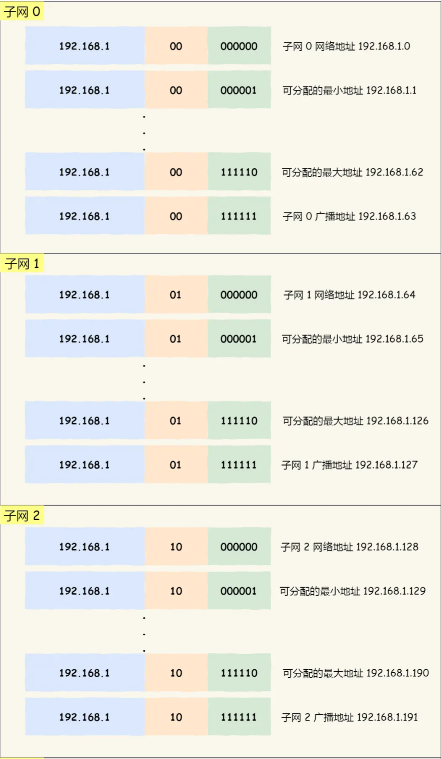

划分后的 4 个子网如下表格：


## 公有 IP 地址与私有 IP 地址

在 A、B、C 分类地址，实际上有分公有 IP 地址和私有 IP 地址。

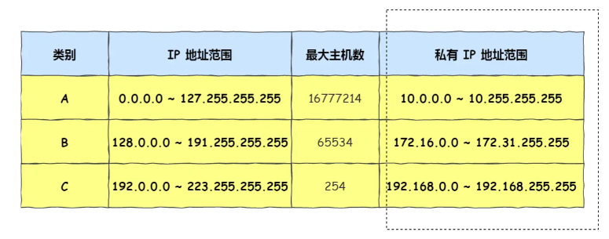

平时我们办公室、家里、学校用的 IP 地址，一般都是私有 IP 地址。因为这些地址允许组织内部的 IT 人员自己管理、自己分配，而且可以重复。因此，你学校的某个私有 IP 地址和我学校的可以是一样的。

就像每个小区都有自己的楼编号和门牌号，你小区家可以叫 1 栋 101 号，我小区家也可以叫 1 栋 101，没有任何问题。但一旦出了小区，就需要带上中山路 666 号（公网 IP 地址），是国家统一分配的，不能两个小区都叫中山路 666。

所以，公有 IP 地址是有个组织统一分配的，假设你要开一个博客网站，那么你就需要去申请购买一个公有 IP，这样全世界的人才能访问。并且公有 IP 地址基本上要在整个互联网范围内保持唯一。


## 公有 IP 地址由谁管理呢？

私有 IP 地址通常是内部的 IT 人员管理，公有 IP 地址是由 ICANN 组织管理，中文叫「互联网名称与数字地址分配机构」。

IANA 是 ICANN 的其中一个机构，它负责分配互联网 IP 地址，是按州的方式层层分配。

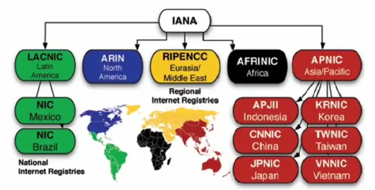

- ARIN 北美地区
- LACNIC 拉丁美洲和一些加勒比群岛
- RIPE NCC 欧洲、中东和中亚
- AfriNIC 非洲地区
- APNIC 亚太地区

其中，在中国是由 CNNIC 的机构进行管理，它是中国国内唯一指定的全局 IP 地址管理的组织。

## IP 地址与路由控制

IP 地址的网络地址这一部分是用于进行路由控制。

路由控制表中记录着网络地址与下一步应该发送至路由器的地址。在主机和路由器上都会有各自的路由器控制表。

在发送 IP 包时，首先要确定 IP 包首部中的目标地址，再从路由控制表中找到与该地址具有相同网络地址的记录，根据该记录将 IP 包转发给相应的下一个路由器。如果路由控制表中存在多条相同网络地址的记录，就选择相同位数最多的网络地址，也就是最长匹配。

下面以下图的网络链路作为例子说明：

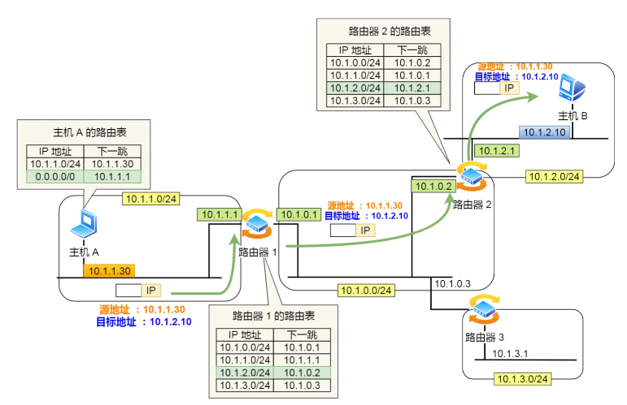

1. 主机 A 要发送一个 IP 包，其源地址是 10.1.1.30 和目标地址是 10.1.2.10，由于没有在主机 A 的路由表找到与目标地址 10.1.2.10 的网络地址，于是包被转发到默认路由（路由器 1）
2. 路由器 1 收到 IP 包后，也在路由器 1 的路由表匹配与目标地址相同的网络地址记录，发现匹配到了，于是就把 IP 数据包转发到了 10.1.0.2 这台路由器 2
3. 路由器 2 收到后，同样对比自身的路由表，发现匹配到了，于是把 IP 包从路由器 2 的 10.1.2.1 这个接口出去，最终经过交换机把 IP 数据包转发到了目标主机

> 环回地址是不会流向网络

环回地址是在同一台计算机上的程序之间进行网络通信时所使用的一个默认地址。

计算机使用一个特殊的 IP 地址 127.0.0.1 作为环回地址。与该地址具有相同意义的是一个叫做 localhost 的主机名。使用这个 IP 或主机名时，数据包不会流向网络。

## IP 分片与重组

每种数据链路的最大传输单元 MTU 都是不相同的，如 FDDI 数据链路 MTU 4352、以太网的 MTU 是 1500 字节等。

每种数据链路的 MTU 之所以不同，是因为每个不同类型的数据链路的使用目的不同。使用目的不同，可承载的 MTU 也就不同。

其中，我们最常见数据链路是以太网，它的 MTU 是 1500 字节。

那么当 IP 数据包大小大于 MTU 时， IP 数据包就会被分片。

经过分片之后的 IP 数据报在被重组的时候，只能由目标主机进行，路由器是不会进行重组的。

假设发送方发送一个 4000 字节的大数据报，若要传输在以太网链路，则需要把数据报分片成 3 个小数据报进行传输，再交由接收方重组成大数据报。


在分片传输中，一旦某个分片丢失，则会造成整个 IP 数据报作废，所以 TCP 引入了 MSS 也就是在 TCP 层进行分片不由 IP 层分片，那么对于 UDP 我们尽量不要发送一个大于 MTU 的数据报文。

## IPv6 基本认识

IPv4 的地址是 32 位的，大约可以提供 42 亿个地址，但是早在 2011 年 IPv4 地址就已经被分配完了。

但是 IPv6 的地址是 128 位的，这可分配的地址数量是大的惊人，说个段子 IPv6 可以保证地球上的每粒沙子都能被分配到一个 IP 地址。

但 IPv6 除了有更多的地址之外，还有更好的安全性和扩展性，说简单点就是 IPv6 相比于 IPv4 能带来更好的网络体验。

但是因为 IPv4 和 IPv6 不能相互兼容，所以不但要我们电脑、手机之类的设备支持，还需要网络运营商对现有的设备进行升级，所以这可能是 IPv6 普及率比较慢的一个原因。

### IPv6 的亮点

IPv6 不仅仅只是可分配的地址变多了，它还有非常多的亮点。

- IPv6 可自动配置，即使没有 DHCP 服务器也可以实现自动分配IP地址，真是便捷到即插即用。
- IPv6 包头包首部长度采用固定的值 40 字节，去掉了包头校验和，简化了首部结构，减轻了路由器负荷，大大提高了传输的性能。
- IPv6 有应对伪造 IP 地址的网络安全功能以及防止线路窃听的功能，大大提升了安全性。

### IPv6 地址的标识方法

IPv4 地址长度共 32 位，是以每 8 位作为一组，并用点分十进制的表示方式。

IPv6 地址长度是 128 位，是以每 16 位作为一组，每组用冒号「:」隔开。

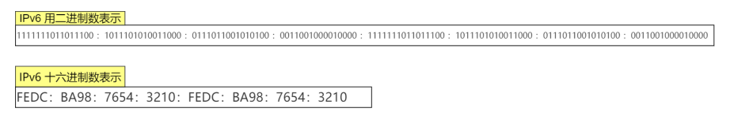

如果出现连续的 0 时还可以将这些 0 省略，并用两个冒号「::」隔开。但是，一个 IP 地址中只允许出现一次两个连续的冒号。


### IPv6 地址的结构

IPv6 类似 IPv4，也是通过 IP 地址的前几位标识 IP 地址的种类。

IPv6 的地址主要有以下类型地址：

- 单播地址，用于一对一的通信
- 组播地址，用于一对多的通信
- 任播地址，用于通信最近的节点，最近的节点是由路由协议决定
- 没有广播地址

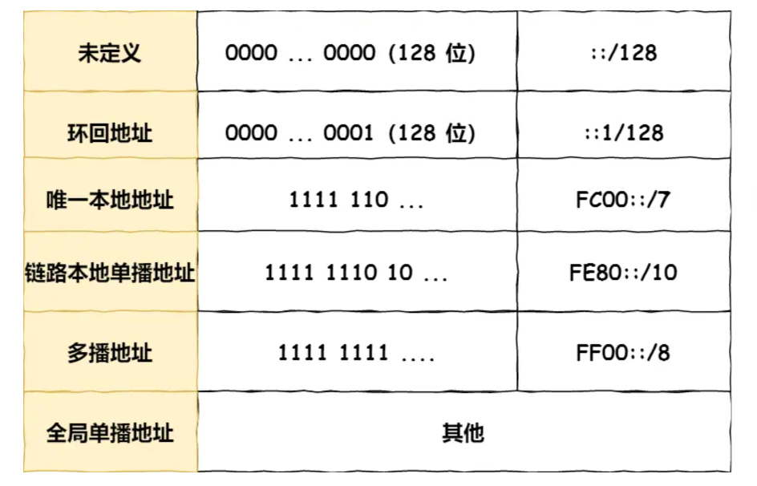

### IPv6 单播地址类型

对于一对一通信的 IPv6 地址，主要划分了三类单播地址，每类地址的有效范围都不同。

- 在同一链路单播通信，不经过路由器，可以使用链路本地单播地址，IPv4 没有此类型

- 在内网里单播通信，可以使用唯一本地地址，相当于 IPv4 的私有 IP

- 在互联网通信，可以使用全局单播地址，相当于 IPv4 的公有 IP


### IPv4 首部与 IPv6 首部

IPv4 首部与 IPv6 首部的差异如下图：


IPv6 相比 IPv4 的首部改进：

- 取消了首部校验和字段。因为在数据链路层和传输层都会校验，因此 IPv6 直接取消了 IP 的校验。
- 取消了分片/重新组装相关字段。分片与重组是耗时的过程，IPv6 不允许在中间路由器进行分片与重组，这种操作只能在源与目标主机，这将大大提高了路由器转发的速度。
- 取消选项字段。选项字段不再是标准 IP 首部的一部分了，但它并没有消失，而是可能出现在 IPv6 首部中的「下一个首部」指出的位置上。删除该选项字段使的 IPv6 的首部成为固定长度的 40 字节。

# IP 协议相关技术

## DNS 

我们在上网的时候，通常使用的方式是域名，而不是 IP 地址，因为域名方便人类记忆。

那么实现这一技术的就是 DNS 域名解析，DNS 可以将域名网址自动转换为具体的 IP 地址。

### 域名的层级关系

DNS 中的域名都是用句点来分隔的，比如 www.server.com，这里的句点代表了不同层次之间的界限。

在域名中，越靠右的位置表示其层级越高。

根域是在最顶层，它的下一层就是 com 顶级域，再下面是 server.com。

所以域名的层级关系类似一个树状结构：

- 根 DNS 服务器
- 顶级域 DNS 服务器（com）
- 权威 DNS 服务器（server.com）


根域的 DNS 服务器信息保存在互联网中所有的 DNS 服务器中。这样一来，任何 DNS 服务器就都可以找到并访问根域 DNS 服务器了。

因此，客户端只要能够找到任意一台 DNS 服务器，就可以通过它找到根域 DNS 服务器，然后再一路顺藤摸瓜找到位于下层的某台目标 DNS 服务器。

### 域名解析的工作流程

浏览器首先看一下自己的缓存里有没有，如果没有就向操作系统的缓存要，还没有就检查本机域名解析文件 hosts，如果还是没有，就会 DNS 服务器进行查询，查询的过程如下：

1. 客户端首先会发出一个 DNS 请求，问 www.server.com 的 IP 是啥，并发给本地 DNS 服务器（也就是客户端的 TCP/IP 设置中填写的 DNS 服务器地址）。
2. 本地域名服务器收到客户端的请求后，如果缓存里的表格能找到 www.server.com，则它直接返回 IP 地址。如果没有，本地 DNS 会去问它的根域名服务器：“老大，能告诉我 www.server.com 的 IP 地址吗？” 根域名服务器是最高层次的，它不直接用于域名解析，但能指明一条道路。
3. 根 DNS 收到来自本地 DNS 的请求后，发现后置是 .com，说：“www.server.com.com 区域管理”，我给你 .com 顶级域名服务器地址给你，你去问问它吧。”
4. 本地 DNS 收到顶级域名服务器的地址后，发起请求问“老二，你能告诉我 www.server.com 的 IP 地址吗？”
5. 顶级域名服务器说：“我给你负责 www.server.com 区域的权威 DNS 服务器的地址，你去问它应该能问到”。
6. 本地 DNS 于是转向问权威 DNS 服务器：“老三，www.server.com 对应的 IP 是啥呀？” server.com 的权威 DNS 服务器，它是域名解析结果的原出处。为啥叫权威呢？就是我的域名我做主。
7. 权威 DNS 服务器查询后将对应的 IP 地址 X.X.X.X 告诉本地 DNS。
8. 本地 DNS 再将 IP 地址返回客户端，客户端和目标建立连接。

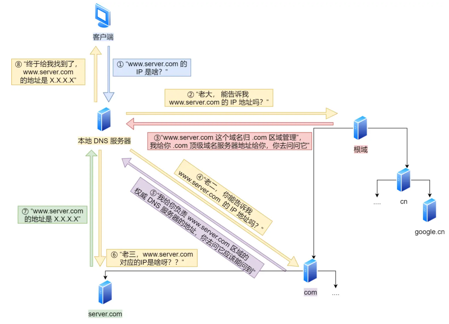

DNS 域名解析的过程蛮有意思的，整个过程就和我们日常生活中找人问路的过程类似，只指路不带路。

## ARP

在传输一个 IP 数据报的时候，确定了源 IP 地址和目标 IP 地址后，就会通过主机「路由表」确定 IP 数据包下一跳。然而，网络层的下一层是数据链路层，所以我们还要知道「下一跳」的 MAC 地址。

由于主机的路由表中可以找到下一跳的 IP 地址，所以可以通过 ARP 协议，求得下一跳的 MAC 地址。

### 那么 ARP 又是如何知道对方 MAC 地址的呢？

简单地说，ARP 是借助 ARP 请求与 ARP 响应两种类型的包确定 MAC 地址的。


- 主机会通过广播发送 ARP 请求，这个包中包含了想要知道的 MAC 地址的主机 IP 地址。
- 当同个链路中的所有设备收到 ARP 请求时，会去拆开 ARP 请求包里的内容，如果 ARP 请求包中的目标 IP 地址与自己的 IP 地址一致，那么这个设备就将自己的 MAC 地址塞入 ARP 响应包返回给主机。

操作系统通常会把第一次通过 ARP 获取的 MAC 地址缓存起来，以便下次直接从缓存中找到对应 IP 地址的 MAC 地址。

不过，MAC 地址的缓存是有一定期限的，超过这个期限，缓存的内容将被清除。

### RARP 协议

ARP 协议是已知 IP 地址求 MAC 地址，那 RARP 协议正好相反，它是已知 MAC 地址求 IP 地址。例如将打印机服务器等小型嵌入式设备接入到网络时就经常会用得到。

通常这需要架设一台 RARP 服务器，在这个服务器上注册设备的 MAC 地址及其 IP 地址。然后再将这个设备接入到网络，接着：

- 该设备会发送一条「我的 MAC 地址是 XXXX，请告诉我，我的 IP 地址应该是什么」的请求信息。
- RARP 服务器接到这个消息后返回「MAC 地址为 XXXX 的设备，IP 地址为 XXXX」的信息给这个设备。

最后，设备就根据从 RARP 服务器所收到的应答信息设置自己的 IP 地址。

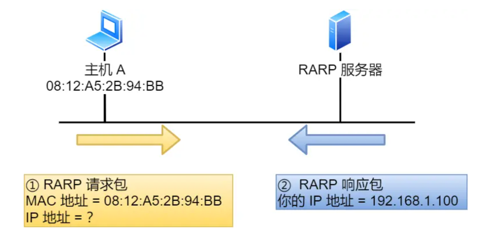

## DHCP

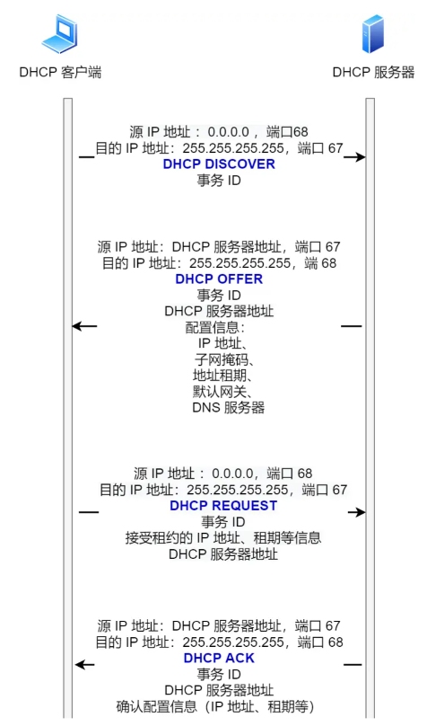

DHCP 客户端进程监听的是 68 端口号，DHCP 服务端进程监听的是 67 端口号。

- 客户端首先发起 DHCP 发现报文（DHCP DISCOVER）的 IP 数据报，由于客户端没有 IP 地址，也不知道 DHCP 服务器的地址，所以使用的是 UDP 广播通信，其使用的广播目的地址是 255.255.255.255（端口 67）并且使用 0.0.0.0（端口 68）作为源 IP 地址。DHCP 客户端将该 IP 数据报传递给链路层，链路层然后将帧广播到所有的网络中设备。
- DHCP 服务器收到 DHCP 发现报文时，用 DHCP 提供报文（DHCP OFFER）向客户端做出响应。该报文仍然使用 IP 广播地址 255.255.255.255，该报文信息携带服务器提供可租约的 IP 地址、子网掩码、默认网关、DNS 服务器以及 IP 地址租用期。
- 客户端收到一个或多个服务器的 DHCP 提供报文后，从中选择一个服务器，并向选中的服务器发送 DHCP 请求报文（DHCP REQUEST）进行响应，回显配置的参数。
- 最后，服务端用 DHCP ACK 报文对 DHCP 请求报文进行响应，应答所要求的参数。

一旦客户端收到 DHCP ACK 后，交互便完成了，并且客户端能够在租用期内使用 DHCP 服务器分配的 IP 地址。

如果租约的 DHCP IP 地址快期后，客户端会向服务器发送 DHCP 请求报文：

- 服务器如果同意继续租用，则用 DHCP ACK 报文进行应答，客户端就会延长租期。
- 服务器如果不同意继续租用，则用 DHCP NACK 报文，客户端就要停止使用租约的 IP 地址。

可以发现，DHCP 交互中，全程都是使用 UDP 广播通信。

> 如果 DHCP 服务器和客户端不是在同一个局域网内，路由器又不会转发广播包，那不是每个网络都要配一个 DHCP 服务器？
>
> 为了解决这一问题，就出现了 DHCP 中继代理。有了 DHCP 中继代理以后，对不同网段的 IP 地址分配也可以由一个 DHCP 服务器统一进行管理。
>
> 
>
> - DHCP 客户端会向 DHCP 中继代理发送 DHCP 请求包，而 DHCP 中继代理在收到这个广播包以后，再以单播的形式发给 DHCP 服务器。
> - 服务器端收到该包以后再向 DHCP 中继代理返回应答，并由 DHCP 中继代理将此包广播给 DHCP 客户端。

因此，DHCP 服务器即使不在同一个链路上也可以实现统一分配和管理 IP 地址。

## NAT

IPv4 的地址是非常紧缺的，在前面我们也提到可以通过无分类地址来减缓 IPv4 地址耗尽的速度，但是互联网的用户增速是非常惊人的，所以 IPv4 地址依然有被耗尽的危险。

于是，提出了一种网络地址转换 NAT 的方法，再次缓解了 IPv4 地址耗尽的问题。

简单的来说 NAT 就是同个公司、家庭、教室内的主机对外部通信时，把私有 IP 地址转换成公有 IP 地址。


由于绝大多数的网络应用都是使用传输层协议 TCP 或 UDP 来传输数据的。因此，可以把 IP 地址 + 端口号一起进行转换。这样，就用一个全球 IP 地址就可以了，这种转换技术就叫网络地址与端口转换 NAPT。


图中有两个客户端 192.168.1.10 和 192.168.1.11 同时与服务器 183.232.231.172 进行通信，并且这两个客户端的本地端口都是 1025。

此时，两个私有 IP 地址都转换 IP 地址为公有地址 120.229.175.121，但是以不同的端口号作为区分。

于是，生成一个 NAPT 路由器的转换表，就可以正确地转换地址跟端口的组合，令客户端 A、B 能同时与服务器之间进行通信。

这种转换表在 NAT 路由器上自动生成。例如，在 TCP 的情况下，建立 TCP 连接首次握手时的 SYN 包一经发出，就会生成这个表。而后又随着收到关闭连接时发出 FIN 包的确认应答从表中被删除。

由于 NAT/NAPT 都依赖于自己的转换表，因此会有以下的问题：

- 外部无法主动与 NAT 内部服务器建立连接，因为 NAPT 转换表没有转换记录。
- 转换表的生成与转换操作都会产生性能开销。
- 通信过程中，如果 NAT 路由器重启了，所有的 TCP 连接都将被重置。

### 如何解决 NAT 潜在的问题？

解决的方法主要有两种方法：

1. IPv6

    IPv6 可用范围非常大，以至于每台设备都可以配置一个公有 IP 地址，就不搞那么多花里胡哨的地址转换了，但是 IPv6 普及速度还需要一些时间。

2. NAT 穿透技术

    NAT 穿越技术拥有这样的功能，它能够让网络应用程序主动发现自己位于 NAT 设备之后，并且会主动获得 NAT 设备的公有 IP，并为自己建立端口映射条目，注意这些都是 NAT 设备后的应用程序自动完成的。

    也就是说，在 NAT 穿透技术中，NAT 设备后的应用程序处于主动地位，它已经明确地知道 NAT 设备要修改它外发的数据包，于是它主动配合 NAT 设备的操作，主动地建立好映射，这样就不像以前由 NAT设备来建立映射了。

    说人话，就是客户端主动从 NAT 设备获取公有 IP 地址，然后自己建立端口映射条目，然后用这个条目对外通信，就不需要 NAT 设备来进行转换了。

## ICMP

ICMP 全称是 Internet Control Message Protocol，也就是互联网控制报文协议。里面有个关键词 —— 控制，如何控制的呢？网络包在复杂的网络传输环境里，常常会遇到各种问题。当遇到问题的时候，总不能死个不明不白，没头没脑的作风不是计算机网络的风格。所以需要传出消息，报告遇到了什么问题，这样才可以调整传输策略，以此来控制整个局面。

### ICMP 功能

ICMP 主要的功能包括：确认 IP 包是否成功送达目标地址、报告发送过程中 IP 包被废弃的原因和改善网络设置等。

在 IP 通信中如果某个 IP 包因为某种原因未能达到目标地址，那么这个具体的原因将由 ICMP 负责通知。


如上图例子，主机 A 向主机 B 发送了数据包，由于某种原因，途中的路由器 2 未能发现主机 B 的存在，这时，路由器 2 就会向主机 A 发送一个 ICMP 目标不可达数据包，说明发往主机 B 的包未能成功。

ICMP 的这种通知消息会使用 IP 进行发送。

因此，从路由器 2 返回的 ICMP 包会按照往常的路由控制先经过路由器 1 再转发给主机 A。收到该 ICMP 包的主机
A 则分解 ICMP 的首部和数据域以后得知具体发生问题的原因。

### ICMP 类型

ICMP 大致可以分为两大类：

- 一类是用于诊断的查询消息，也就是「查询报文类型」
- 另一类是通知出错原因的错误消息，也就是「差错报文类型」

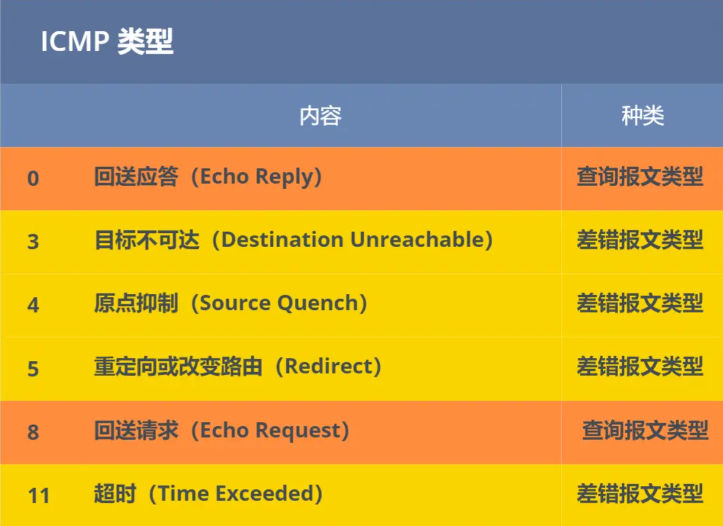

## IGMP

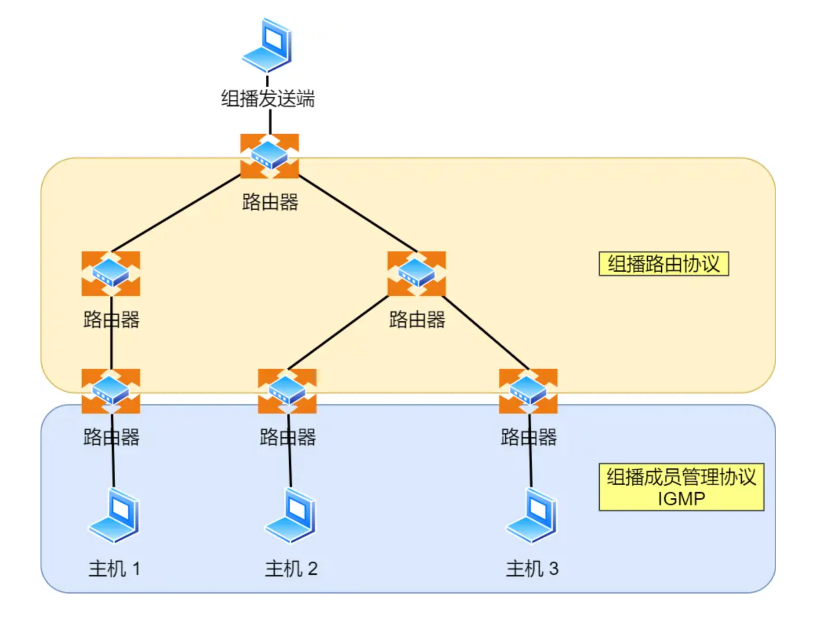

IGMP 是因特网组管理协议，工作在主机（组播成员）和最后一跳路由之间，如上图中的蓝色部分。

- IGMP 报文向路由器申请加入和退出组播组，默认情况下路由器是不会转发组播包到连接中的主机，除非主机通过 IGMP 加入到组播组，主机申请加入到组播组时，路由器就会记录 IGMP 路由器表，路由器后续就会转发组播包到对应的主机了。
- IGMP 报文采用 IP 封装，IP 头部的协议号为 2，而且 TTL 字段值通常为 1，因为 IGMP 是工作在主机与连接的路由器之间。

### IGMP 工作机制

IGMP 分为了三个版本分别是，IGMPv1、IGMPv2、IGMPv3。

接下来，以 IGMPv2 作为例子，说说常规查询与响应和离开组播组这两个工作机制。

**常规查询与响应工作机制**

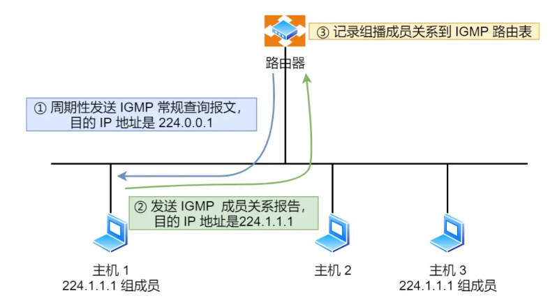

1. 路由器会周期性发送目的地址为 224.0.0.1（表示同一网段内所有主机和路由器）IGMP 常规查询报文。
2. 主机 1 和主机 3 收到这个查询，随后会启动「报告延迟计时器」，计时器的时间是随机的，通常是 0~10 秒，计时器超时后主机就会发送 IGMP 成员关系报告报文（源 IP 地址为自己主机的 IP 地址，目的 IP 地址为组播地址）。如果在定时器超时之前，收到同一个组内的其他主机发送的成员关系报告报文，则自己不再发送，这样可以减少网络中多余的 IGMP 报文数量。
3. 路由器收到主机的成员关系报文后，就会在 IGMP 路由表中加入该组播组，后续网络中一旦该组播地址的数据到达路由器，它会把数据包转发出去。

### 离开组播组工作机制

离开组播组的情况一，网段中仍有该组播组：


1. 主机 1 要离开组 224.1.1.1，发送 IGMPv2 离组报文，报文的目的地址是 224.0.0.2（表示发向网段内的所有路由器）
2. 路由器收到该报文后，以 1 秒为间隔连续发送 IGMP 特定组查询报文（共计发送 2 个），以便确认该网络是否还有 224.1.1.1 组的其他成员。
3. 主机 3 仍然是组 224.1.1.1 的成员，因此它立即响应这个特定组查询。路由器知道该网络中仍然存在该组播组的成员，于是继续向该网络转发 224.1.1.1 的组播数据包。

离开组播组的情况二，网段中没有该组播组：

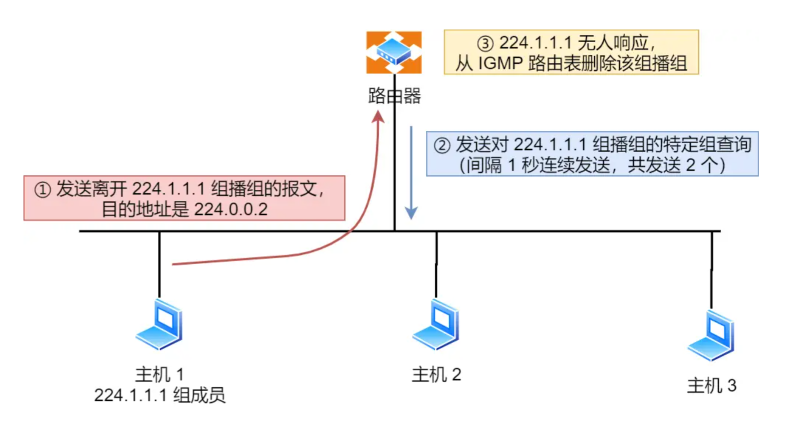

1. 主机 1 要离开组播组 224.1.1.1，发送 IGMP 离组报文。
2. 路由器收到该报文后，以 1 秒为间隔连续发送 IGMP 特定组查询报文（共计发送 2 个）。此时在该网段内，组 224.1.1.1 已经没有其他成员了，因此没有主机响应这个查询。
3. 一定时间后，路由器认为该网段中已经没有 224.1.1.1 组播组成员了，将不会再向这个网段转发该组播地址的数据包。

# HTTP

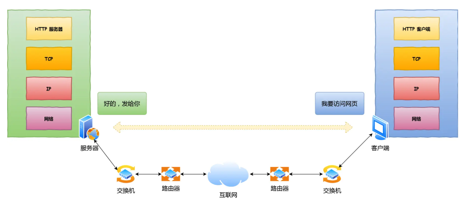

# 第一步：解析 URL

首先浏览器做的第一步工作就是要对 URL 进行解析，从而生成发送给 Web 服务器的请求信息。

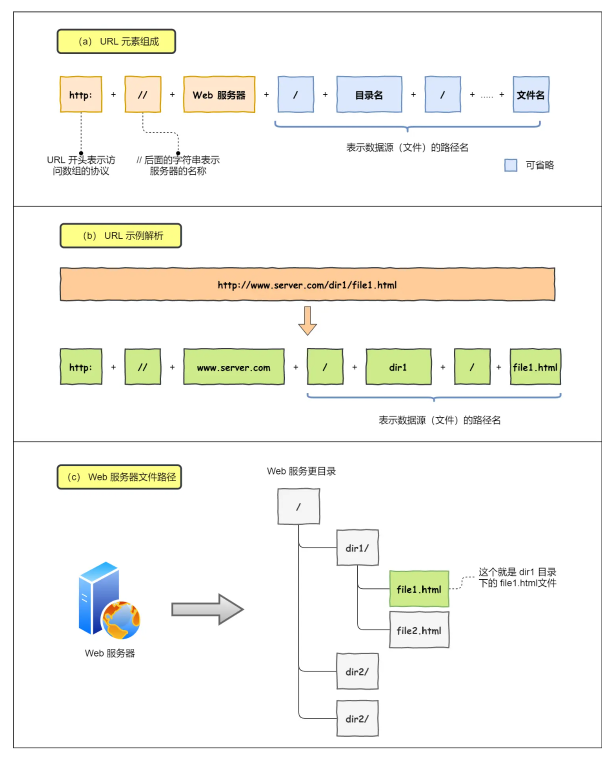

所以图中的长长的 URL 实际上是请求服务器里的文件资源。

> 要是上图中的蓝色部分 URL 元素都省略了，那应该是请求哪个文件呢？
>
> 当没有路径名时，就代表访问根目录下事先设置的默认文件，也就是 /index.html 或者 /default.html 这些文件，这样就不会发生混乱了。

### 生产 HTTP 请求信息

对 URL 进行解析之后，浏览器确定了 Web 服务器和文件名，接下来就是根据这些信息来生成 HTTP 请求消息了。

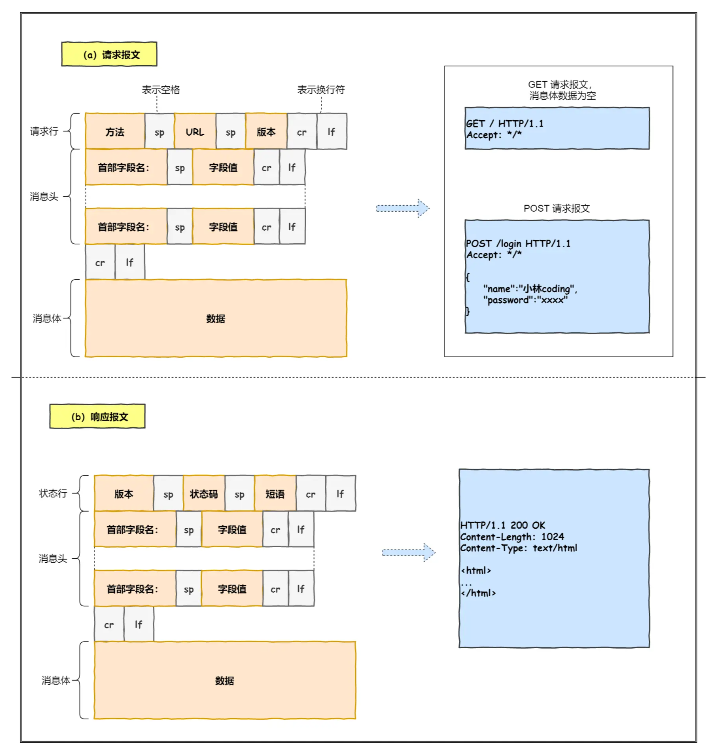

# 第二步：DNS 

我们在上网的时候，通常使用的方式是域名，而不是 IP 地址，因为域名方便人类记忆。

那么实现这一技术的就是 DNS 域名解析，DNS 可以将域名网址自动转换为具体的 IP 地址。

### 域名的层级关系

DNS 中的域名都是用句点来分隔的，比如 www.server.com，这里的句点代表了不同层次之间的界限。

在域名中，越靠右的位置表示其层级越高。

根域是在最顶层，它的下一层就是 com 顶级域，再下面是 server.com。

所以域名的层级关系类似一个树状结构：

- 根 DNS 服务器
- 顶级域 DNS 服务器（com）
- 权威 DNS 服务器（server.com）


根域的 DNS 服务器信息保存在互联网中所有的 DNS 服务器中。这样一来，任何 DNS 服务器就都可以找到并访问根域 DNS 服务器了。

因此，客户端只要能够找到任意一台 DNS 服务器，就可以通过它找到根域 DNS 服务器，然后再一路顺藤摸瓜找到位于下层的某台目标 DNS 服务器。

### 域名解析的工作流程

浏览器首先看一下自己的缓存里有没有，如果没有就向操作系统的缓存要，还没有就检查本机域名解析文件 hosts，如果还是没有，就会 DNS 服务器进行查询，查询的过程如下：

1. 客户端首先会发出一个 DNS 请求，问 www.server.com 的 IP 是啥，并发给本地 DNS 服务器（也就是客户端的 TCP/IP 设置中填写的 DNS 服务器地址）。
2. 本地域名服务器收到客户端的请求后，如果缓存里的表格能找到 www.server.com，则它直接返回 IP 地址。如果没有，本地 DNS 会去问它的根域名服务器：“老大，能告诉我 www.server.com 的 IP 地址吗？” 根域名服务器是最高层次的，它不直接用于域名解析，但能指明一条道路。
3. 根 DNS 收到来自本地 DNS 的请求后，发现后置是 .com，说：“www.server.com.com 区域管理”，我给你 .com 顶级域名服务器地址给你，你去问问它吧。”
4. 本地 DNS 收到顶级域名服务器的地址后，发起请求问“老二，你能告诉我 www.server.com 的 IP 地址吗？”
5. 顶级域名服务器说：“我给你负责 www.server.com 区域的权威 DNS 服务器的地址，你去问它应该能问到”。
6. 本地 DNS 于是转向问权威 DNS 服务器：“老三，www.server.com对应的IP是啥呀？” server.com 的权威 DNS 服务器，它是域名解析结果的原出处。为啥叫权威呢？就是我的域名我做主。
7. 权威 DNS 服务器查询后将对应的 IP 地址 X.X.X.X 告诉本地 DNS。
8. 本地 DNS 再将 IP 地址返回客户端，客户端和目标建立连接。


DNS 域名解析的过程蛮有意思的，整个过程就和我们日常生活中找人问路的过程类似，只指路不带路。

# 第三步：协议栈

通过 DNS 获取到 IP 后，就可以把 HTTP 的传输工作交给操作系统中的协议栈。

协议栈的内部分为几个部分，分别承担不同的工作。上下关系是有一定的规则的，上面的部分会向下面的部分委托工作，下面的部分收到委托的工作并执行。


应用程序（浏览器）通过调用 Socket 库，来委托协议栈工作。协议栈的上半部分有两块，分别是负责收发数据的 TCP 和 UDP 协议，它们两会接受应用层的委托执行收发数据的操作。

协议栈的下面一半是用 IP 协议控制网络包收发操作，在互联网上传数据时，数据会被切分成一块块的网络包，而将网络包发送给对方的操作就是由 IP 负责的。

此外 IP 中还包括 ICMP 协议和 ARP 协议。

- ICMP 用于告知网络包传送过程中产生的错误以及各种控制信息。
- ARP 用于根据 IP 地址查询相应的以太网 MAC 地址。

IP 下面的网卡驱动程序负责控制网卡硬件，而最下面的网卡则负责完成实际的收发操作，也就是对网线中的信号执行发送和接收操作。

# 第四步：TCP

HTTP 是基于 TCP 协议传输的，所以在这我们先了解下 TCP 协议。

### TCP 包头格式

我们先看看 TCP 报文头部的格式：

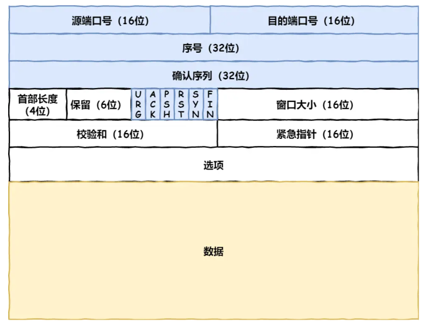

首先，**源端口号** 和 **目标端口号** 是不可少的，如果没有这两个端口号，数据就不知道应该发给哪个应用。

接下来有包的 **序号**，这个是为了解决包乱序的问题。

还有应该有的是 **确认号**，目的是确认发出去对方是否有收到。如果没有收到就应该重新发送，直到送达，这个是为了解决不丢包的问题。

接下来还有一些状态位。例如 SYN 是发起一个连接，ACK 是回复，RST 是重新连接，FIN 是结束连接等。TCP 是面向连接的，因而双方要维护连接的状态，这些带状态位的包的发送，会引起双方的状态变更。

还有一个重要的就是窗口大小。TCP 要做流量控制，通信双方各声明一个窗口（缓存大小），标识自己当前能够的处理能力。

除了做流量控制以外，TCP 还会做拥塞控制，对于真正的通路堵车不堵车，它无能为力，唯一能做的就是控制自己，也即控制发送的速度。不能改变世界，就改变自己嘛。

### TCP 传输数据之前，要先三次握手建立连接

在 HTTP 传输数据之前，首先需要 TCP 建立连接，TCP 连接的建立，通常称为三次握手。

这个所谓的「连接」，只是双方计算机里维护一个状态机，在连接建立的过程中，双方的状态变化时序图就像这样。


- 一开始，客户端和服务端都处于 CLOSED 状态。先是服务端主动监听某个端口，处于 LISTEN 状态。
- 然后客户端主动发起连接 SYN，之后处于 SYN-SENT 状态。
- 服务端收到发起的连接，返回 SYN，并且 ACK 客户端的 SYN，之后处于 SYN-RCVD 状态。
- 客户端收到服务端发送的 SYN 和 ACK 之后，发送 ACK 的 ACK，之后处于 ESTABLISHED 状态，因为它一发一收成功了。
- 服务端收到 ACK 的 ACK 之后，处于 ESTABLISHED 状态，因为它也一发一收了。

所以三次握手目的是保证双方都有发送和接收的能力。

> 如何查看 TCP 的连接状态？
>
> TCP 的连接状态查看，在 Linux 可以通过 netstat napt 命令查看。

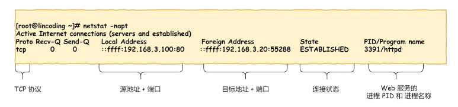

### TCP 分割数据

如果 HTTP 请求消息比较长，超过了 MSS 的长度，这时 TCP 就需要把 HTTP 的数据拆解成一块块的数据发送，而不是一次性发送所有数据。

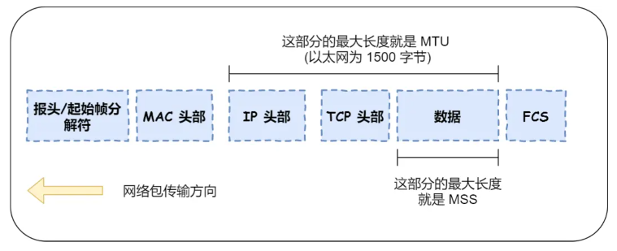

- MTU：一个网络包的最大长度，以太网中一般为 1500 字节。
- MSS：除去 IP 和 TCP 头部之后，一个网络包所能容纳的 TCP 数据的最大长度。

数据会被以 MSS 的长度为单位进行拆分，拆分出来的每一块数据都会被放进单独的网络包中。也就是在每个被拆分的数据加上 TCP 头信息，然后交给 IP 模块来发送数据。


### TCP 报文生成

TCP 协议里面会有两个端口，一个是浏览器监听的端口（通常是随机生成的），一个是 Web 服务器监听的端口（HTTP 默认端口号是 80， HTTPS 默认端口号是 443）。

在双方建立了连接后，TCP 报文中的数据部分就是存放 HTTP 头部 + 数据，组装好 TCP 报文之后，就需交给下面的网络层处理。

至此，网络包的报文如下图。

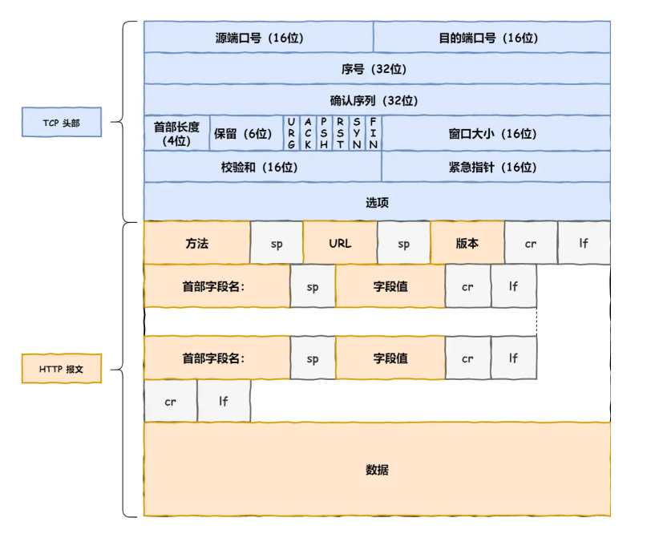

# 第五步：IP

TCP 模块在执行连接、收发、断开等各阶段操作时，都需要委托 IP 模块将数据封装成网络包发送给通信对象。

IP 包头格式


在 IP 协议里面需要有源地址 IP 和目标地址 IP：

- 源地址 IP，即是客户端输出的 IP 地址；
- 目标地址 IP，即通过 DNS 域名解析得到的 Web 服务器 IP。

因为 HTTP 是经过 TCP 传输的，所以在 IP 包头的协议号，要填写为 06（十六进制），表示协议为 TCP。

> 假设客户端有多个网卡，就会有多个 IP 地址，那 IP 头部的源地址应该选择哪个 IP 呢？
>
> 当存在多个网卡时，在填写源地址 IP 时，就需要判断到底应该填写哪个地址。这个判断相当于在多块网卡中判断应该使用哪个一块网卡来发送包。
> 
>这个时候就需要根据路由表规则，来判断哪一个网卡作为源地址 IP。
> 
>在 Linux 操作系统，我们可以使用 `route -n` 命令查看当前系统的路由表。
> 
>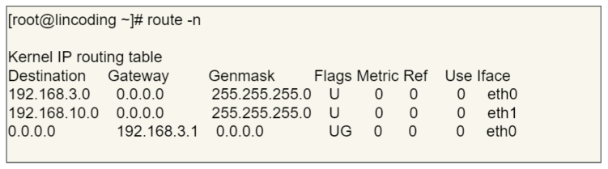

举个例子，根据上面的路由表，我们假设 Web 服务器的目标地址是 192.168.10.200。


1. 首先先和第一条目的子网掩码（Genmask）进行与运算，得到结果为 192.168.10.0，但是第一个条目的 Destination 是 192.168.3.0，两者不一致所以匹配失败。
2. 再与第二条目的子网掩码进行与运算，得到的结果为 192.168.10.0，与第二条目的 Destination 192.168.10.0 匹配成功，所以将使用 eth1 网卡的 IP 地址作为 IP 包头的源地址。

那么假设 Web 服务器的目标地址是 10.100.20.100，那么依然依照上面的路由表规则判断，判断后的结果是和第三条目匹配。

第三条目比较特殊，它目标地址和子网掩码都是 0.0.0.0，这表示默认网关，如果其他所有条目都无法匹配，就会自动匹配这一行。并且后续就把包发给路由器，Gateway 即是路由器的 IP 地址。

### IP 报文生成

至此，网络包的报文如下图。

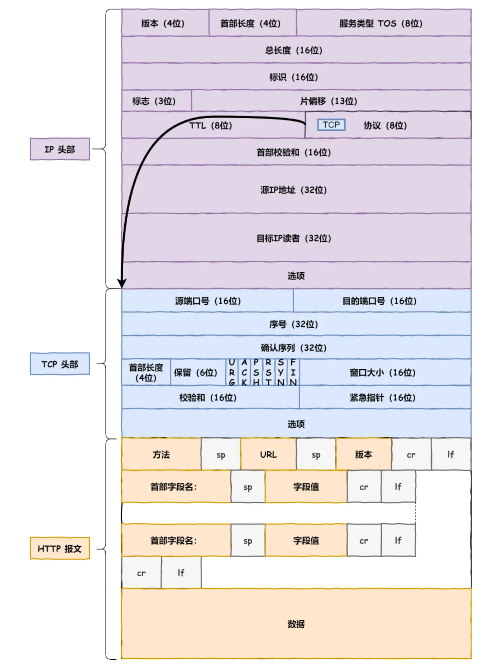

# 第六步：MAC

生成了 IP 头部之后，接下来网络包还需要在 IP 头部的前面加上 MAC 头部。

### MAC 包头格式

MAC 头部是以太网使用的头部，它包含了接收方和发送方的 MAC 地址等信息。

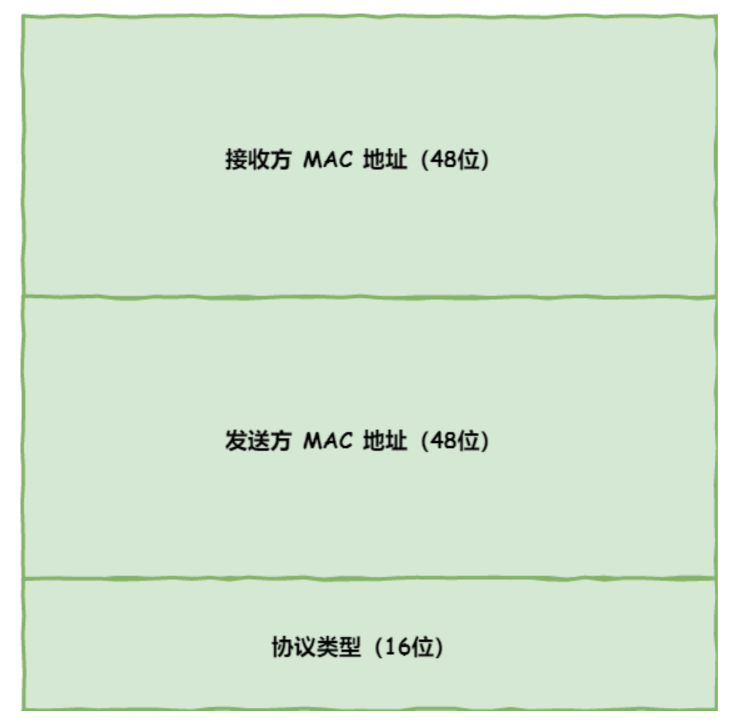

在 MAC 包头里需要发送方 MAC 地址和接收方目标 MAC 地址，用于两点之间的传输。

一般在 TCP/IP 通信里，MAC 包头的协议类型只使用：

- 0800：IP 协议
- 0806：ARP 协议

### 发送方和接收方如何确认?

发送方的 MAC 地址获取就比较简单了，MAC 地址是在网卡生产时写入到 ROM 里的，只要将这个值读取出来写入到 MAC 头部就可以了。

接收方的 MAC 地址就有点复杂了，只要告诉以太网对方的 MAC 的地址，以太网就会帮我们把包发送过去，那么很显然这里应该填写对方的 MAC 地址。

所以先得搞清楚应该把包发给谁，这个只要查一下路由表就知道了。在路由表中找到相匹配的条目，然后把包发给 Gateway 列中的 IP 地址就可以了。

> 既然知道要发给谁，按如何获取对方的 MAC 地址呢？
>
> 此时就需要 ARP 协议帮我们找到路由器的 MAC 地址。
>
> 

ARP 协议会在以太网中以广播的形式，对以太网所有的设备喊出：“这个 IP 地址是谁的？请把你的MAC 地址告诉我”。然后就会有人回答：“这个 IP 地址是我的，我的 MAC 地址是 XXXX”。如果对方和自己处于同一个子网中，那么通过上面的操作就可以得到对方的 MAC 地址。然后，我们将这个 MAC 地址写入 MAC 头部，MAC 头部就完成了。

> 每次都要广播获取，这不是很麻烦吗？
>
> 在后续操作系统会把本次查询结果放到一块叫做 ARP 缓存的内存空间留着以后用，不过缓存的时间就几分钟。
>
> 也就是说，在发包时：
>
> - 先查询 ARP 缓存，如果其中已经保存了对方的 MAC 地址，就不需要发送 ARP 查询，直接使用 ARP 缓存中的地址。
> - 而当 ARP 缓存中不存在对方 MAC 地址时，则发送 ARP 广播查询。

### 查看 ARP 缓存内容

在 Linux 系统中，我们可以使用 `arp -a` 命令来查看 ARP 缓存的内容。

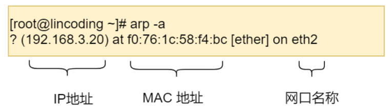

### MAC 报文生成

至此，网络包的报文如下图。

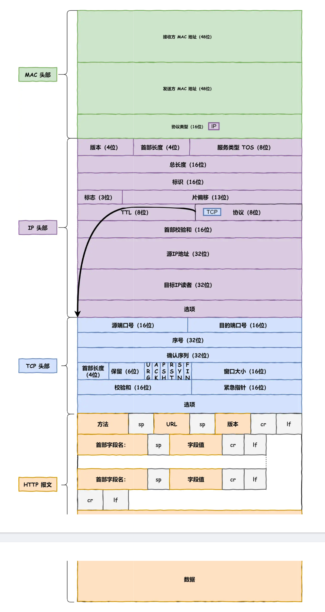

# 第七步：网卡

IP 生成的网络包只是存放在内存中的一串二进制数字信息，没有办法直接发送给对方。因此，我们需要将数字信息转换为电信号，才能在网线上传输，也就是说，这才是真正的数据发送过程。

负责执行这一操作的是网卡，要控制网卡还需要靠网卡驱动程序。

网卡驱动从 IP 模块获取到包之后，会将其复制到网卡内的缓存区中，接着会在其开头加上报头和起始帧分界符，在末尾加上用于检测错误的帧校验序列。


-   起始帧分界符是一个用来表示包起始位置的标记
-   末尾的 FCS（帧校验序列）用来检查包传输过程是否有损坏

最后网卡会将包转为电信号，通过网线发送出去。

# 第八步：交换机

交换机的设计是将网络包原样转发到目的地。交换机工作在 MAC 层，也称为二层网络设备。

### 交换机的包接收操作

首先，电信号到达网线接口，交换机里的模块进行接收，接下来交换机里的模块将电信号转换为数字信号。

然后通过包末尾的 FCS 校验错误，如果没问题则放到缓冲区。这部分操作基本和计算机的网卡相同，但交换机的工作方式和网卡不同。

计算机的网卡本身具有 MAC 地址，并通过核对收到的包的接收方 MAC 地址判断是不是发给自己的，如果不是发给自己的则丢弃；相对地，交换机的端口不核对接收方 MAC 地址，而是直接接收所有的包并存放到缓冲区中。因此，和网卡不同，交换机的端口不具有 MAC 地址。

将包存入缓冲区后，接下来需要查询一下这个包的接收方 MAC 地址是否已经在 MAC 地址表中有记录了。

交换机的 MAC 地址表主要包含两个信息：

-   一个是设备的 MAC 地址
-   另一个是该设备连接在交换机的哪个端口上


举个例子，如果收到的包的接收方 MAC 地址为 00-02-B3-1C-9C-F9，则与图中表中的第 3 行匹配，根据端口列的信息，可知这个地址位于 3 号端口上，然后就可以通过交换电路将包发送到相应的端口了。

所以，交换机根据 MAC 地址表查找 MAC 地址，然后将信号发送到相应的端口。

>   当 MAC 地址表找不到指定的 MAC 地址会怎么样？
>
>   地址表中找不到指定的 MAC 地址。这可能是因为具有该地址的设备还没有向交换机发送过包，或者这个设备一段时间没有工作导致地址被从地址表中删除了。
>
>   这种情况下，交换机无法判断应该把包转发到哪个端口，只能将包转发到除了源端口之外的所有端口上，无论该设备连接在哪个端口上都能收到这个包。
>
>   这样做不会产生什么问题，因为以太网的设计本来就是将包发送到整个网络的，然后只有相应的接收者才接收包，而其他设备则会忽略这个包。
>
>   有人会说：“这样做会发送多余的包，会不会造成网络拥塞呢？”
>
>   其实完全不用过于担心，因为发送了包之后目标设备会作出响应，只要返回了响应包，交换机就可以将它的地址写入 MAC 地址表，下次也就不需要把包发到所有端口了。
>   
>局域网中每秒可以传输上千个包，多出一两个包并无大碍。
>   
>此外，如果接收方 MAC 地址是一个广播地址，那么交换机会将包发送到除源端口之外的所有端口。
>   
>以下两个属于广播地址：
>   
>-   MAC 地址中的 FF:FF:FF:FF:FF:FF
>   -   IP 地址中的 255.255.255.255

# 第九步：路由器

### 路由器与交换机的区别

网络包经过交换机之后，现在到达了路由器，并在此被转发到下一个路由器或目标设备。这一步转发的工作原理和交换机类似，也是通过查表判断包转发的目标。

不过在具体的操作过程上，路由器和交换机是有区别的。

-   因为路由器是基于 IP 设计的，俗称三层网络设备，路由器的各个端口都具有 MAC 地址和 IP 地址；
-   而交换机是基于以太网设计的，俗称二层网络设备，交换机的端口不具有 MAC 地址。

### 路由器基本原理

路由器的端口具有 MAC 地址，因此它就能够成为以太网的发送方和接收方；同时还具有 IP 地址，从这个意义上来说，它和计算机的网卡是一样的。

当转发包时，首先路由器端口会接收发给自己的以太网包，然后路由表查询转发目标，再由相应的端口作为发送方将以太网包发送出去。

### 路由器的包接收操作

首先，电信号到达网线接口部分，路由器中的模块会将电信号转成数字信号，然后通过包末尾的 FCS 进行错误校验。

如果没问题则检查 MAC 头部中的接收方 MAC 地址，看看是不是发给自己的包，如果是就放到接收缓冲区中，否则就丢弃这个包。

总的来说，路由器的端口都具有 MAC 地址，只接收与自身地址匹配的包，遇到不匹配的包则直接丢弃。

### 查询路由表确定输出端口

完成包接收操作之后，路由器就会去掉包开头的 MAC 头部。

MAC 头部的作用就是将包送达路由器，其中的接收方 MAC 地址就是路由器端口的 MAC 地址。因此，当包到达路由器之后，MAC 头部的任务就完成了，于是 MAC 头部就会被丢弃。

接下来，路由器会根据 MAC 头部后方的 IP 头部中的内容进行包的转发操作。转发操作分为几个阶段，首先是查询路由表判断转发目标。

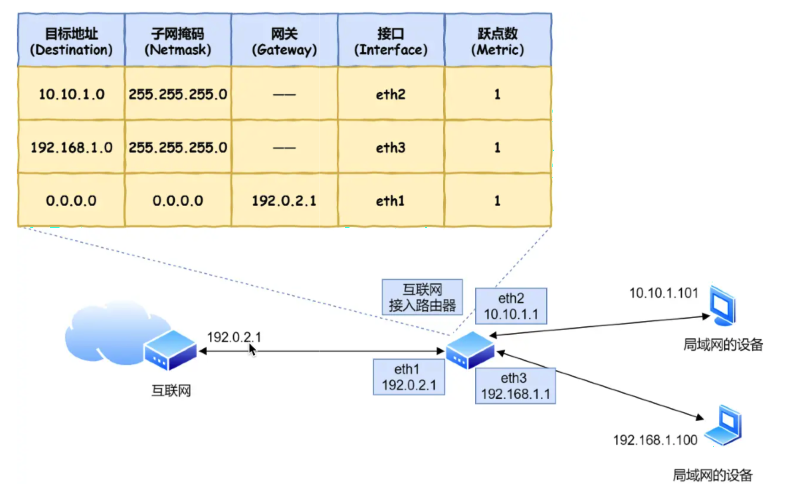

具体的工作流程根据上图，举个例子。

假设地址为 10.10.1.101 的计算机要向地址为 192.168.1.100 的服务器发送一个包，这个包先到达图中的路由器。

判断转发目标的第一步，就是根据包的接收方 IP 地址查询路由表中的目标地址栏，以找到相匹配的记录。

路由匹配和前面讲的一样，每个条目的子网掩码和 192.168.1.100 IP 做 & 与运算后，得到的结果与对应条目的目标地址进行匹配，如果匹配就会作为候选转发目标，如果不匹配就继续与下个条目进行路由匹配。

如第二条目的子网掩码 255.255.255.0 与 192.168.1.100 IP 做 & 与运算后，得到结果是 192.168.1.0，这与第二条目的目标地址 192.168.1.0 匹配，该第二条目记录就会被作为转发目标。

实在找不到匹配路由时，就会选择默认路由，路由表中子网掩码为 0.0.0.0 的记录表示「默认路由」。

### 路由器的发送操作

接下来就会进入包的发送操作。

首先，我们需要根据路由表的网关列判断对方的地址。

-   如果网关是一个 IP 地址，则这个 IP 地址就是我们要转发到的目标地址，还未抵达终点，还需继续需要路由器转发。
-   如果网关为空，则 IP 头部中的接收方 IP 地址就是要转发到的目标地址，也是就终于找到 IP 包头里的目标地址了，说明已抵达终点。

知道对方的 IP 地址之后，接下来需要通过 ARP 协议根据 IP 地址查询 MAC 地址，并将查询的结果作为接收方 MAC 地址。

路由器也有 ARP 缓存，因此首先会在 ARP 缓存中查询，如果找不到则发送 ARP 查询请求。

接下来是发送方 MAC 地址字段，这里填写输出端口的 MAC 地址。还有一个以太类型字段，填写 0080（十六进制）表示 IP 协议。

网络包完成后，接下来会将其转换成电信号并通过端口发送出去。这一步的工作过程和计算机也是相同的。

发送出去的网络包会通过交换机到达下一个路由器。由于接收方 MAC 地址就是下一个路由器的地址，所以交换机会根据这一地址将包传输到下一个路由器。

接下来，下一个路由器会将包转发给再下一个路由器，经过层层转发之后，网络包就到达了最终的目的地。

不知你发现了没有，在网络包传输的过程中，源 IP 和目标 IP 始终是不会变的，一直变化的是 MAC 地址，因为需要 MAC 地址在以太网内进行两个设备之间的包传输。

# 第十步：服务器与客户端


数据包抵达服务器后，服务器会先扒开数据包的 MAC 头部，查看是否和服务器自己的 MAC 地址符合，符合就将包收起来。

接着继续扒开数据包的 IP 头，发现 IP 地址符合，根据 IP 头中协议项，知道自己上层是 TCP 协议。

于是，扒开 TCP 的头，里面有序列号，需要看一看这个序列包是不是我想要的，如果是就放入缓存中然后返回一个 ACK，如果不是就丢弃。TCP 头部里面还有端口号， HTTP 的服务器正在监听这个端口号。

于是，服务器自然就知道是 HTTP 进程想要这个包，于是就将包发给 HTTP 进程。

服务器的 HTTP 进程看到，原来这个请求是要访问一个页面，于是就把这个网页封装在 HTTP 响应报文里。

HTTP 响应报文也需要穿上 TCP、IP、MAC 头部，不过这次是源地址是服务器 IP 地址，目的地址是客户端 IP 地址。

穿好头部衣服后，从网卡出去，交由交换机转发到出城的路由器，路由器就把响应数据包发到了下一个路由器，就这样跳啊跳。

最后跳到了客户端的城门把手的路由器，路由器扒开 IP 头部发现是要找城内的人，于是又把包发给了城内的交换机，再由交换机转发到客户端。

客户端收到了服务器的响应数据包后，同样也非常的高兴，客户能拆快递了！

于是，客户端开始扒皮，把收到的数据包的皮扒剩 HTTP 响应报文后，交给浏览器去渲染页面，一份特别的数据包快递，就这样显示出来了！

最后，客户端要离开了，向服务器发起了 TCP 四次挥手，至此双方的连接就断开了。

# TCP 基本认识

### TCP 头格式

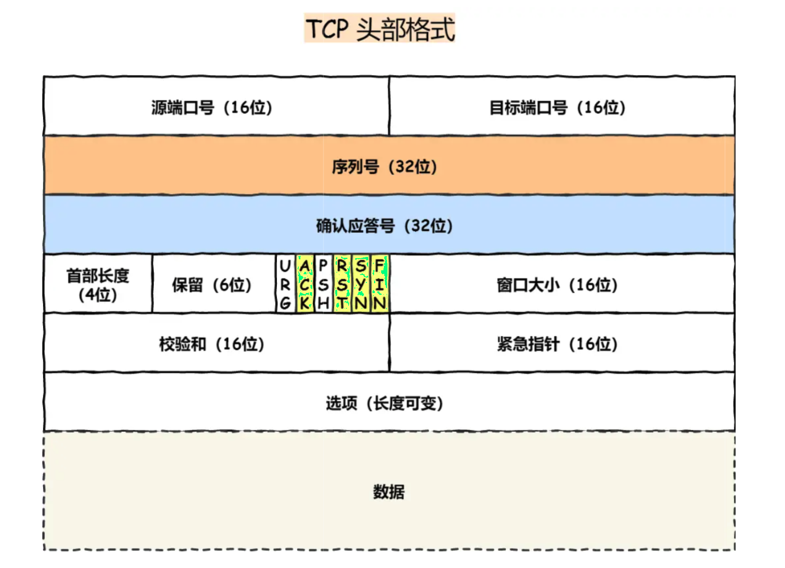

**序列号：** 在建立连接时由计算机生成的随机数作为其初始值，通过 SYN 包传给接收端主机，每发送一次数据，就「累加」一次该「数据字节数」的大小。用来解决 **网络包乱序问题。**

**确认应答号：** 指下一次「期望」收到的数据的序列号，发送端收到这个确认应答以后可以认为在这个序号以前的数据都已经被正常接收。 **用来解决不丢包的问题。**

控制位：

-   ACK：该位为 1 时，「确认应答」的字段变为有效，TCP 规定除了最初建立连接时的 SYN 包之外该位必须设置为 1。
-   RST：该位为 1 时，表示 TCP 连接中出现异常必须强制断开连接。
-   SYN：该位为 1 时，表示希望建立连接，并在其「序列号」的字段进行序列号初始值的设定。
-   FIN：该位为 1 时，表示今后不会再有数据发送，希望断开连接。当通信结束希望断开连接时，通信双方的主机之间就可以相互交换 FIN 位为 1 的 TCP 段。

>   为什么需要 TCP 协议？ TCP 工作在哪一层？
>
>   IP 层是「不可靠」的，它不保证网络包的交付、不保证网络包的按序交付、也不保证网络包中的数据的完整性。
>
>   
>
>   如果需要保障网络数据包的可靠性，那么就需要由上层（传输层）的 TCP 协议来负责。
>
>   因为 TCP 是一个工作在传输层的可靠数据传输的服务，它能确保接收端接收的网络包是无损坏、无间隔、非冗余和按序的。

### 什么是 TCP？

TCP 是面向连接的、可靠的、基于字节流的传输层通信协议。


-   面向连接：一定是「一对一」才能连接，不能像 UDP 协议可以一个主机同时向多个主机发送消息，也就是一对多是无法做到的；
-   可靠的：无论的网络链路中出现了怎样的链路变化，TCP 都可以保证一个报文一定能够到达接收端；
-   字节流：消息是「没有边界」的，所以无论我们消息有多大都可以进行传输。并且消息是「有序的」，当「前一个」消息没有收到的时候，即使它先收到了后面的字节，那么也不能扔给应用层去处理，同时对「重复」的报文会自动丢弃。

### 什么是 TCP 连接？

简单来说就是，用于保证可靠性和流量控制维护的某些状态信息，这些信息的组合，包括 Socket、序列号和窗口大小称为连接。


所以我们可以知道，建立一个 TCP 连接是需要客户端与服务器端达成上述三个信息的共识。

-   Socket：由 IP 地址和端口号组成
-   序列号：用来解决乱序问题等
-   窗口大小：用来做流量控制

### 如何唯一确定一个 TCP 连接呢？

TCP 四元组可以唯一的确定一个连接，四元组包括如下：

-   源地址
-   源端口
-   目的地址
-   目的端口


源地址和目的地址的字段（32 位）是在 IP 头部中，作用是通过 IP 协议发送报文给对方主机。

源端口和目的端口的字段（16 位）是在 TCP 头部中，作用是告诉 TCP 协议应该把报文发给哪个进程。

>   有一个 IP 的服务器监听了一个端口，它的 TCP 的最大连接数是多少？
>
>   服务器通常固定在某个本地端口上监听，等待客户端的连接请求。
>
>   因此，客户端 IP 和端口是可变的，其理论值计算公式如下：
>
>   
>
>   对 IPv4，客户端的 IP 数最多为 2 的 32 次方，客户端的端口数最多为 2 的 16 次方，也就是服务端单机最大 TCP 连接数，约为 2 的 48 次方。
>
>   当然，服务端最大并发 TCP 连接数远不能达到理论上限。
>
>   -   首先主要是文件描述符限制，Socket 都是文件，所以首先要通过 ulimit 配置文件描述符的数目；
>   -   另一个是内存限制，每个 TCP 连接都要占用一定内存，操作系统的内存是有限的。

>   UDP 和 TCP 有什么区别呢？分别的应用场景是？
>
>   UDP 不提供复杂的控制机制，利用 IP 提供面向「无连接」的通信服务。
>
>   UDP 协议真的非常简，头部只有 8 个字节（ 64 位），UDP 的头部格式如下：
>
>   
>
>   -   目标和源端口：主要是告诉 UDP 协议应该把报文发给哪个进程。
>   -   包长度：该字段保存了 UDP 首部的长度跟数据的长度之和。
>   -   校验和：校验和是为了提供可靠的 UDP 首部和数据而设计。

### TCP 和 UDP 区别：

1.  连接：
    -   TCP 是面向连接的传输层协议，传输数据前先要建立连接。
    -   UDP 是不需要连接，即刻传输数据。
2.  服务对象
    -   TCP 是一对一的两点服务，即一条连接只有两个端点。
    -   UDP 支持一对一、一对多、多对多的交互通信。
3.  可靠性
    -   TCP 是可靠交付数据的，数据可以无差错、不丢失、不重复、按需到达。
    -   UDP 是尽最大努力交付，不保证可靠交付数据。
4.  拥塞控制、流量控制
    -   TCP 有拥塞控制和流量控制机制，保证数据传输的安全性。
    -   UDP 则没有，即使网络非常拥堵了，也不会影响 UDP 的发送速率。
5.  首部开销
    -   TCP 首部长度较长，会有一定的开销，首部在没有使用「选项」字段时是 20 个字节，如果使用了「选项」字段则会变长的。
    -   UDP 首部只有 8 个字节，并且是固定不变的，开销较小。
6.  传输方式
    -   TCP 是流式传输，没有边界，但保证顺序和可靠。
    -   UDP 是一个包一个包的发送，是有边界的，但可能会丢包和乱序。
7.  分片不同
    -   TCP 的数据大小如果大于 MSS 大小，则会在传输层进行分片，目标主机收到后，也同样在传输层组装 TCP 数据包，如果中途丢失了一个分片，只需要传输丢失的这个分片。
    -   UDP 的数据大小如果大于 MTU 大小，则会在 IP 层进行分片，目标主机收到后，在 IP 层组装完数据，接着再传给传输层，但是如果中途丢了一个分片，则就需要重传所有的数据包，这样传输效率非常差，所以通常 UDP 的报文应该小于 MTU。

### TCP 和 UDP 应用场景：

由于 TCP 是面向连接，能保证数据的可靠性交付，因此经常用于：

-   FTP 文件传输
-   HTTP / HTTPS

由于 UDP 面向无连接，它可以随时发送数据，再加上 UDP 本身的处理既简单又高效，因此经常用于：

-   包总量较少的通信，如 DNS、SNMP 等
-   视频、音频等多媒体通信
-   广播通信

>   为什么 UDP 头部没有「首部长度」字段，而 TCP 头部有「首部长度」字段呢？
>
>   原因是 TCP 有可变长的「选项」字段，而 UDP 头部长度则是不会变化的，无需多一个字段去记录 UDP 的首部长度。

>   为什么 UDP 头部有「包长度」字段，而 TCP 头部则没有「包长度」字段呢？

先说说 TCP 是如何计算负载数据长度：

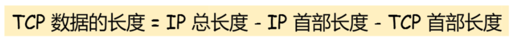

其中 IP 总长度和 IP 首部长度，在 IP 首部格式是已知的。TCP 首部长度，则是在 TCP 首部格式已知的，所以就可以求得 TCP 数据的长度。

大家这时就奇怪了问：“ UDP 也是基于 IP 层的呀，那 UDP 的数据长度也可以通过这个公式计算呀？为何还要有「包长度」呢？”

这么一问，确实感觉 UDP 「包长度」是冗余的。

因为为了网络设备硬件设计和处理方便，首部长度需要是 4 字节的整数倍。

如果去掉 UDP 「包长度」字段，那 UDP 首部长度就不是 4 字节的整数倍了，所以这可能是为了补全 UDP 首部长度是 4 字节的整数倍，才补充了「包长度」字段。

# TCP 连接建立

TCP 是面向连接的协议，所以使用 TCP 前必须先建立连接，而建立连接是通过三次握手来进行的。


-   一开始，客户端和服务端都处于 CLOSED 状态。先是服务端主动监听某个端口，处于 LISTEN 状态

    

-   客户端会随机初始化序号（client_isn），将此序号置于 TCP 首部的「序号」字段中，同时把 SYN 标志位置为 1，表示 SYN 报文。接着把第一个 SYN 报文发送给服务端，表示向服务端发起连接，该报文不包含应用层数据，之后客户端处于 SYN-SENT 状态。

    

-   服务端收到客户端的 SYN 报文后，首先服务端也随机初始化自己的序号（server_isn），将此序号填入 TCP 首部的「序号」字段中，其次把 TCP 首部的「确认应答号」字段填入`client_isn+1`, 接着把 SYN 和 ACK 标志位置为 1。最后把该报文发给客户端，该报文也不包含应用层数据，之后服务端处于 SYN-RCVD 状态。

    

-   客户端收到服务端报文后，还要向服务端回应最后一个应答报文，首先该应答报文 TCP 首部 ACK 标志位置为 1，其次「确认应答号」字段填入`server_isn+1`，最后把报文发送给服务端，**这次报文可以携带客户到服务器的数据**，之后客户端处于 ESTABLISHED 状态。

-   服务器收到客户端的应答报文后，也进入 ESTABLISHED 状态。

从上面的过程可以发现 **第三次握手是可以携带数据的，前两次握手是不可以携带数据的**，这也是面试常问的题。

一旦完成三次握手，双方都处于 ESTABLISHED 状态，此时连接就已建立完成，客户端和服务端就可以相互发送数据了。

### 如何在 Linux 系统中查看 TCP 状态？

TCP 的连接状态查看，在 Linux 可以通过 `netstat -napt` 命令查看。

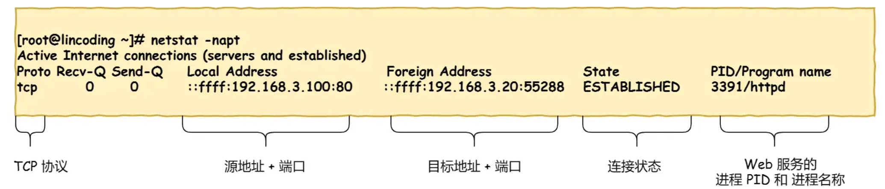

### 为什么是三次握手？不是两次、四次？

相信大家比较常回答的是：“因为三次握手才能保证双方具有接收和发送的能力。”

这回答是没问题，但这回答是片面的，并没有说出主要的原因。

在前面我们知道了什么是 TCP 连接：

-   用于保证可靠性和流量控制维护的某些状态信息，这些信息的组合，包括 Socket、序列号和窗口大小称为连接。

所以，重要的是为什么三次握手才可以初始化 Socket、序列号和窗口大小并建立 TCP 连接。

接下来以三个方面分析三次握手的原因：

-   三次握手才可以阻止重复历史连接的初始化（主要原因）
-   三次握手才可以同步双方的初始序列号
-   三次握手才可以避免资源浪费

### 原因一：避免历史连接

三次握手的 **首要原因是为了防止旧的重复连接初始化造成混乱。**

网络环境是错综复杂的，往往并不是如我们期望的一样，先发送的数据包，就先到达目标主机，可能会由于网络拥堵等乱七八糟的原因，会使得旧的数据包，先到达目标主机，那么这种情况下 TCP 三次握手是如何避免的呢？


客户端连续发送多次 SYN 建立连接的报文，在网络拥堵情况下：

-   一个「旧 SYN 报文」比「最新的 SYN 」报文早到达了服务端；
-   那么此时服务端就会回一个`SYN+ACK`报文给客户端；
-   客户端收到后可以根据自身的上下文，判断这是一个历史连接（序列号过期或超时），那么客户端就会发送 RST 报文给服务端，表示中止这一次连接。

如果是两次握手连接，就不能判断当前连接是否是历史连接，三次握手则可以在客户端（发送方）准备发送第三次报文时，客户端因有足够的上下文来判断当前连接是否是历史连接：

-   如果是历史连接（序列号过期或超时），则第三次握手发送的报文是 RST 报文，以此中止历史连接；
-   如果不是历史连接，则第三次发送的报文是 ACK 报文，通信双方就会成功建立连接；

所以，TCP 使用三次握手建立连接的最主要原因是防止历史连接初始化了连接。

### 原因二：同步双方初始序列号

TCP 协议的通信双方，都必须维护一个「序列号」，序列号是可靠传输的一个关键因素，它的作用：

-   接收方可以去除重复的数据；
-   接收方可以根据数据包的序列号按序接收；
-   可以标识发送出去的数据包中，哪些是已经被对方收到的；

可见，序列号在 TCP 连接中占据着非常重要的作用，所以当客户端发送携带「初始序列号」的 SYN 报文的时候，需要服务端回一个 ACK 应答报文，表示客户端的 SYN 报文已被服务端成功接收，那当服务端发送「初始序列号」给客户端的时候，依然也要得到客户端的应答回应，这样一来一回，才能确保双方的初始序列号能被可靠的同步。


四次握手其实也能够可靠的同步双方的初始化序号，但由于第二步和第三步可以优化成一步，所以就成了「三次握手」。

而两次握手只保证了一方的初始序列号能被对方成功接收，没办法保证双方的初始序列号都能被确认接收。

### 原因三：避免资源浪费

如果只有「两次握手」，当客户端的 SYN 请求连接在网络中阻塞，客户端没有接收到 ACK 报文，就会重新发送 SYN，由于没有第三次握手，服务器不清楚客户端是否收到了自己发送的建立连接的 ACK 确认信号，所以每收到一个 SYN 就只能先主动建立一个连接，这会造成什么情况呢？

如果客户端的 SYN 阻塞了，重复发送多次 SYN 报文，那么服务器在收到请求后就会建立多个冗余的无效链接，造成不必要的资源浪费。


即两次握手会造成消息滞留情况下，服务器重复接受无用的连接请求 SYN 报文，而造成重复分配资源。

### 小结

TCP 建立连接时，通过三次握手能防止历史连接的建立，能减少双方不必要的资源开销，能帮助双方同步初始化序列号。序列号能够保证数据包不重复、不丢弃和按序传输。

不使用「两次握手」和「四次握手」的原因：

-   「两次握手」：无法防止历史连接的建立，会造成双方资源的浪费，也无法可靠的同步双方序列号；
-   「四次握手」：三次握手就已经理论上最少可靠连接建立，所以不需要使用更多的通信次数。

>   为什么客户端和服务端的初始序列号是不相同的？
>
>   如果一个已经失效的连接被重用了，但是该旧连接的历史报文还残留在网络中，如果序列号相同，那么就无法分辨出该报文是不是历史报文，如果历史报文被新的连接接收了，则会产生数据错乱。所以，每次建立连接前重新初始化一个序列号主要是为了通信双方能够根据序号将不属于本连接的报文段丢弃。
>
>   另一方面是为了安全性，防止黑客伪造的相同序列号的 TCP 报文被对方接收。

>   初始序列号 ISN 是如何随机产生的？
>
>   起始 ISN 是基于时钟的，每 4 毫秒 + 1，转一圈要 4.55 个小时。
>
>   RFC1948 中提出了一个较好的初始化序列号 ISN 随机生成算法。
>
>   ISN = M + F (localhost, localport, remotehost, remoteport)
>
>   -   M 是一个计时器，这个计时器每隔 4 毫秒加 1。
>   -   F 是一个 Hash 算法，根据源 IP、目的 IP、源端口、目的端口生成一个随机数值。要保证Hash 算法不能被外部轻易推算得出，用 MD5 算法是一个比较好的选择。

>   既然 IP 层会分片，为什么 TCP 层还需要 MSS 呢？
>
>   先来认识下 MTU 和 MSS
>
>   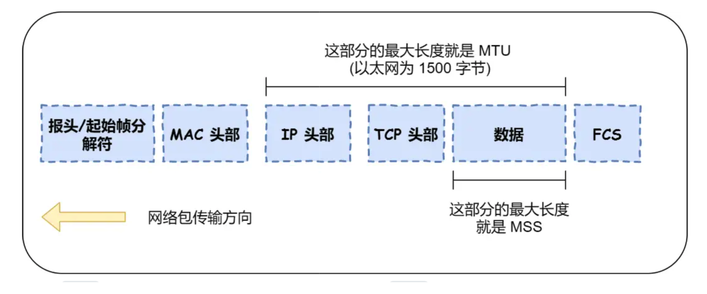
>
>   -   MTU：一个网络包的最大长度，以太网中一般为 1500 字节；
>   -   MSS：除去 IP 和 TCP 头部之后，一个网络包所能容纳的 TCP 数据的最大长度；
>
>   如果在 TCP 的整个报文（头部 + 数据）交给 IP 层进行分片，会有什么异常呢？
>
>   当 IP 层有一个超过 MTU 大小的数据（TCP 头部 + TCP 数据）要发送，那么 IP 层就要进行分片，把数据分片成若干片，保证每一个分片都小于 MTU。把一份 IP 数据报进行分片以后，由目标主机的 IP 层来进行重新组装后，再交给上一层 TCP 传输层。
>
>   这看起来井然有序，但这存在隐患的，那么当如果一个 IP 分片丢失，整个 IP 报文的所有分片都得重传。
>
>   因为 IP 层本身没有超时重传机制，它由传输层的 TCP 来负责超时和重传。
>
>   当接收方发现 TCP 报文（头部 + 数据）的某一片丢失后，则不会响应 ACK 给对方，那么发送方的 TCP 在超时后，就会重发「整个 TCP 报文（头部 + 数据）」。
>
>   因此，可以得知由 IP 层进行分片传输，是非常没有效率的。
>
>   所以，为了达到最佳的传输效能 TCP 协议在建立连接的时候通常要协商双方的 MSS 值，当 TCP 层发现数据超过 MSS 时，则就先会进行分片，当然由它形成的 IP 包的长度也就不会大于 MTU ，自然也就不用 IP 分片了。
>
>   
>
>   经过 TCP 层分片后，如果一个 TCP 分片丢失后，进行重发时也是以 MSS 为单位，而不用重传所有的分片，大大增加了重传的效率。

>   什么是 SYN 攻击？如何避免 SYN 攻击？

### SYN 攻击

我们都知道 TCP 连接建立是需要三次握手，假设攻击者短时间伪造不同 IP 地址的 SYN 报文，服务端每接收到一个 SYN 报文，就进入 SYN_RCVD 状态，但服务端发送出去的 ACK+SYN 报文，无法得到未知 IP 主机的 ACK 应答，久而久之就会占满服务端的 SYN 接收队列（未连接队列），使得服务器不能为正常用户服务。


### 避免 SYN 攻击方式一

其中一种解决方式是通过修改 Linux 内核参数，控制队列大小和当队列满时应做什么处理。

-   当网卡接收数据包的速度大于内核处理的速度时，会有一个队列保存这些数据包。控制该队列的
    最大值如下参数：

    ```
    net.core.netdev_max_backlog
    ```

-   SYN_RCVD 状态连接的最大个数：

    ```
    net.ipv4.tcp_max_syn_backlog
    ```

-   超出处理能时，对新的 SYN 直接回报 RST，丢弃连接：

    ```
    net.ipv4.tcp_abort_on_overflow
    ```

### 避免 SYN 攻击方式二

我们先来看下 Linux 内核的 SYN（未完成连接建立）队列与 Accpet（已完成连接建立）队列是如何工作的？

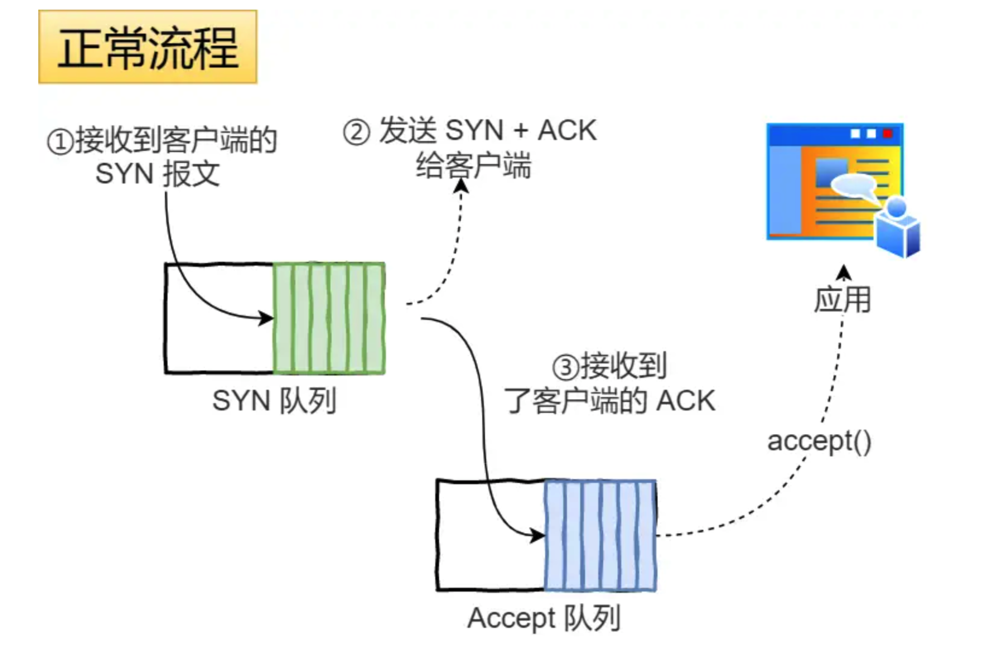

正常流程：

-   当服务端接收到客户端的 SYN 报文时，会将其加入到内核的「 SYN 队列」；
-   接着发送 SYN + ACK 给客户端，等待客户端回应 ACK 报文；
-   服务端接收到 ACK 报文后，从「 SYN 队列」移除放入到「 Accept 队列」；
-   应用通过调用 accpet() socket 接口，从「 Accept 队列」取出连接。


应用程序过慢：

-   如果应用程序过慢时，就会导致「 Accept 队列」被占满。

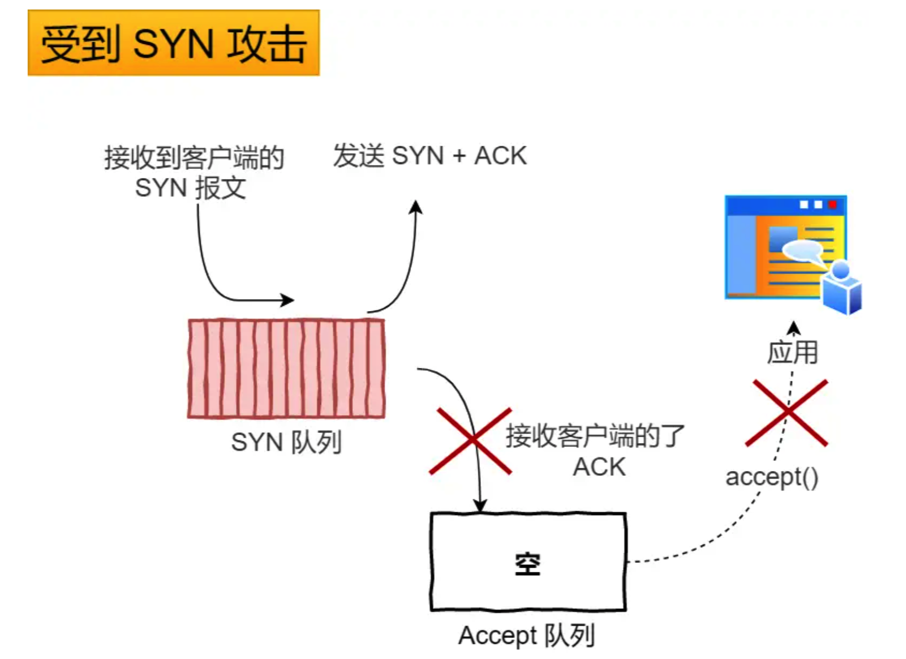

受到 SYN 攻击：

-   如果不断受到 SYN 攻击，就会导致「 SYN 队列」被占满。

tcp_syncookies 的方式可以应对 SYN 攻击的方法：

```
net.ipv4.tcp_syncookies=1
```


-   当「 SYN 队列」满之后，后续服务器收到 SYN 包，不进入「 SYN 队列」；
-   计算出一个 cookie 值，再以 SYN + ACK 中的「序列号」返回客户端，
-   服务端接收到客户端的应答报文时，服务器会检查这个 ACK 包的合法性。如果合法，直接放入到「 Accept 队列」。
-   最后应用通过调用 accpet() socket 接口，从「 Accept 队列」取出的连接。

# TCP 连接断开

### TCP 四次挥手过程和状态变迁

天下没有不散的宴席，对于 TCP 连接也是这样， TCP 断开连接是通过四次挥手方式。

双方都可以主动断开连接，断开连接后主机中的「资源」将被释放。

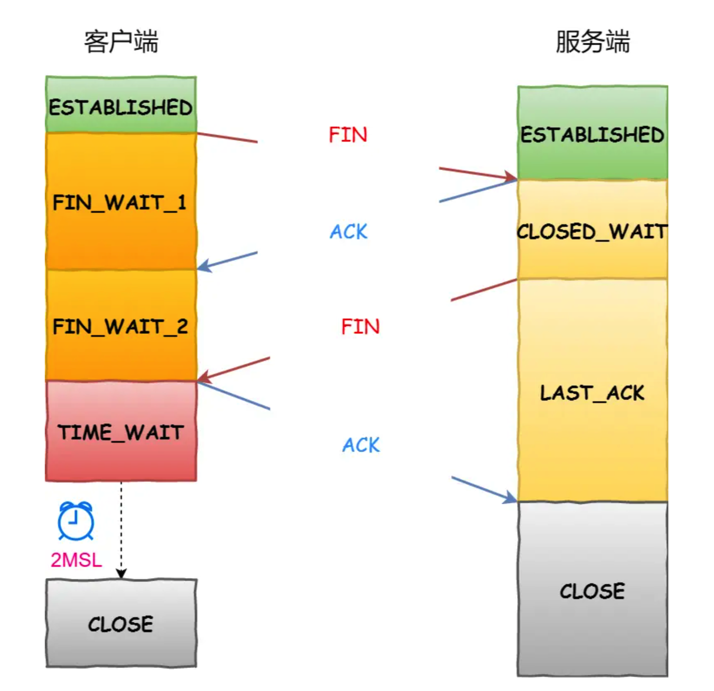

-   客户端打算关闭连接，此时会发送一个 TCP 首部 FIN 标志位被置为 1 的报文，也即 FIN 报文，之后客户端进入 FIN_WAIT_1 状态。
-   服务端收到该报文后，就向客户端发送 ACK 应答报文，接着服务端进入 CLOSED_WAIT 状态。
-   客户端收到服务端的 ACK 应答报文后，之后进入 FIN_WAIT_2 状态。
-   等待服务端处理完数据后，也向客户端发送 FIN 报文，之后服务端进入 LAST_ACK 状态。
-   客户端收到服务端的 FIN 报文后，回一个 ACK 应答报文，之后进入 TIME_WAIT 状态
-   服务器收到了 ACK 应答报文后，就进入了 CLOSED 状态，至此服务端已经完成连接的关闭。
-   客户端在经过 2MSL 一段时间后，自动进入 CLOSED 状态，至此客户端也完成连接的关闭。

可以看到，每个方向都需要 **一个 FIN 和一个 ACK**，因此通常被称为四次挥手。

这里一点需要注意是： **主动关闭连接的，才有 TIME_WAIT 状态。**

>   为什么挥手需要四次？
>
>   再来回顾下四次挥手双方发 FIN 包的过程，就能理解为什么需要四次了。
>
>   -   关闭连接时，客户端向服务端发送 FIN 时，仅仅表示客户端不再发送数据了但是还能接收数据。
>   -   服务器收到客户端的 FIN 报文时，先回一个 ACK 应答报文，而服务端可能还有数据需要处理和发送，等服务端不再发送数据时，才发送 FIN 报文给客户端来表示同意现在关闭连接。
>
>   从上面过程可知，服务端通常需要等待完成数据的发送和处理，所以服务端的 ACK 和 FIN 一般都会分开发送，从而比三次握手导致多了一次。

>   为什么 TIME_WAIT 等待的时间是 2MSL？
>
>   MSL 是 Maximum Segment Lifetime，报文最大生存时间，它是任何报文在网络上存在的最长时间，超过这个时间报文将被丢弃。因为 TCP 报文基于是 IP 协议的，而 IP 头中有一个 TTL 字段，是 IP 数据报可以经过的最大路由数，每经过一个处理他的路由器此值就减 1，当此值为 0 则数据报将被丢弃，同时发送 ICMP 报文通知源主机。
>
>   MSL 与 TTL 的区别： MSL 的单位是时间，而 TTL 是经过路由跳数。所以 MSL 应该要大于等于 TTL 消耗为 0 的时间，以确保报文已被自然消亡。
>
>   TIME_WAIT 等待 2 倍的 MSL，比较合理的解释是：网络中可能存在来自发送方的数据包，当这些发送方的数据包被接收方处理后又会向对方发送响应，所以一来一回需要等待 2 倍的时间。
>
>   比如如果被动关闭方没有收到断开连接的最后的 ACK 报文，就会触发超时重发 FIN 报文，另一方接收到 FIN 后，会重发 ACK 给被动关闭方，一来一去正好 2 个 MSL。
>
>   **2MSL 的时间是从客户端接收到 FIN 后发送 ACK 开始计时的。**如果在 TIME_WAIT 时间内，因为客户端的 ACK 没有传输到服务端，客户端又接收到了服务端重发的 FIN 报文，那么 2MSL 时间将重新计时。
>
>   在 Linux 系统里 2MSL 默认是 60 秒，那么一个 MSL 也就是 30 秒。Linux 系统停留在 TIME_WAIT 的时间为固定的 60 秒。
>
>   其定义在 Linux 内核代码里的名称为 TCP_TIMEWAIT_LEN：
>
>   ```c
>   #define TCP_TIMEWAIT_LEN(60*Hz) /* how long to wait to destroy TIME_WAIT state, about 60 seconds */
>   ```
>
>   如果要修改 TIME_WAIT 的时间长度，只能修改 Linux 内核代码里 TCP_TIMEWAIT_LEN 的值，并重新编译 Linux 内核。

>   为什么需要 TIME_WAIT 状态？
>
>   主动发起关闭连接的一方，才会有 TIME_WAIT 状态。
>
>   需要 TIME-WAIT 状态，主要是两个原因：
>
>   -   防止具有相同「四元组」的「旧」数据包被收到；
>   -   保证「被动关闭连接」的一方能被正确的关闭，即保证最后的 ACK 能让被动关闭方接收，从而帮助其正常关闭；

### 原因一：防止旧连接的数据包

假设 TIME_WAIT 没有等待时间或时间过短，被延迟的数据包抵达后会发生什么呢？


-   如上图黄色框框服务端在关闭连接之前发送的 SEQ=301 报文，被网络延迟了。
-   这时有相同端口的 TCP 连接被复用后，被延迟的 SEQ=301 抵达了客户端，那么客户端是有可能正常接收这个过期的报文，这就会产生数据错乱等严重的问题。

所以，TCP 就设计出了这么一个机制，经过 2MSL 这个时间，足以让两个方向上的数据包都被丢弃，使得原来连接的数据包在网络中都自然消失，再出现的数据包一定都是新建立连接所产生的。

### 原因二：保证连接正确关闭

TIME_WAIT 作用是等待足够的时间以确保最后的 ACK 能让被动关闭方接收，从而帮助其正常关闭。

假设 TIME_WAIT 没有等待时间或时间过短，断开连接会造成什么问题呢？


-   如上图红色框框客户端四次挥手的最后一个 ACK 报文如果在网络中被丢失了，此时如果客户端 TIME_WAIT 过短或没有，则就直接进入了 CLOSED 状态了，那么服务端则会一直处在 LASE_ACK 状态。
-   当客户端发起建立连接的 SYN 请求报文后，服务端会发送 RST 报文给客户端，连接建立的过程就会被终止。

如果 TIME_WAIT 等待足够长的情况就会遇到两种情况：

-   服务端正常收到四次挥手的最后一个 ACK 报文，则服务端正常关闭连接。
-   服务端没有收到四次挥手的最后一个 ACK 报文时，则会重发 FIN 关闭连接报文并等待新的 ACK 报文。

所以客户端在 TIME_WAIT 状态等待 2MSL 时间后，就可以保证双方的连接都可以正常的关闭。

>   TIME_WAIT 过多有什么危害？
>
>   如果服务器有处于 TIME_WAIT 状态的 TCP，则说明是由服务器方主动发起的断开请求。
>
>   过多的 TIME_WAIT 状态主要的危害有两种：
>
>   -   第一是内存资源占用；
>   -   第二是对端口资源的占用，一个 TCP 连接至少消耗一个本地端口；
>
>   第二个危害是会造成严重的后果的，要知道，端口资源也是有限的，一般可以开启的端口为 32768～61000，也可以通过如下参数设置指定
>
>   ```shell
>   net.ipv4.ip_local_port_range
>   ```
>
>   如果发起连接一方的 TIME_WAIT 状态过多，占满了所有端口资源，则会导致无法创建新连接。
>
>   客户端受端口资源限制：
>
>   -   客户端 TIME_WAIT 过多，就会导致端口资源被占用，因为端口就 65536 个，被占满就会导致无法创建新的连接。
>
>   服务端受系统资源限制：
>
>   -   由于一个四元组表示 TCP 连接，理论上服务端可以建立很多连接，服务端确实只监听一个端口但是会把连接扔给处理线程，所以理论上监听的端口可以继续监听。但是线程池处理不了那么多一直不断的连接了。所以当服务端出现大量 TIME_WAIT 时，系统资源被占满时，会导致处理不过来新的连接。

>   如何优化 TIME_WAIT？
>
>   这里给出优化 TIME_WAIT 的几个方式，都是有利有弊：
>
>   -   打开 `net.ipv4.tcp_tw_reuse` 和 `net.ipv4.tcp_timestamps` 选项；
>   -   `net.ipv4.tcp_max_tw_buckets`
>   -   程序中使用 SO_LINGER ，应用强制使用 RST 关闭。

### 方式一：net.ipv4.tcp_tw_reuse 和 tcp_timestamps

如下的 Linux 内核参数开启后，则可以复用处于 TIME_WAIT 的 socket 为新的连接所用。

有一点需要注意的是，tcp_tw_reuse 功能只能用客户端（连接发起方），因为开启了该功能，在调用 `connect()` 函数时，内核会随机找一个 TIME_WAIT 状态超过 1 秒的连接给新的连接复用。

```shell
net.ipv4.tcp_tw_reuse = 1
```

使用这个选项，还有一个前提，需要打开对 TCP 时间戳的支持，即

```shell
net.ipv4.tcp_timestamps = 1(默认为 1)
```

这个时间戳的字段是在 TCP 头部的「选项」里，用于记录 TCP 发送方的当前时间戳和从对端接收到的最新时间戳。

由于引入了时间戳，我们在前面提到的 2MSL 问题就不复存在了，因为重复的数据包会因为时间戳过期被自然丢弃。

### 方式二：net.ipv4.tcp_max_tw_buckets

这个值默认为 18000，当系统中处于 TIME_WAIT 的连接一旦超过这个值时，系统就会将所有的 TIME_WAIT 连接状态重置。

这个方法过于暴力，而且治标不治本，带来的问题远比解决的问题多，不推荐使用。

### 方式三：程序中使用 SO_LINGER

我们可以通过设置 socket 选项，来设置调用 close 关闭连接行为。

```c
struct linger so_linger;
so_linger.l_onoff = 1;
so_linger.l_linger = 0;
setsockopt(s, SOL_SOCKET, SO_LINGER, &so_linger, sizeof(so_linger));
```

如果 l_onoff 为非 0，且 l_linger 值为 0，那么调用 close 后，会立该发送一个 RST 标志给对端，该 TCP 连接将跳过四次挥手，也就跳过了 TIME_WAIT 状态，直接关闭。

但这为跨越 TIME_WAIT 状态提供了一个可能，不过是一个非常危险的行为，不值得提倡。

>   如果已经建立了连接，但是客户端突然出现故障了怎么办？

TCP 有一个机制是保活机制。这个机制的原理是这样的：

定义一个时间段，在这个时间段内，如果没有任何连接相关的活动，TCP 保活机制会开始作用，每隔一个时间间隔，发送一个探测报文，该探测报文包含的数据非常少，如果连续几个探测报文都没有得到响应，则认为当前的 TCP 连接已经死亡，系统内核将错误信息通知给上层应用程序。

在 Linux 内核可以有对应的参数可以设置保活时间、保活探测的次数、保活探测的时间间隔，以下都为默认值：

```c
net.ipv4.tcp_keepalive_time=7200
net.ipv4.tcp_keepalive_intvl=26
net.ipv4.tcp_keepalive_probes=9
```

-   tcp_keepalive_time=7200：表示保活时间是 7200 秒（2 小时），也就 2 小时内如果没有任何连接相关的活动，则会启动保活机制；
-   tcp_keepalive_intvl=75：表示每次检测间隔 75 秒；
-   tcp_keepalive_probes=9：表示检测 9 次无响应，认为对方是不可达的，从而中断本次的连接。

也就是说在 Linux 系统中，最少需要经过 2 小时 11 分 15 秒才可以发现一个「死亡」连接。

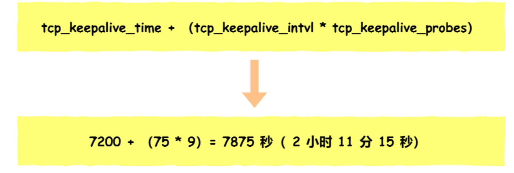

这个时间是有点长的，我们也可以根据实际的需求，对以上的保活相关的参数进行设置。

如果开启了 TCP 保活，需要考虑以下几种情况：

第一种，对端程序是正常工作的。当 TCP 保活的探测报文发送给对端, 对端会正常响应，这样 TCP 保活时间会被重置，等待下一个 TCP 保活时间的到来。

第二种，对端程序崩溃并重启。当 TCP 保活的探测报文发送给对端后，对端是可以响应的，但由于没有该连接的有效信息，会产生一个 RST 报文，这样很快就会发现 TCP 连接已经被重置。

第三种，是对端程序崩溃，或对端由于其他原因导致报文不可达。当 TCP 保活的探测报文发送给对端后，石沉大海，没有响应，连续几次，达到保活探测次数后，TCP 会报告该 TCP 连接已经死亡。

# Socket 编程

>   针对 TCP 应该如何 Socket 编程？


-   服务端和客户端初始化 socket，得到文件描述符；
-   服务端调用 bind，将绑定在 IP 地址和端口；
-   服务端调用 listen，进行监听；
-   服务端调用 accept，等待客户端连接；
-   客户端调用 connect，向服务器端的地址和端口发起连接请求；
-   服务端 accept 返回用于传输的 socket 的文件描述符；
-   客户端调用 write 写入数据；服务端调用 read 读取数据；
-   客户端断开连接时，会调用 close，那么服务端 read 读取数据的时候，就会读取到了 EOF，待处理完数据后，服务端调用 close，表示连接关闭。

这里需要注意的是，服务端调用 accept 时，连接成功了会返回一个已完成连接的 socket，后续用来传输数据。

所以，监听的 socket 和真正用来传送数据的 socket，是「两个」 socket，一个叫作监听 socket，一个叫作已完成连接 socket。

成功连接建立之后，双方开始通过 read 和 write 函数来读写数据，就像往一个文件流里面写东西一样。

>   listen 时候参数 backlog 的意义？

Linux 内核中会维护两个队列：

-   未完成连接队列（SYN 队列）：接收到一个 SYN 建立连接请求，处于 SYN_RCVD 状态；
-   已完成连接队列（Accpet 队列）：已完成 TCP 三次握手过程，处于 ESTABLISHED 状态；

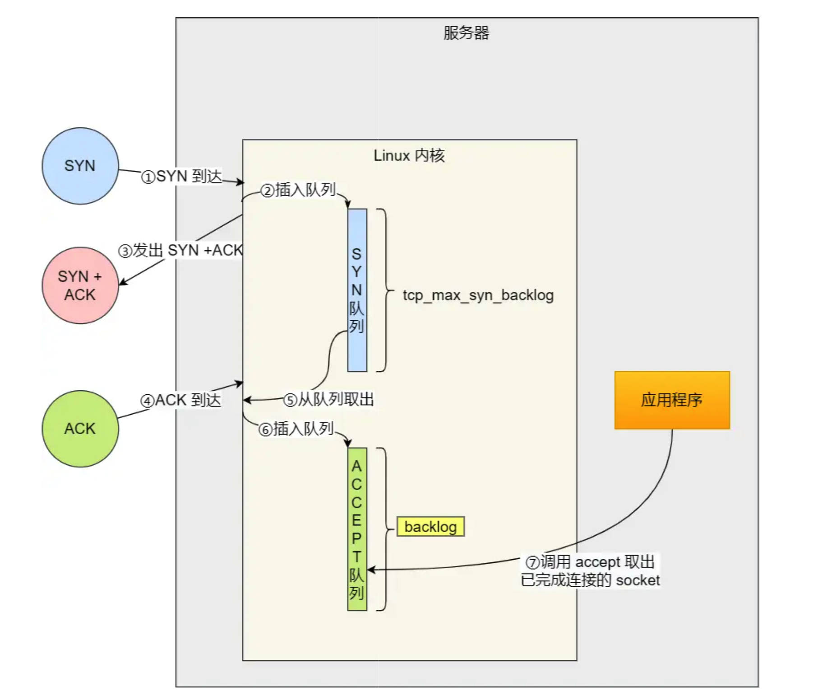

```c
int listen (int sockedfd, int backlog)
```

-   参数一 socketfd 为 socketfd 文件描述符
-   参数二 backlog，这参数在历史版本有一定的变化

在早期 Linux 内核 backlog 是 SYN 队列大小，也就是未完成的队列大小。

在 Linux 内核 2.2 之后，backlog 变成 accept 队列，也就是已完成连接建立的队列长度，所以现在通常认为 backlog 是 accept 队列。

但是上限值是内核参数 somaxconn 的大小，也就说 `accpet 队列长度 = min(backlog,somaxconn)`。

>   accept 发生在三次握手的哪一步？

我们先看看客户端连接服务端时，发送了什么？

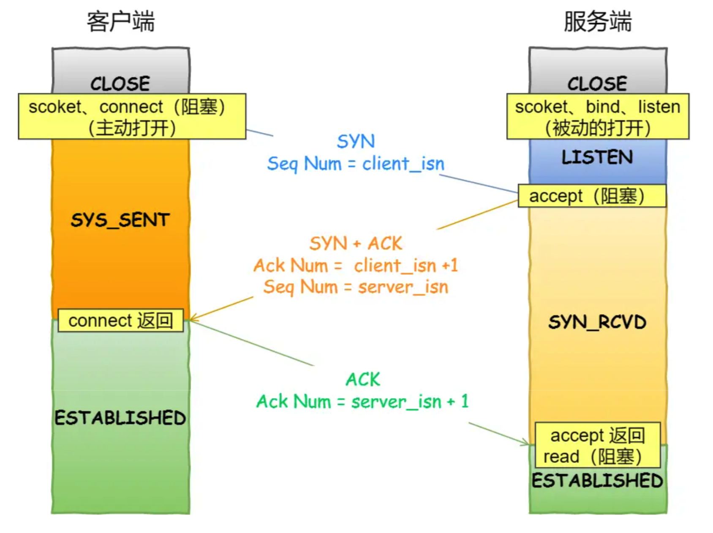

-   客户端的协议栈向服务器端发送了 SYN 包，并告诉服务器端当前发送序列号 client_isn，客户端进入 SYN_SENT 状态；
-   服务器端的协议栈收到这个包之后，和客户端进行 ACK 应答，应答的值为 client_isn+1，表示对 SYN 包 client_isn 的确认，同时服务器也发送一个 SYN 包，告诉客户端当前我的发送序列号为 server_isn，服务器端进入 SYN_RCVD 状态；
-   客户端协议栈收到 ACK 之后，使得应用程序从 connect 调用返回，表示客户端到服务器端的单向连接建立成功，客户端的状态为 ESTABLISHED，同时客户端协议栈也会对服务器端的 SYN 包进行应答，应答数据为 server_isn+1；
-   应答包到达服务器端后，服务器端协议栈使得 accept 阻塞调用返回，这个时候服务器端到客户端的单向连接也建立成功，服务器端也进入 ESTABLISHED 状态。

从上面的描述过程，我们可以得知客户端 connect 成功返回是在第二次握手，服务端 accept 成功返回是在三次握手成功之后。

>   客户端调用 close 了，连接是断开的流程是什么？

我们看看客户端主动调用了 close，会发生什么？

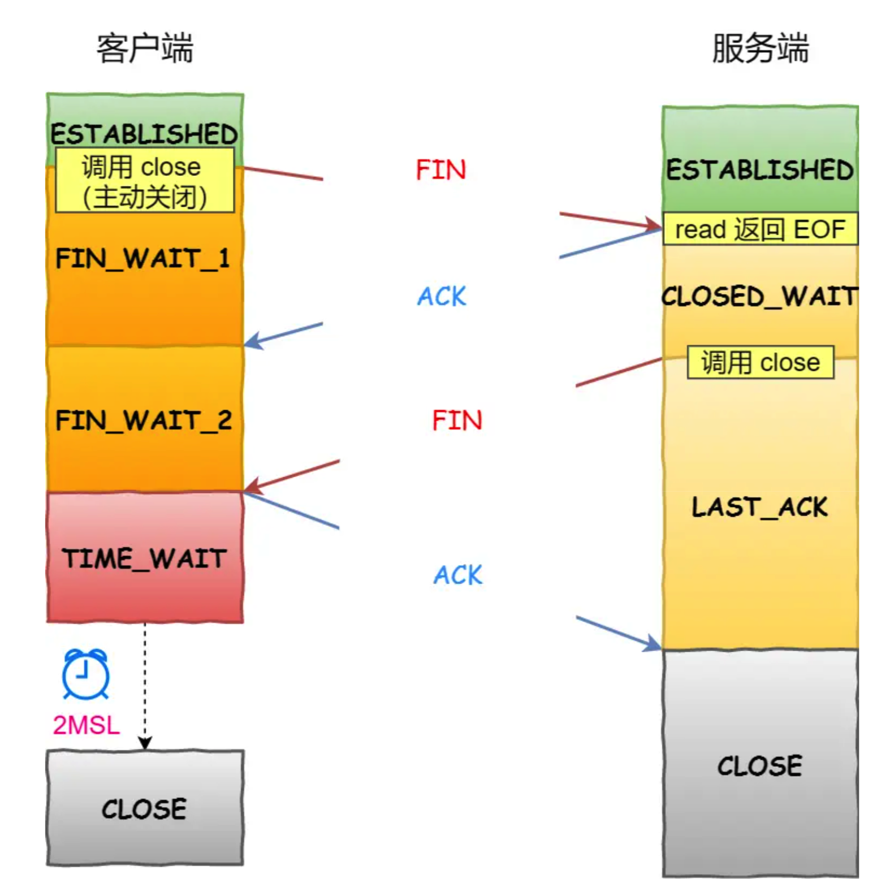

-   客户端调用 close，表明客户端没有数据需要发送了，则此时会向服务端发送 FIN 报文，进入 FIN_WAIT_1 状态；
-   服务端接收到了 FIN 报文，TCP 协议栈会为 FIN 包插入一个文件结束符 EOF 到接收缓冲区中，应用程序可以通过 read 调用来感知这个 FIN 包。这个 EOF 会被放在已排队等候的其他已接收的数据之后，这就意味着服务端需要处理这种异常情况，因为 EOF 表示在该连接上再无额外数据到达。此时，服务端进入 CLOSE_WAIT 状态；
-   接着，当处理完数据后，自然就会读到 EOF，于是也调用 close 关闭它的套接字，这会使得客户端会发出一个 FIN 包，之后处于 LAST_ACK 状态；
-   客户端接收到服务端的 FIN 包，并发送 ACK 确认包给服务端，此时客户端将进入 TIME_WAIT 状态；
-   服务端收到 ACK 确认包后，就进入了最后的 CLOSE 状态；
-   客户端经过 2MSL 时间之后，也进入 CLOSE 状态；

# 重传机制

TCP 实现可靠传输的方式之一，是通过序列号与确认应答。

在 TCP 中，当发送端的数据到达接收主机时，接收端主机会返回一个确认应答消息，表示已收到消息。

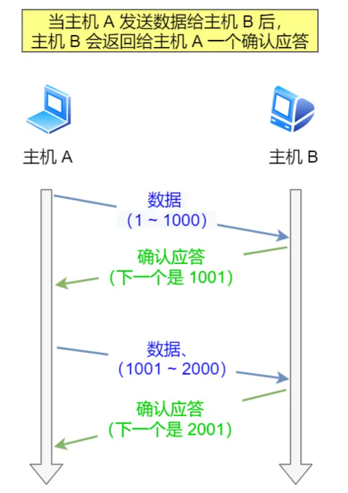

但在错综复杂的网络，并不一定能如上图那么顺利能正常的数据传输，万一数据在传输过程中丢失了呢？

所以 TCP 针对数据包丢失的情况，会用重传机制解决。

接下来说说常见的重传机制：

- 超时重传
- 快速重传
- SACK
- D-SACK

## 超时重传

重传机制的其中一个方式，就是在发送数据时，设定一个定时器，当超过指定的时间后，没有收到对方的 ACK 确认应答报文，就会重发该数据，也就是我们常说的超时重传。

TCP 会在以下两种情况发生超时重传：

- 数据包丢失
- 确认应答丢失

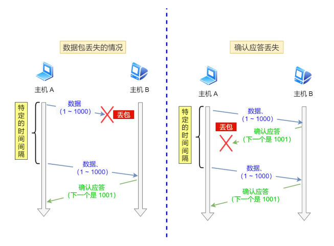

> 超时时间应该设置为多少呢？

我们先来了解一下什么是 RTT（Round-Trip Time 往返时延），从下图我们就可以知道：


RTT 就是数据从网络一端传送到另一端所需的时间，也就是包的往返时间。

超时重传时间是以 RTO（Retransmission Timeout 超时重传时间）表示。

假设在重传的情况下，超时时间 RTO「较长或较短」时，会发生什么事情呢？

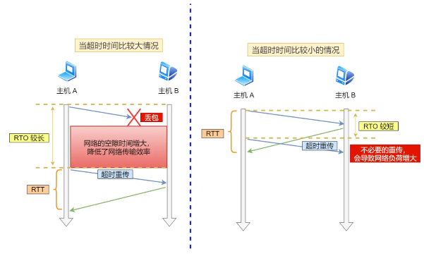

上图中有两种超时时间不同的情况：

- 当超时时间 RTO 较大时，重发就慢，丢了老半天才重发，没有效率，性能差；
- 当超时时间 RTO 较小时，会导致可能并没有丢就重发，于是重发的就快，会增加网络拥塞，导致更多的超时，更多的超时导致更多的重发。

精确的测量超时时间 RTO 的值是非常重要的，这可让我们的重传机制更高效。

根据上述的两种情况，我们可以得知，超时重传时间 RTO 的值应该略大于报文往返 RTT 的值。


至此，可能大家觉得超时重传时间 RTO 的值计算，也不是很复杂嘛。

好像就是在发送端发包时记下 t0，然后接收端再把这个 ack 回来时再记一个 t1，于是 RTT = t1 – t0。没那么简单，这只是一个采样，不能代表普遍情况。

实际上「报文往返 RTT 的值」是经常变化的，因为我们的网络也是时常变化的。也就因为「报文往返 RTT 的值」是经常波动变化的，所以「超时重传时间 RTO 的值」应该是一个动态变化的值。

我们来看看 Linux 是如何计算 RTO 的呢？

估计往返时间，通常需要采样以下两个：

- 需要 TCP 通过采样 RTT 的时间，然后进行加权平均，算出一个平滑 RTT 的值，而且这个值还是要不断变化的，因为网络状况不断地变化。
- 除了采样 RTT，还要采样 RTT 的波动范围，这样就避免如果 RTT 有一个大的波动的话，很难被发现的情况。

RFC6289 建议使用以下的公式计算 RTO：


其中 SRTT 是计算平滑的 RTT ，DevRTR 是计算平滑的 RTT 与最新 RTT 的差距。

在 Linux 下，`α = 0.125，β = 0.25， μ = 1，∂ = 4`。别问怎么来的，问就是大量实验中调出来的。

如果超时重发的数据，再次超时的时候，又需要重传的时候，TCP 的策略是超时间隔加倍。

也就是每当遇到一次超时重传的时候，都会将下一次超时时间间隔设为先前值的两倍。两次超时，就说明网络环境差，不宜频繁反复发送。

超时触发重传存在的问题是，超时周期可能相对较长。那是不是可以有更快的方式呢？

于是就可以用「快速重传」机制来解决超时重发的时间等待。

## 快速重传

TCP 还有另外一种快速重传（Fast Retransmit）机制，它不以时间为驱动，而是以数据驱动重传。

快速重传机制，是如何工作的呢？其实很简单，一图胜千言。

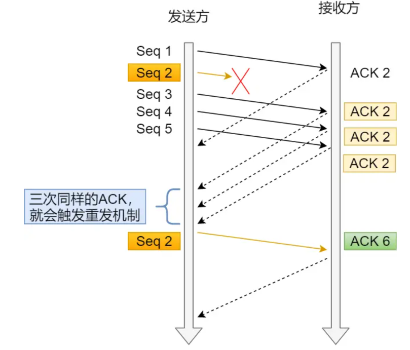

在上图，发送方发出了 1，2，3，4，5 份数据：

- 第一份 Seq1 先送到了，于是就 Ack 回 2；
- 结果 Seq2 因为某些原因没收到，Seq3 到达了，于是还是 Ack 回 2；
- 后面的 Seq4 和 Seq5 都到了，但还是 Ack 回 2，因为 Seq2 还是没有收到；
- 发送端收到了三个 Ack = 2 的确认，知道了 Seq2 还没有收到，就会在定时器过期之前，重传丢失的 Seq2。
- 最后，收到了 Seq2，此时因为 Seq3，Seq4，Seq5 都收到了，于是 Ack 回 6 。 

所以，快速重传的工作方式是当收到三个相同的 ACK 报文时，会在定时器过期之前，重传丢失的报文段。

快速重传机制只解决了一个问题，就是超时时间的问题，但是它依然面临着另外一个问题。就是重传的时候，是重传之前的一个，还是重传所有的问题。

比如对于上面的例子，是重传 Seq2 呢？还是重传 Seq2、Seq3、Seq4、Seq5 呢？因为发送端并不清楚这连续的三个 Ack 2 是谁传回来的。

根据 TCP 不同的实现，以上两种情况都是有可能的。可见，这是一把双刃剑。

为了解决不知道该重传哪些 TCP 报文，于是就有 SACK 方法。

## SACK 方法

还有一种实现重传机制的方式叫：SACK（ Selective Acknowledgment 选择性确认）。

这种方式需要在 TCP 头部「选项」字段里加一个 SACK 的东西，它可以将缓存的地图发送给发送方，这样发送方就可以知道哪些数据收到了，哪些数据没收到，知道了这些信息，就可以只重传丢失的数据。

如下图，发送方收到了三次同样的 ACK 确认报文，于是就会触发快速重发机制，通过 SACK 信息发现只有 200~299 这段数据丢失，则重发时，就只选择了这个 TCP 段进行重复。

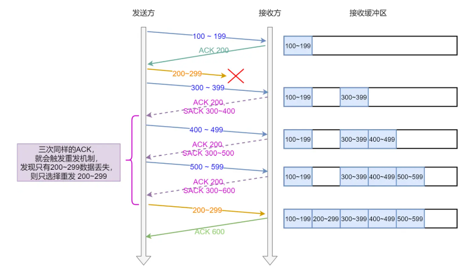

如果要支持 SACK，必须双方都要支持。在 Linux 下，可以通过 `net.ipv4.tcp_sack` 参数打开这个功能（Linux 2.4 后默认打开）。

## Duplicate SACK

Duplicate SACK 又称 D-SACK，其主要使用了 SACK 来告诉「发送方」有哪些数据被重复接收了。

下面举例两个栗子，来说明 D-SACK 的作用。

**ACK 丢包**


- 「接收方」发给「发送方」的两个 ACK 确认应答都丢失了，所以发送方超时后，重传第一个数据包（3000 ~ 3499）
- 于是「接收方」发现数据是重复收到的，于是回了一个 `SACK = 3000~3500`，告诉「发送方」`3000~3500` 的数据早已被接收了，因为 ACK 都到了 4000 了，已经意味着 4000 之前的所有数据都已收到，所以这个 SACK 就代表着 D-SACK。
- 这样「发送方」就知道了，数据没有丢，是「接收方」的 ACK 确认报文丢了。

**网络延时**


- 数据包（1000~1499）被网络延迟了，导致「发送方」没有收到 Ack 1500 的确认报文。
- 而后面报文到达的三个相同的 ACK 确认报文，就触发了快速重传机制，但是在重传后，被延迟的数据包（1000~1499）又到了「接收方」；
- 所以「接收方」回了一个 SACK=1000~1500，因为 ACK 已经到了 3000，所以这个 SACK 是 D-SACK，表示收到了重复的包。
- 这样发送方就知道快速重传触发的原因不是发出去的包丢了，也不是因为回应的 ACK 包丢了，而是因为网络延迟了。

可见，D-SACK 有这么几个好处：
1. 可以让「发送方」知道，是发出去的包丢了，还是接收方回应的 ACK 包丢了;
2. 可以知道是不是「发送方」的数据包被网络延迟了;
3. 可以知道网络中是不是把「发送方」的数据包给复制了;

在 Linux 下可以通过 net.ipv4.tcp_dsack 参数开启/关闭这个功能（Linux 2.4 后默认打开）。

# 滑动窗口

> 引入窗口概念的原因

我们都知道 TCP 是每发送一个数据，都要进行一次确认应答。当上一个数据包收到了应答了，再发送下一个。

这个模式就有点像我和你面对面聊天，你一句我一句。但这种方式的缺点是效率比较低的。

如果你说完一句话，我在处理其他事情，没有及时回复你，那你不是要干等着我做完其他事情后，我回复你，你才能说下一句话，很显然这不现实。


所以，这样的传输方式有一个缺点：数据包的往返时间越长，通信的效率就越低。

为解决这个问题，TCP 引入了窗口这个概念。即使在往返时间较长的情况下，它也不会降低网络通信的效率。

那么有了窗口，就可以指定窗口大小，窗口大小就是指无需等待确认应答，而可以继续发送数据的最大值。

窗口的实现实际上是操作系统开辟的一个缓存空间，发送方主机在等到确认应答返回之前，必须在缓冲区中保留已发送的数据。如果按期收到确认应答，此时数据就可以从缓存区清除。

假设窗口大小为 3 个 TCP 段，那么发送方就可以「连续发送」 3 个 TCP 段，并且中途若有 ACK 丢失，可以通过「下一个确认应答进行确认」。如下图：

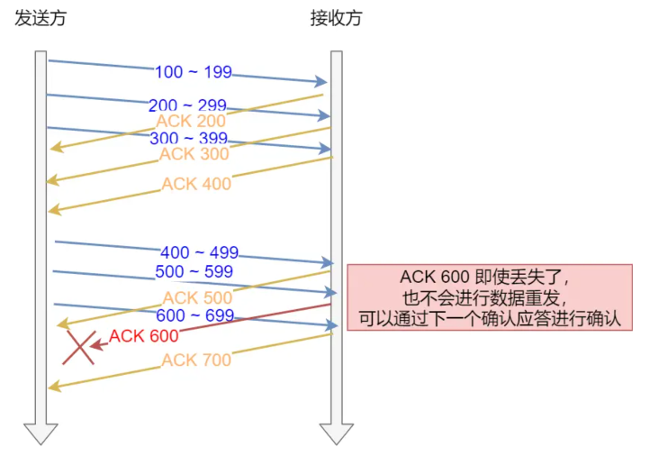

图中的 ACK 600 确认应答报文丢失，也没关系，因为可以通过下一个确认应答进行确认，只要发送方收到了 ACK 700 确认应答，就意味着 700 之前的所有数据「接收方」都收到了。这个模式就叫累计确认或者累计应答。

> 窗口大小由哪一方决定？

TCP 头里有一个字段叫 Window，也就是窗口大小。

这个字段是接收端告诉发送端自己还有多少缓冲区可以接收数据。于是发送端就可以根据这个接收端的处理能力来发送数据，而不会导致接收端处理不过来。

所以，通常窗口的大小是由接收方的窗口大小来决定的。

发送方发送的数据大小不能超过接收方的窗口大小，否则接收方就无法正常接收到数据。

> 发送方的滑动窗口

我们先来看看发送方的窗口，下图就是发送方缓存的数据，根据处理的情况分成四个部分，其中深蓝色方框是发送窗口，紫色方框是可用窗口：

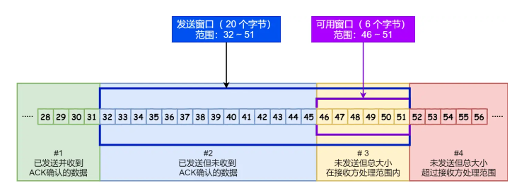

- #1 是已发送并收到 ACK 确认的数据：1~31 字节
- #2 是已发送但未收到 ACK 确认的数据：32~45 字节
- #3 是未发送但总大小在接收方处理范围内（接收方还有空间）：46~51 字节
- #4 是未发送但总大小超过接收方处理范围（接收方没有空间）：52 字节以后

在下图，当发送方把数据「全部」都一下发送出去后，可用窗口的大小就为 0 了，表明可用窗口耗尽，在没收到 ACK 确认之前是无法继续发送数据了。

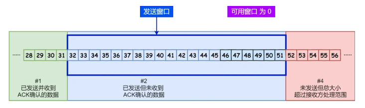

在下图，当收到之前发送的数据 32~36 字节的 ACK 确认应答后，如果发送窗口的大小没有变化，则滑动窗口往右边移动 5 个字节，因为有 5 个字节的数据被应答确认，接下来 52~56 字节又变成了可用窗口，那么后续也就可以发送52~56 这 5 个字节的数据了。


> 程序是如何表示发送方的四个部分的呢？

TCP 滑动窗口方案使用三个指针来跟踪在四个传输类别中的每一个类别中的字节。其中两个指针是绝对指针（指特定的序列号），一个是相对指针（需要做偏移）。


- SND.WND：表示发送窗口的大小（大小是由接收方指定的）；
- SND.UNA：是一个绝对指针，它指向的是已发送但未收到确认的第一个字节的序列号，也就是 #2 的第一个字节。
- SND.NXT：也是一个绝对指针，它指向未发送但可发送范围的第一个字节的序列号，也就是 #3 的第一个字节。
- 指向 #4 的第一个字节是个相对指针，它需要 SND.UNA 指针加上 SND.WND 大小的偏移量，就可以指向 #4 的第一个字节了。

那么可用窗口大小的计算就可以是：

可用窗口大 = SND.WND -（SND.NXT - SND.UNA）

> 接收方的滑动窗口

接下来我们看看接收方的窗口，接收窗口相对简单一些，根据处理的情况划分成三个部分：

- #1 + #2 是已成功接收并确认的数据（等待应用进程读取）；
- #3 是未收到数据但可以接收的数据；
- #4 未收到数据并不可以接收的数据；


其中三个接收部分，使用两个指针进行划分:

- RCV.WND：表示接收窗口的大小，它会通告给发送方。
- RCV.NXT：是一个指针，它指向期望从发送方发送来的下一个数据字节的序列号，也就是 #3 的第一个字节。
- 指向 #4 的第一个字节是个相对指针，它需要 RCV.NXT 指针加上 RCV.WND 大小的偏移量，就可以指向 #4 的第一个字节了。

> 接收窗口和发送窗口的大小是相等的吗？

并不是完全相等，接收窗口的大小是约等于发送窗口的大小的。

因为滑动窗口并不是一成不变的。比如，当接收方的应用进程读取数据的速度非常快的话，这样的话接收窗口可以很快的就空缺出来。那么新的接收窗口大小，是通过 TCP 报文中的 Windows 字段来告诉发送方。那么这个传输过程是存在时延的，所以接收窗口和发送窗口是约等于的关系。

# 流量控制

发送方不能无脑的发数据给接收方，要考虑接收方处理能力。

如果一直无脑的发数据给对方，但对方处理不过来，那么就会导致触发重发机制，从而导致网络流量的无端的浪费。

为了解决这种现象发生，TCP 提供一种机制可以让「发送方」根据「接收方」的实际接收能力控制发送的数据量，这就是所谓的流量控制。

下面举个栗子，为了简单起见，假设以下场景：

- 客户端是接收方，服务端是发送方
- 假设接收窗口和发送窗口相同，都为 200
- 假设两个设备在整个传输过程中都保持相同的窗口大小，不受外界影响


根据上图的流量控制，说明下每个过程：

1. 客户端向服务端发送请求数据报文。这里要说明下，本次例子是把服务端作为发送方，所以没有画出服务端的接收窗口。
2. 服务端收到请求报文后，发送确认报文和 80 字节的数据，于是可用窗口 Usable 减少为 120 字节，同时 SND.NXT 指针也向右偏移 80 字节后，指向 321，这意味着下次发送数据的时候，序列号是 321。
3. 客户端收到 80 字节数据后，于是接收窗口往右移动 80 字节，RCV.NXT 也就指向 321，这意味着客户端期望的下一个报文的序列号是 321，接着发送确认报文给服务端。
4. 服务端再次发送了 120 字节数据，于是可用窗口耗尽为 0，服务端无法再继续发送数据。
5. 客户端收到 120 字节的数据后，于是接收窗口往右移动 120 字节，RCV.NXT 也就指向 441，接着发送确认报文给服务端。
6. 服务端收到对 80 字节数据的确认报文后，SND.UNA 指针往右偏移后指向 321，于是可用窗口 Usable 增大到 80。
7. 服务端收到对 120 字节数据的确认报文后，SND.UNA 指针往右偏移后指向 441，于是可用窗口 Usable 增大到 200。
8. 服务端可以继续发送了，于是发送了 160 字节的数据后，SND.NXT 指向 601，于是可用窗口 Usable 减少到 40。
9. 客户端收到 160 字节后，接收窗口往右移动了 160 字节，RCV.NXT 也就是指向了 601，接着发送确认报文给服务端。
10. 服务端收到对 160 字节数据的确认报文后，发送窗口往右移动了 160 字节，于是 SND.UNA 指针偏移了 160 后指向 601，可用窗口 Usable 也就增大至了 200。

## 操作系统缓冲区与滑动窗口的关系

前面的流量控制例子，我们假定了发送窗口和接收窗口是不变的，但是实际上，发送窗口和接收窗口中所存放的字节数，都是放在操作系统内存缓冲区中的，而操作系统的缓冲区，会被操作系统调整。

当应用进程没办法及时读取缓冲区的内容时，也会对我们的缓冲区造成影响。

> 那操心系统的缓冲区，是如何影响发送窗口和接收窗口的呢？

当应用程序没有及时读取缓存时，发送窗口和接收窗口的变化。

考虑以下场景：

- 客户端作为发送方，服务端作为接收方，发送窗口和接收窗口初始大小为 360；
- 服务端非常的繁忙，当收到客户端的数据时，应用层不能及时读取数据。


根据上图的流量控制，说明下每个过程：
1. 客户端发送 140 字节数据后，可用窗口变为 220 （360 - 140）。
2. 服务端收到 140 字节数据，但是服务端非常繁忙，应用进程只读取了 40 个字节，还有 100 字节占用着缓冲区，于是接收窗口收缩到了 260 （360 - 100），最后发送确认信息时，将窗口大小通告给客户端。
3. 客户端收到确认和窗口通告报文后，发送窗口减少为 260。
4. 客户端发送 180 字节数据，此时可用窗口减少到 80。
5. 服务端收到 180 字节数据，但是应用程序没有读取任何数据，这 180 字节直接就留在了缓冲区，于是接收窗口收缩到了 80 （260 - 180），并在发送确认信息时，通过窗口大小给客户端。
6. 客户端收到确认和窗口通告报文后，发送窗口减少为 80。
7. 客户端发送 80 字节数据后，可用窗口耗尽。
8. 服务端收到 80 字节数据，但是应用程序依然没有读取任何数据，这 80 字节留在了缓冲区，于是接收窗口收缩到了 0，并在发送确认信息时，通过窗口大小给客户端。
9. 客户端收到确认和窗口通告报文后，发送窗口减少为 0。

可见最后窗口都收缩为 0 了，也就是发生了窗口关闭。当发送方可用窗口变为 0 时，发送方实际上会定时发送窗口探测报文，以便知道接收方的窗口是否发生了改变，这个内容后面会说，这里先简单提一下。

当服务端系统资源非常紧张的时候，操心系统可能会直接减少了接收缓冲区大小，这时应用程序又无法及时读取缓存数据，那么这时候就有严重的事情发生了，会出现数据包丢失的现象。

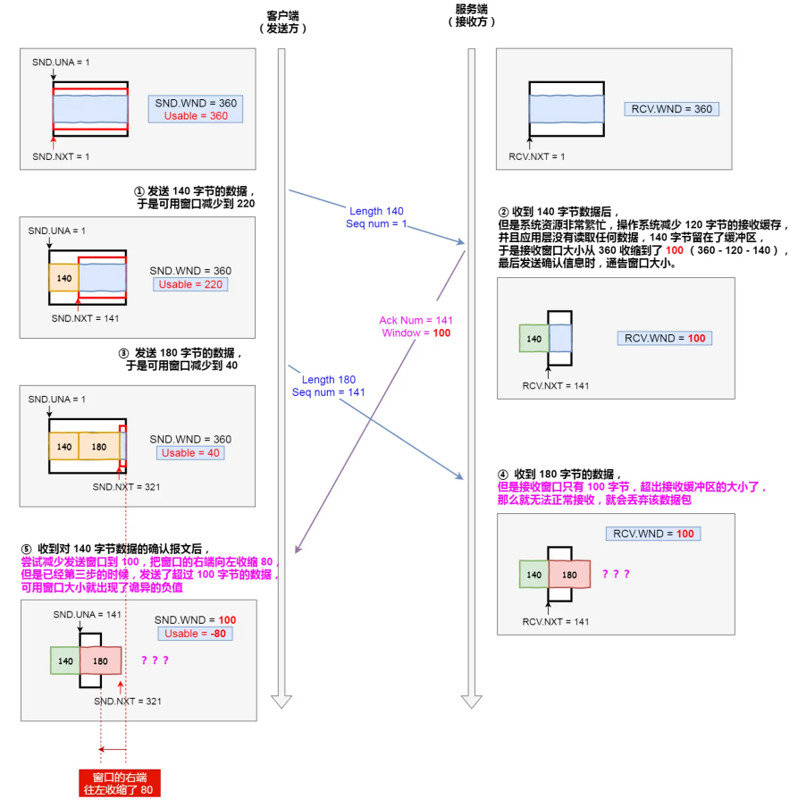

说明下每个过程：
1. 客户端发送 140 字节的数据，于是可用窗口减少到了 220。
2. 服务端因为现在非常的繁忙，操作系统于是就把接收缓存减少了 120 字节，当收到 140 字节数据后，又因为应用程序没有读取任何数据，所以 140 字节留在了缓冲区中，于是接收窗口大小从 360 收缩成了 100，最后发送确认信息时，通告窗口大小给对方。
3. 此时客户端因为还没有收到服务端的通告窗口报文，所以不知道此时接收窗口收缩成了 100，客户端只会看自己的可用窗口还有 220，所以客户端就发送了 180 字节数据，于是可用窗口减少到 40。
4. 服务端收到了 180 字节数据时，发现数据大小超过了接收窗口的大小，于是就把数据包丢失了。
5. 客户端收到第 2 步时，服务端发送的确认报文和通告窗口报文，尝试减少发送窗口到 100，把窗口的右端向左收缩了 80，此时可用窗口的大小就会出现诡异的负值。

所以，如果发生了先减少缓存，再收缩窗口，就会出现丢包的现象。

为了防止这种情况发生，TCP 规定是不允许同时减少缓存又收缩窗口的，而是采用先收缩窗口，过段时间再减少缓存，这样就可以避免了丢包情况。

## 窗口关闭

如果窗口大小为 0 时，就会阻止发送方给接收方传递数据，直到窗口变为非 0 为止，这就是窗口关闭。

> 窗口关闭潜在的危险

接收方向发送方通告窗口大小时，是通过 ACK 报文来通告的。

那么，当发生窗口关闭时，接收方处理完数据后，会向发送方通告一个窗口非 0 的 ACK 报文，如果这个通告窗口的 ACK 报文在网络中丢失了，那麻烦就大了。


这会导致发送方一直等待接收方的非 0 窗口通知，接收方也一直等待发送方的数据，如不采取措施，这种相互等待的过程，会造成了死锁的现象。

> TCP 是如何解决窗口关闭时，潜在的死锁现象呢？

为了解决这个问题，TCP 为每个连接设有一个持续定时器，只要 TCP 连接一方收到对方的零窗口通知，就启动持续计时器。

如果持续计时器超时，就会发送窗口探测 ( Window probe ) 报文，而对方在确认这个探测报文时，给出自己现在的接收窗口大小。


- 如果接收窗口仍然为 0，那么收到这个报文的一方就会重新启动持续计时器；
- 如果接收窗口不是 0，那么死锁的局面就可以被打破了。

窗口探测的次数一般为 3 次，每次大约 30-60 秒（不同的实现可能会不一样）。如果 3 次过后接收窗口还是 0 的话，有的 TCP 实现就会发 RST 报文来中断连接。

## 糊涂窗口综合症

如果接收方太忙了，来不及取走接收窗口里的数据，那么就会导致发送方的发送窗口越来越小。

到最后，如果接收方腾出几个字节并告诉发送方现在有几个字节的窗口，而发送方会义无反顾地发送这几个字节，这就是糊涂窗口综合症。

要知道，我们的 TCP + IP 头有 40 个字节，为了传输那几个字节的数据，要达上这么大的开销，这太不经济了。

就好像一个可以承载 50 人的大巴车，每次来了一两个人，就直接发车。除非家里有矿的大巴司机，才敢这样玩，不然迟早破产。要解决这个问题也不难，大巴司机等乘客数量超过了 25 个，才认定可以发车。

现举个糊涂窗口综合症的栗子，考虑以下场景：

接收方的窗口大小是 360 字节，但接收方由于某些原因陷入困境，假设接收方的应用层读取的能力如下：

- 接收方每接收 3 个字节，应用程序就只能从缓冲区中读取 1 个字节的数据；
- 在下一个发送方的 TCP 段到达之前，应用程序还从缓冲区中读取了 40 个额外的字节；

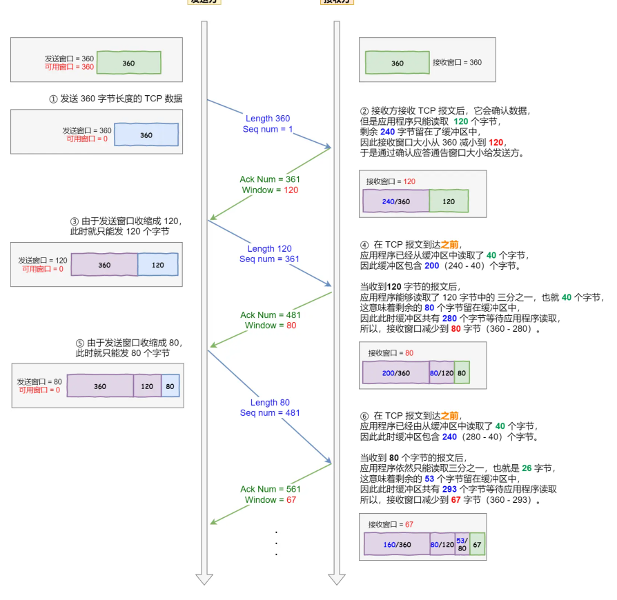

每个过程的窗口大小的变化，在图中都描述的很清楚了，可以发现窗口不断减少了，并且发送的数据都是比较小的了。

所以，糊涂窗口综合症的现象是可以发生在发送方和接收方：

- 接收方可以通告一个小的窗口
- 而发送方可以发送小数据

于是，要解决糊涂窗口综合症，就解决上面两个问题就可以了

- 让接收方不通告小窗口给发送方
- 让发送方避免发送小数据

> 怎么让接收方不通告小窗口呢？

接收方通常的策略如下：

当「窗口大小」小于 min( MSS，缓存空间/2 ) ，也就是小于 MSS 与 1/2 缓存大小中的最小值时，就会向发送方通告窗口为 0，也就阻止了发送方再发数据过来。

等到接收方处理了一些数据后，窗口大小 >= MSS，或者接收方缓存空间有一半可以使用，就可以把窗口打开让发送方发送数据过来。

> 怎么让发送方避免发送小数据呢？

发送方通常的策略:

使用 Nagle 算法，该算法的思路是延时处理，它满足以下两个条件中的一条才可以发送数据：

- 要等到窗口大小 >= MSS 或是数据大小 >= MSS
- 收到之前发送数据的 ack 回包

只要没满足上面条件中的一条，发送方一直在囤积数据，直到满足上面的发送条件。

另外，Nagle 算法默认是打开的，如果对于一些需要小数据包交互的场景的程序，比如，telnet 或 ssh 这样的交互性比较强的程序，则需要关闭 Nagle 算法。

可以在 Socket 设置 TCP_NODELAY 选项来关闭这个算法（关闭 Nagle 算法没有全局参数，需要根据每个应用自己的特点来关闭）

```c
setsockopt(sock_fd, IPPROTO_TCP, TCP_NODELAY, (char *)&value, sizeof(int));
```

# 拥塞控制

> 为什么要有拥塞控制呀，不是有流量控制了吗？

前面的流量控制是避免「发送方」的数据填满「接收方」的缓存，但是并不知道网络的中发生了什么。

一般来说，计算机网络都处在一个共享的环境。因此也有可能会因为其他主机之间的通信使得网络拥堵。

在网络出现拥堵时，如果继续发送大量数据包，可能会导致数据包时延、丢失等，这时 TCP 就会重传数据，但是一重传就会导致网络的负担更重，于是会导致更大的延迟以及更多的丢包，这个情况就会进入恶性循环被不断地放大....

所以，TCP 不能忽略网络上发生的事，它被设计成一个无私的协议，当网络发送拥塞时，TCP 会自我牺牲，降低发送的数据量。

于是，就有了拥塞控制，控制的目的就是避免「发送方」的数据填满整个网络。

为了在「发送方」调节所要发送数据的量，定义了一个叫做「拥塞窗口」的概念。

> 什么是拥塞窗口？和发送窗口有什么关系呢？

拥塞窗口 cwnd 是发送方维护的一个的状态变量，它会根据网络的拥塞程度动态变化的。

我们在前面提到过发送窗口 swnd 和接收窗口 rwnd 是约等于的关系，那么由于加入了拥塞窗口的概念后，此时发送窗口的值是 swnd = min(cwnd, rwnd)，也就是拥塞窗口和接收窗口中的最小值。

拥塞窗口 cwnd 变化的规则：

- 只要网络中没有出现拥塞，cwnd 就会增大；
- 但网络中出现了拥塞，cwnd 就减少；

> 那么怎么知道当前网络是否出现了拥塞呢？

其实只要「发送方」没有在规定时间内接收到 ACK 应答报文，也就是发生了超时重传，就会认为网络出现了用拥塞。

> 拥塞控制有哪些控制算法？

拥塞控制主要是四个算法：

- 慢启动
- 拥塞避免
- 拥塞发生
- 快速恢复

## 慢启动

TCP 在刚建立连接完成后，首先是有个慢启动的过程，这个慢启动的意思就是一点一点的提高发送数据包的数量，如果一上来就发大量的数据，这不是给网络添堵吗？

慢启动的算法记住一个规则就行：当发送方每收到一个 ACK，拥塞窗口 cwnd 的大小就会加 1。

这里假定拥塞窗口 cwnd 和发送窗口 swnd 相等，下面举个栗子：

- 连接建立完成后，一开始初始化 cwnd = 1，表示可以传一个 MSS大小的数据。
- 当收到一个 ACK 确认应答后，cwnd 增加 1，于是一次能够发送 2 个
- 当收到 2 个的 ACK 确认应答后， cwnd 增加 2，于是就可以比之前多发2 个，所以这一次能够发送 4 个
- 当这 4 个的 ACK 确认到来的时候，每个确认 cwnd 增加 1， 4 个确认 cwnd 增加 4，于是就可以比之前多发 4 个，所以这一次能够发送 8 个。


可以看出慢启动算法，发包的个数是指数性的增长。

> 那慢启动涨到什么时候是个头呢？

有一个叫慢启动门限 ssthresh（slow start threshold）状态变量。

- 当 cwnd < ssthresh 时，使用慢启动算法。
- 当 cwnd >= ssthresh 时，就会使用「拥塞避免算法」。

## 拥塞避免算法

前面说道，当拥塞窗口 cwnd 「超过」慢启动门限 ssthresh 就会进入拥塞避免算法。

一般来说 ssthresh 的大小是 65535 字节。

那么进入拥塞避免算法后，它的规则是：每当收到一个 ACK 时，cwnd 增加 1/cwnd。

接上前面的慢启动的栗子，现假定 ssthresh 为 8：

- 当 8 个 ACK 应答确认到来时，每个确认增加 1/8，8 个 ACK 确认 cwnd 一共增加 1，于是这一次能够发送 9 个 MSS 大小的数据，变成了线性增长。


所以，我们可以发现，拥塞避免算法就是将原本慢启动算法的指数增长变成了线性增长，还是增长阶段，但是增长速度缓慢了一些。

就这么一直增长着后，网络就会慢慢进入了拥塞的状况了，于是就会出现丢包现象，这时就需要对丢失的数据包进行重传。

当触发了重传机制，也就进入了「拥塞发生算法」。

## 拥塞发生

当网络出现拥塞，也就是会发生数据包重传，重传机制主要有两种：

- 超时重传
- 快速重传

这两种使用的拥塞发送算法是不同的，接下来分别来说说。

> 发生超时重传的拥塞发生算法

当发生了「超时重传」，则就会使用拥塞发生算法。

这个时候，ssthresh 和 cwnd 的值会发生变化：

- ssthresh 设为 cwnd/2，
- cwnd 重置为 1。

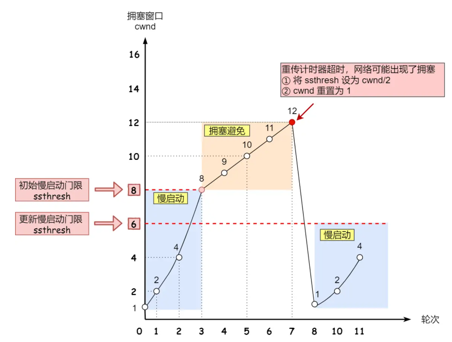

接着，就重新开始慢启动，慢启动是会突然减少数据流的。这真是一旦「超时重传」，马上回到解放前。但是这种方式太激进了，反应也很强烈，会造成网络卡顿。

> 发生快速重传的拥塞发生算法

还有更好的方式，前面我们讲过「快速重传算法」。当接收方发现丢了一个中间包的时候，发送三次前一个包的 ACK，于是发送端就会快速地重传，不必等待超时再重传。

TCP 认为这种情况不严重，因为大部分没丢，只丢了一小部分，则 ssthresh 和 cwnd 变化如下：

- cwnd=cwnd/2，也就是设置为原来的一半;
- ssthresh=cwnd；
- 进入快速恢复算法

## 快速恢复

快速重传和快速恢复算法一般同时使用，快速恢复算法是认为，你还能收到 3 个重复 ACK 说明网络也不那么糟糕，所以没有必要像 RTO 超时那么强烈。

正如前面所说，进入快速恢复之前，cwnd 和 ssthresh 已被更新了：

- cwnd=cwnd/2，也就是设置为原来的一半；
- ssthresh cwnd；

然后，进入快速恢复算法如下：

- 拥塞窗口 cwnd=ssthresh+3（ 3 的意思是确认有 3 个数据包被收到了）；
- 重传丢失的数据包；
- 如果再收到重复的 ACK，那么 cwnd 增加 1；
- 如果收到新数据的 ACK 后，把 cwnd 设置为第一步中的 ssthresh 的值，原因是该 ACK 确认了新的数据，说明从 duplicated ACK 时的数据都已收到，该恢复过程已经结束，可以回到恢复之前的状态了，也即再次进入拥塞避免状态；

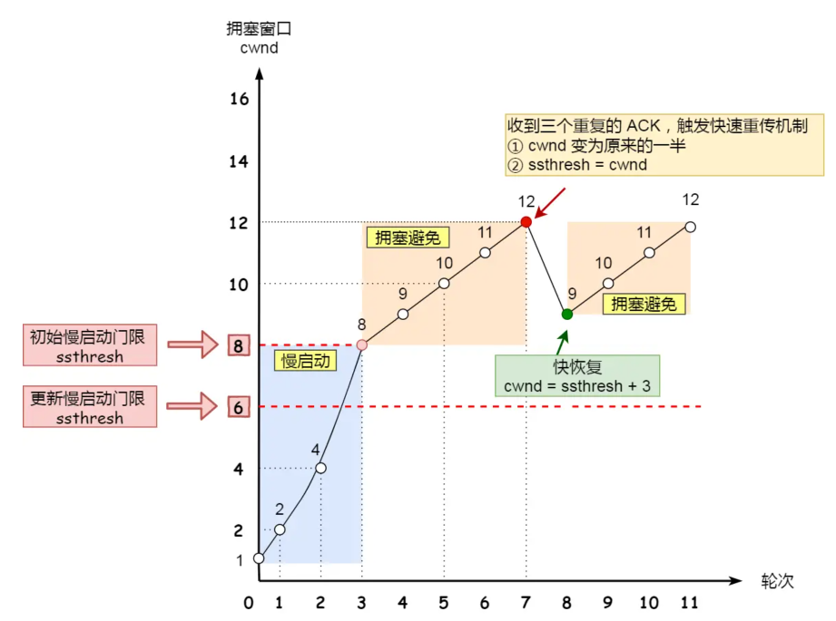

也就是没有像「超时重传」一夜回到解放前，而是还在比较高的值，后续呈线性增长。

# 什么是 TCP 半连接队列和全连接队列？

在 TCP 三次握手的时候，Linux 内核会维护两个队列，分别是：

- 半连接队列，也称 SYN 队列；
- 全连接队列，也称 accepet 队列；

服务端收到客户端发起的 SYN 请求后，内核会把该连接存储到半连接队列，并向客户端响应 SYN+ACK，接着客户端会返回 ACK，服务端收到第三次握手的 ACK 后，内核会把连接从半连接队列移除，然后创建新的完全的连接，并将其添加到 accept 队列，等待进程调用 accept 函数时把连接取出来。

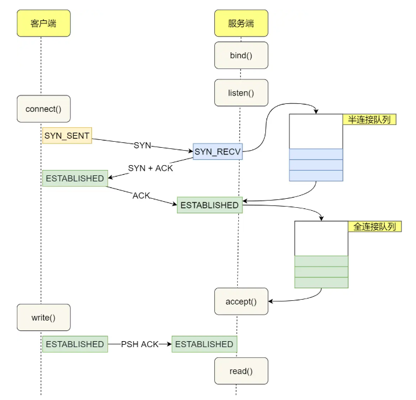

不管是半连接队列还是全连接队列，都有最大长度限制，超过限制时，内核会直接丢弃，或返回 RST 包。

