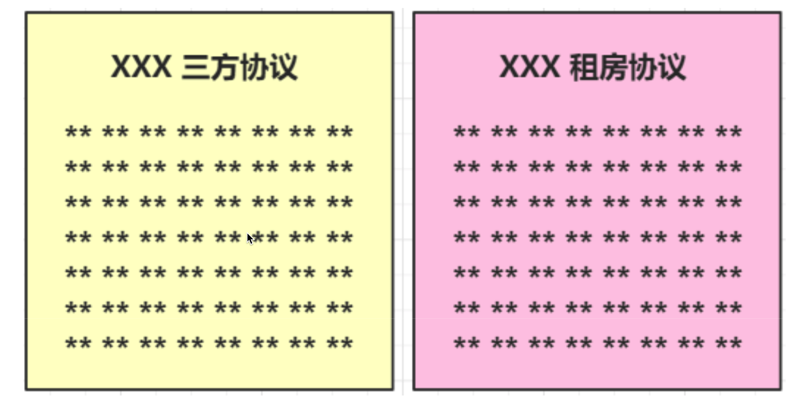
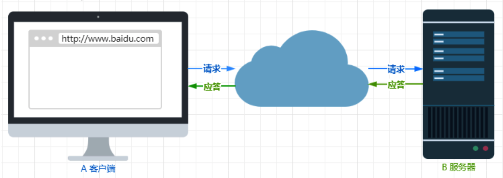

# HTTP 基本概念

>   HTTP 是什么？描述一下

HTTP 是超文本传输协议，也就是 HyperText Transfer Protocol。

>   能否详细解释「超文本传输协议」?

HTTP的名字「超文本协议传输」，它可以拆成三个部分: .

-   超文本
-   传输
-   协议

1.  协议

在生活中，我们也随处可见「协议」，例如：

-   刚毕业时会签一个「三方协议」；
-   找房子时会签一个「租房协议」

生活中的协议，本质上与计算机中的协议是相同的，协议的特点：

-   「协」字，代表的意思是必须有 **两个以上的参与者**。例如三方协议里的参与者有三个：你、公司、学校三个；租房协议里的参与者有两个：你和房东。
-   「议」 字，代表的意思是对参与者的一种 **行为约定和规范**。例如三方协议里规定试用期期限、毁约金等；租房协议里规定租期期限、每月租金金额、违约如何处理等。

针对 HTTP 协议，我们可以这么理解。HTTP 是一个用在计算机世界里的协议。它使用计算机能够理解的语言确立了一种计算机之间交流通信的规范 **（两个以上的参与者）**，以及相关的各种控制和错误处理方式（行为约定和规范）。

2.  传输

所谓的「传输」，很好理解，就是把一堆东西从 A 点搬到 B 点，或者从 B 点搬到 A 点。

别轻视了这个简单的动作，它至少包含两项重要的信息。

HTTP 协议是一个 **双向协议**。我们在上网冲浪时，浏览器是请求方 A，百度网站就是应答方 B。双方约定用 HTTP 协议来通信，于是浏览器把请求数据发送给网站，网站再把一些数据返回给浏览器，最后由浏览器渲染在屏幕，就可以看到图片、视频了。

数据虽然是在 A 和 B 之间传输，但允许中间有 **中转或接力**。

就好像第一排的同学想传递纸条给最后一排的同学, 那么传递的过程中就需要经过好多个同学（中间人），这样的传输方式就从「A<-->B」，变成了「A<->N<->M<->B」。

而在 HTTP 里，需要中间人遵从 HTTP 协议，只要不打扰基本的数据传输，就可以添加任意额外的东西。

针对传输，我们可以进一步理解了 HTTP。

HTTP 是一个在计算机世界里专门用来在 **两点之间传输数据** 的约定和规范。

3.  「超文本」

HTTP 传输的内容是「超文本」。

我们先来理解「文本」，在互联网早期的时候只是简单的字符文字，但现在「文本」的涵义已经可以扩展为图片、视频、压缩包等，在 HTTP 眼里这些都算作「文本」。

再来理解「超文本」，它就是 **超越了普通文本的文本**，它是文字、图片、视频等的混合体，最关键有超链接，能从一个超文本跳转到另外一个超文本。

HTML 就是最常见的超文本了，它本身只是纯文字文件，但内部用很多标签定义了图片、视频等的链接，再经过浏览器的解释，呈现给我们的就是一个文字、有画面的网页了。

经过了对 HTTP 里这三个名词的详细解释，就可以给出比「超文本传输协议」 这七个字更准确更有技术含量的答案：

**HTTP 是一个在计算机世界里专门在「两点」之间「传输」文字、图片、音频、视频等「超文本」数据的「约定和规范」。**

>   那 HTTP 是用于从互联网服务器传输超文本到本地浏览器的协议，这种说法正确吗?

这种说法是不正确的。因为也可以是「服务器< - >服务器」，所以采用两点之间的描述会更准确。

>   HTTP常见的状态码，有哪些?

`1xx`类状态码属于提示信息，是协议处理中的一种中间状态，实际用到的比较少。

`2xx`类状态码表示服务器成功处理了客户端的请求，也是我们最愿意看到的状态。

-   「200 OK」是最常见的成功状态码，表示一切正常。如果是非 HEAD 请求，服务器返回的响应头都会有 body 数据。

-   「204 No Content」也是常见的成功状态码，与 200 OK 基本相同，但响应头没有 body 数据。

-   「206 Partial Content」是应用于 HTTP 分块下载或断点续传，表示响应返回的 body 数据并不是资源的全部，而是其中的一部分，也是服务器处理成功的状态。

`3xx`类状态码表示客户端请求的资源发送了变动，需要客户端用新的 URL 重新发送请求获取资源，也就是 **重定向**。

-   「301 Moved Permanently」表示永久重定向，说明请求的资源已经不存在了，需改用新的 URL 再次访问。

-   「302 Found」表示临时重定向，说明请求的资源还在，但暂时需要用另一个 URL 来访问。
-   301 和 302 都会在响应头里使用字段 Location，指明后续要跳转的 URL，浏览器会自动重定向新的 URL。
-   「304 Not Modified」不具有跳转的含义，表示资源未修改，重定向已存在的缓冲文件，也称缓存重定向，用于缓存控制。

`4xx`类状态码表示客户端发送的报文有误，服务器无法处理，也就是错误码的含义。

-   「400 Bad Request」表示客户端请求的报文有错误，但只是个笼统的错误。
-   「403 Forbidden」表示服务器禁止访问资源，并不是客户端的请求出错。
-   「404 Not Found」表示请求的资源在服务器上不存在或未找到，所以无法提供给客户端。

`5xx`类状态码表示客户端请求报文正确，但是服务器处理时内部发生了错误，属于服务器端的错误码。

-   「500 Internal Server Error」与 400 类型，是个笼统通用的错误码，服务器发生了什么错误，我们并不知道。
-   「501 Not Implemented」表示客户端请求的功能还不支持，类似“即将开业，敬请期待”的意思。
-   「502 Bad Gateway」通常是服务器作为网关或代理时返回的错误码，表示服务器自身工作正常，访问后端服务器发生了错误。
-   「503 Service Unavailable」表示服务器当前很忙，暂时无法响应服务器，类似“网络服务正忙，请稍后重试”的意思。